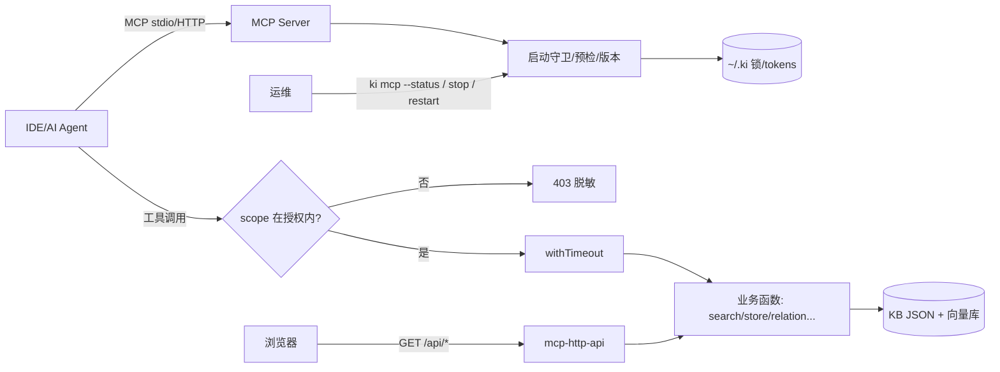

# C4-数据流向与消费：MCP 服务专家

> 本专家是协议层，本身不持久化业务数据；其产生的"锁/Token/健康状态"数据是运维与并发控制资产。

## 数据实体总览

| 数据实体 | 来源接口 | 去向 | 消费方 | 业务用途 |
|----------|----------|------|--------|----------|
| MCP 会话 | `buildKiMcpServer(authScopes)`（每会话实例）+ StreamableHTTPServerTransport | 进程内存（会话 Map，含空闲回收） | 各 MCP 客户端（IDE/AI Agent） | 承载一次 MCP 连接的工具调用；会话级绑定授权 scope 集合 |
| `~/.ki/mcp-stdio-<pid>.lock` | `acquireStdioLock` | lock 文件（JSON：pid + startedAt，每实例一个） | 本专家（`listLiveStdioLocks` / `ki mcp stop` / `--status`） | stdio 实例登记与进程定位（**不再用于互斥**） |
| `~/.ki/mcp-http.lock` | `writeLockFile`（`startHttpMcpServer`） | lock 文件（JSON：pid + host + port + startedAt + web） | 本专家（`printHttpStatus` / `ki mcp stop` / `restart`） | HTTP 单例持锁者身份排查与 restart 配置延续 |
| `~/.ki/mcp-tokens.json` | `createToken` / `updateTokenScopes` / `deleteToken` | Token 存储（JSON 数组，0600，目录 0700） | 本专家（`findTokenScopes` 鉴权 / `ki mcp token list`）+ 人工 | 多租户 Bearer 凭据与 scope 授权（RBAC） |
| `/healthz` 响应 | `fetchHealthz` / `printHttpStatus` | HTTP 响应（内存） | 本专家（幂等单例判定）+ 运维 | 健康探活与状态诊断 |
| `/api/*` 响应 | `mcp-http-api.ts` 的 `handleApiRequest` | HTTP 响应（内存） | Web UI 前端（可视化前端专家） | 前端数据接口（`/api/import/*` 归导入专家） |
| MCP 工具调用结果 | 13 个工具 handler | MCP 响应（协议） | IDE / AI Agent | 查询/写入/管理能力的交付通道 |

## 逐实体详述

### 1. MCP 会话
- **来源接口**：`buildKiMcpServer`（HTTP 模式每会话新建）+ `createMcpHttpServer` 的 transport 管理
- **去向**：进程内存（`transports` Map + `lastActive` Map）
- **消费方**：各 MCP 客户端（IDE / AI Agent）[基于引用扫描，未深入验证]
- **业务用途**：维持一次 MCP 连接（initialize → 工具调用 → DELETE 关闭），空闲超时（默认 30 分钟）自动回收，上限 256 会话防内存增长

### 2. stdio / HTTP 锁文件
- **来源接口**：`acquireStdioLock`（每实例一个文件）/ `writeLockFile`（HTTP 单例）；`ki mcp stop` 清理
- **去向**：`~/.ki/` 下的 lock 文件
- **消费方**：本专家（启动守卫 / `--status` / `stop` / `restart` 配置延续）+ 人工排查（`cat ~/.ki/mcp-*.lock`）
- **业务用途**：**进程管理定位**——多 IDE 场景下 HTTP 单例独占向量库锁，stdio 多实例靠空闲释放锁错开；lock 不用于互斥，写失败只告警不阻断

### 3. 多 Token 存储
- **来源接口**：`createToken` / `updateTokenScopes` / `deleteToken`（原子写：临时文件 → rename）
- **去向**：`~/.ki/mcp-tokens.json`（0600，JSON 数组）
- **消费方**：本专家（`findTokenScopes` 非回环鉴权 / `ki mcp token list`）+ 人工
- **业务用途**：多租户 Bearer 凭据与**最小 scope 授权**；一个进程服务多租户，越权在 HTTP 层拦截。损坏时写操作拒绝（`MCP_TOKEN_CORRUPT`）防静默丢失

### 4. /healthz 健康状态
- **来源接口**：`createMcpHttpServer` 的 `/healthz` handler（免鉴权）
- **去向**：HTTP 响应（含 pid / version / host / port / authFailures）
- **消费方**：本专家（幂等单例探活 / `--status`）+ 运维监控 [基于引用扫描，未深入验证]
- **业务用途**：探活判定"已有健康实例可复用"；`authFailures` 计数暴露鉴权配置错误

### 5. 工具调用结果
- **来源接口**：13 个工具 handler（`withTimeout` 包裹业务函数）
- **去向**：MCP JSON-RPC 响应
- **消费方**：IDE / AI Agent
- **业务用途**：协议交付通道——查询（search/query-group/module-info）、写入（store/bulk-store/sync-relation/bulk-sync-relation）、管理（manage-index/scope-list/tag-list）

### 6. `/api/*` 扩展接口响应
- **来源接口**：`mcp-http-api.ts` 的 `handleApiRequest`（由 `createMcpHttpServer` 挂载）
- **去向**：HTTP 响应（JSON）
- **消费方**：Web UI 前端（可视化前端专家）
- **业务用途**：前端数据接口；其中 `/api/import/*` 的实现与归属归「知识索引导入专家」

## 数据流图

