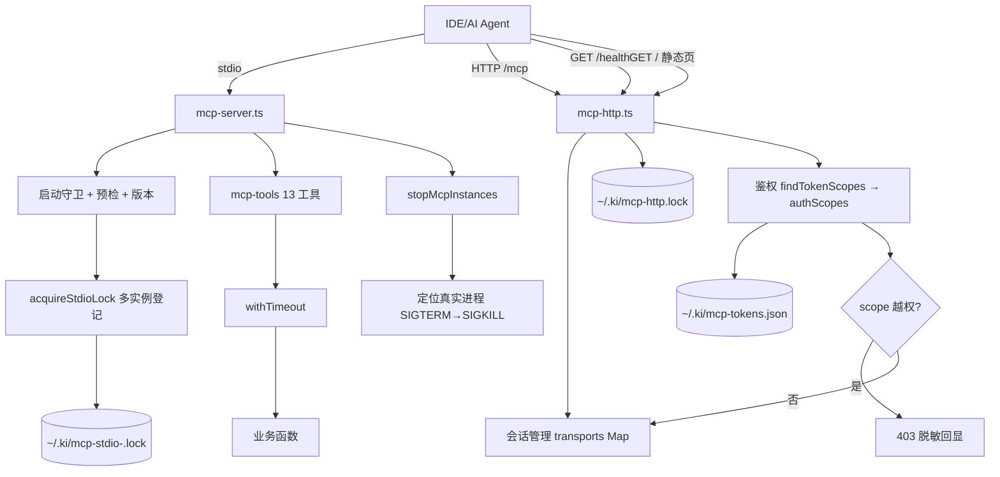

# 01-架构：MCP 服务专家

**本文引用的文件**
- [src/mcp-server.ts](file:///root/knowledge-indexer/src/mcp-server.ts)
- [src/lib/mcp-http.ts](file:///root/knowledge-indexer/src/lib/mcp-http.ts)
- [src/lib/mcp-http-api.ts](file:///root/knowledge-indexer/src/lib/mcp-http-api.ts)
- [src/lib/net-addr.ts](file:///root/knowledge-indexer/src/lib/net-addr.ts)
- [src/lib/mcp-tools/util.ts](file:///root/knowledge-indexer/src/lib/mcp-tools/util.ts)
- [src/lib/mcp-stdio-lock.ts](file:///root/knowledge-indexer/src/lib/mcp-stdio-lock.ts)
- [src/lib/mcp-stop.ts](file:///root/knowledge-indexer/src/lib/mcp-stop.ts)
- [src/lib/mcp-token.ts](file:///root/knowledge-indexer/src/lib/mcp-token.ts)
- [src/lib/health-check.ts](file:///root/knowledge-indexer/src/lib/health-check.ts)
- [src/lib/version-guard.ts](file:///root/knowledge-indexer/src/lib/version-guard.ts)

## 目录
1. [简介](#简介)
2. [模块职责与边界](#模块职责与边界)
3. [架构分层](#架构分层)
4. [依赖关系](#依赖关系)
5. [关键设计决策](#关键设计决策)
6. [对外接口与契约层索引](#对外接口与契约层索引)
7. [术语表](#术语表)
8. [结论](#结论)

## 简介

本专家是 kisearch 对外的 **MCP（Model Context Protocol）服务层**。核心目标：让 AI Agent / IDE 通过标准 MCP 协议接入知识索引能力，并解决多 IDE 争抢嵌入式向量库文件锁的问题（HTTP 共享单例模式）。

章节来源：[src/mcp-server.ts](file:///root/knowledge-indexer/src/mcp-server.ts)（`buildKiMcpServer` / `startMcpServer`）

## 模块职责与边界

**职责**：
- MCP Server 构建与工具注册（13 个）
- stdio / HTTP 两种传输模式 + 守护进程化（`--daemon`）+ `restart`
- 启动守卫（幂等复用 / 多实例提示 / 非回环 Token 预检 / 预检失败拒绝）
- 锁管理（stdio 每实例独立 lock / http lock）
- 多 Token 鉴权 + scope 授权（RBAC）：存储管理 + HTTP 层越权拦截
- 前端静态托管（`--web`）与 `/api/*` 路由挂载
- 一键停止（定位真实持锁进程）
- 启动预检（消费 doctor 逻辑）与版本自检

**边界**（不做什么）：
- 不实现业务逻辑（检索/存储/关系管理），仅协议封装与参数校验
- 不暴露危险操作（MCP 工具集零破坏性）
- 不实现健康检查项（归「存储与配置基础专家」）；不实现 `/api/import/*`（归「知识索引导入专家」）

## 架构分层

```
客户端层         IDE / AI Agent（MCP stdio 或 HTTP）/ 浏览器（--web）
                     │  (JSON-RPC 2.0 / HTTP)
服务入口层        src/mcp-server.ts（startMcpServer 分发：stdio/http/status/stop/restart/token）
                     │            bin/ki.mjs（daemon detached spawn）
传输层           lib/mcp-http.ts（Streamable HTTP + 单例守护 + 鉴权 + scope 闸门 + 静态页 + /api 挂载）
                lib/mcp-stdio-lock.ts（stdio 每实例独立 lock，仅进程管理定位）
                     │
工具注册层        lib/mcp-tools/*（13 工具：search/store/bulk-store/query-group/...）
                lib/mcp-tools/util.ts（withTimeout 超时防护）
                     │
支撑层           lib/mcp-token.ts（多 Token + scope 授权） lib/mcp-stop.ts（停止）
                lib/health-check.ts（预检，属存储专家） lib/version-guard.ts（版本）
                lib/net-addr.ts（回环判定）
                     │
业务能力层       检索/存储/关系业务函数（其他业务专家）
```



图表来源：[src/mcp-server.ts](file:///root/knowledge-indexer/src/mcp-server.ts)（`startMcpServer` 分发流程）

## 依赖关系

| 依赖方 | 被依赖方 | 说明 |
|--------|----------|------|
| `mcp-server.ts` | `lib/mcp-http.ts` / `lib/mcp-stdio-lock.ts` / `lib/mcp-stop.ts` / `lib/mcp-token.ts` / `lib/health-check.ts` / `lib/version-guard.ts` / `lib/cli-args.ts` / `lib/config.ts` / `lib/mcp-tools/*` | 启动分发与预检 |
| `lib/mcp-http.ts` | `lib/version-guard.ts`（readKiVersion）/ `lib/mcp-token.ts`（findTokenScopes/isScopeAuthorized）/ `lib/net-addr.ts`（isLoopbackHost）/ `lib/mcp-http-api.ts`（`/api/*` 路由）/ `lib/vector-client.ts`（closeEngine 动态 import） | HTTP 单例、鉴权与关闭 |
| `lib/mcp-stop.ts` | `lib/mcp-http.ts`（getHttpLockPath/fetchHealthz）/ `lib/mcp-stdio-lock.ts`（listStdioLockFiles/stdioLockPidFromPath/pidAlive） | 停止定位 |
| `lib/mcp-tools/*` | `lib/vector-client.ts` / 各业务 lib / `lib/mcp-tools/util.ts` | 工具实现 |

**外部依赖**：`@modelcontextprotocol/sdk`（McpServer / StdioServerTransport / StreamableHTTPServerTransport）、`node:http`、`node:crypto`。

**强依赖业务专家**：检索与向量客户端专家（vector-client）、关系与索引管理专家（sync-relation/query-group/get-module-info/manage-index/delete-relation）、知识索引导入专家（scan-kb 增量）。

## 关键设计决策

1. **HTTP 共享单例根治锁冲突**：多 IDE 各拉 stdio 进程只有一人持锁，其余静默降级 → 改为单进程 HTTP 服务作为唯一持锁者，所有 IDE 经 URL 共享（`mcp-http.ts`）。
2. **幂等单例**：启动先探活 `/healthz`，命中健康实例（`name==='kisearch'`）复用退出；**stdio 不再互斥**：多实例靠向量库空闲释放锁（3s）+ 撞锁重试（2s×3）错开共享，lock 仅用于进程管理定位。
3. **鉴权按绑定地址条件生效**：回环免鉴权（secure by default），非回环强制鉴权；Token 比较用 `crypto.timingSafeEqual` 常量时间（防时序侧信道）。
4. **多 Token + scope 授权（RBAC）替代单托管 Token**：一个进程可服务多个租户，每个 Token 绑定授权 scope 集合（`all` 为保留字）；授权在 HTTP 层执行（`tools/call` 全项校验），无 scope 参数工具走 `SCOPE_LESS_TOOLS` 白名单 + 工具层 `authScopes` 过滤输出兜底。存储 `~/.ki/mcp-tokens.json`（0600，原子写），**损坏时写操作 fail-closed 报错防静默扩散**。
5. **工具超时防护**：`withTimeout` 包裹每个工具 handler（READ 30s / WRITE 60s / BULK 300s），防长驻进程被挂起调用阻塞（`util.ts`）。
6. **会话治理**：HTTP 每会话独立 transport + McpServer；空闲回收（30 分钟）+ 上限 256 防 Map 无界增长。
7. **身份校验防误杀**：`ki mcp stop` 杀前读 `/proc/<pid>/cmdline` 校验确为 ki 进程，防 pid 复用误杀（`mcp-stop.ts`）。
8. **预检前移**：启动预检复用 doctor 逻辑，存在 ❌ 拒绝启动（`health-check.ts`），报告写 stderr 不污染 stdio。
9. **版本自检**：长驻进程启动 banner + 监听 package.json 变化告警重启（`version-guard.ts`）。
10. **零破坏性 MCP 工具集**：不含 delete/force 危险操作（NEG-15），`ki_manage_index_delete` 仅限空节点。
11. **守护进程化在 `bin/ki.mjs` 层**：detached spawn 实现 `--daemon`，spawn 后 3s 存活探测（退出即 fail-loud 附前台复跑指引）；日志不落盘、无崩溃自动拉起（用户明确决策）。
12. **`restart` 配置优先级 CLI > lock > 配置 > 默认**：与 `--status` 探测保持一致，否则会探测不到非默认地址实例；强制 `--http --daemon`；非回环 host 先做 Token 预检（避免 `ok:true` 假象）。
13. **`--web` 缺失产物不阻塞**：静态目录缺 `index.html` 时仅告警，MCP 服务照常启动（前端可用性不该拖垮检索服务）。

## 对外接口与契约层索引

- 契约层：`../C0-使用总览.md`、`../C1-能力契约.md`、`../C2-使用流程.md`、`../C4-数据流向与消费.md`
- 实现层索引：`02-实现.md`、`03-数据流转.md`、`05-接口.md`、`06-测试.md`、`07-运维.md`

## 术语表

| 术语 | 含义 |
|------|------|
| MCP | Model Context Protocol，模型上下文协议 |
| Streamable HTTP | MCP 的 HTTP 传输模式（基于 node:http） |
| 回环绑定 | 监听 127.0.0.1/::1/localhost（`127.0.0.0/8`、`::1`、`localhost`），免鉴权 |
| 授权 scope 集合 | 每个 Token 绑定的可见 scope 列表；`['all']` 为全部；`null` 表示免鉴权 |
| `SCOPE_LESS_TOOLS` | 无 scope 参数工具的白名单（`ki_scope_list`、`ki_manage_index_list`），豁免单点 scope 校验 |
| 幂等单例 | 重复启动命中健康实例时复用退出 |
| 全权临时 Token | `--token` / `KI_MCP_TOKEN` 提供的进程级 Token，不受 scope 限制 |

## 关键发现 / 主要风险

- **mcp lock（stdio/http）与 zvec 向量库锁是两套独立锁**：`ki mcp stop` 管不到向量库锁（见 AGENTS.md 变更记录）
- **HTTP 单例 `closeAllConnections`** 依赖 Node ≥ 18.2（`mcp-http.ts`）
- **`describeListenError`** 对 EADDRINUSE 区分"非 ki 进程占用"场景，给出换端口建议
- **daemon 网络类慢失败仍可能假报成功**：3s 存活探测超时按成功处理，需用 `ki mcp --status` 兜底
- **Token「读-改-写」无文件锁**：并发调用 `token generate/update/delete` 可能丢更新（低频运维可接受）
- **`--web`/`--no-web` 走 lock 延续、`--allowed-hosts` 走配置文件**，两套延续机制不一致（长期建议统一）

## 结论

本专家通过"HTTP 共享单例 + 幂等守卫 + 多 Token/scope 授权 + 超时防护 + 守护进程化"解决多客户端并发接入、向量库锁冲突与多租户隔离问题；契约层覆盖启动/接入/鉴权/停止全流程，实现层为协议细节排查提供导航。

出处行：生成日期 2026-08-06（合并补全 2026-08-28，基线 commit 9841255）
