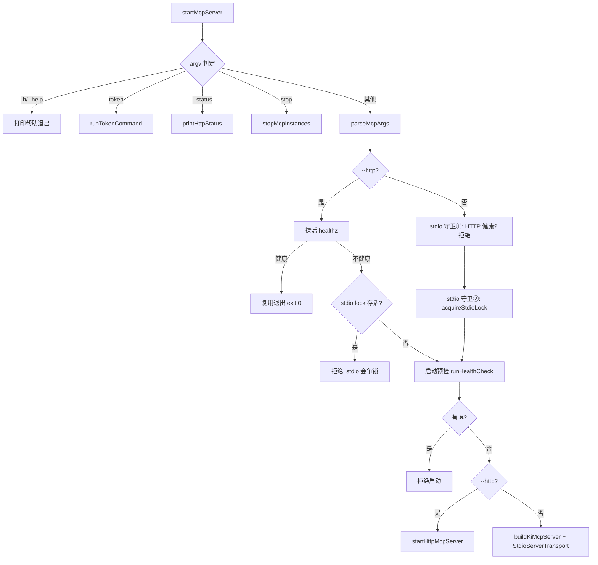
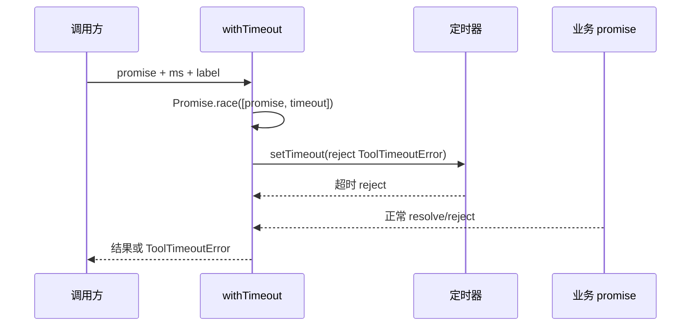

# 02-实现：MCP 服务专家

**本文引用的文件**
- [src/mcp-server.ts](file:///root/knowledge-indexer/src/mcp-server.ts)
- [src/lib/mcp-http.ts](file:///root/knowledge-indexer/src/lib/mcp-http.ts)
- [src/lib/net-addr.ts](file:///root/knowledge-indexer/src/lib/net-addr.ts)
- [src/lib/mcp-tools/util.ts](file:///root/knowledge-indexer/src/lib/mcp-tools/util.ts)
- [src/lib/mcp-stdio-lock.ts](file:///root/knowledge-indexer/src/lib/mcp-stdio-lock.ts)
- [src/lib/mcp-stop.ts](file:///root/knowledge-indexer/src/lib/mcp-stop.ts)
- [src/lib/mcp-token.ts](file:///root/knowledge-indexer/src/lib/mcp-token.ts)

## 目录
1. [简介](#简介)
2. [启动分发实现](#启动分发实现)
3. [HTTP 单例实现](#http-单例实现)
4. [工具超时防护实现](#工具超时防护实现)
5. [stdio 锁实现](#stdio-锁实现)
6. [托管 Token 实现](#托管-token-实现)
7. [一键停止实现](#一键停止实现)
8. [结论](#结论)

## 简介

本文件剖析 MCP 服务专家的核心实现：启动分发、HTTP 单例、超时防护、锁、Token 与停止。

## 启动分发实现

**`startMcpServer`**（`mcp-server.ts`）分发流程：

图表来源：[src/mcp-server.ts](file:///root/knowledge-indexer/src/mcp-server.ts)（`startMcpServer` 各守卫分支）

**关键实现点**：
- `parseMcpArgs`：解析 `--http/--host/--port/--token/--allowed-hosts`；`--token > KI_MCP_TOKEN > 托管文件` 优先级；非回环绑定无 Token 时 `failJson('MCP_HTTP_TOKEN_REQUIRED')`
- 回环绑定提供 Token 时输出提示（鉴权已禁用，Token 不生效）
- stdio 模式 `process.on('exit', releaseStdioLock)` 保证各退出路径释放
- shutdown 统一：stopVersionGuard → closeEngine → exit

## HTTP 单例实现

**`createMcpHttpServer(opts)`**（`mcp-http.ts`）核心：
- `transports: Map<sessionId, StreamableHTTPServerTransport>` + `lastActive: Map<sessionId, number>`
- 空闲清扫定时器（60s 周期，unref）：`now - lastActive > sessionIdleMs` 时 `t.close()` + dropSession
- `handleRequest` 路由：
  - `GET /healthz`：免鉴权返回 `{ok, name:'kisearch', pid, version, host?, port?, authFailures?}`
  - `POST /mcp`：有 sessionId → 复用 transport；无 sessionId 且是 initialize → 新建会话（上限 maxSessions=256 超限 503）；否则 400
  - `GET/DELETE /mcp`：按 sessionId 处理（DELETE 关闭会话）
  - 其他路径 404；非 GET/POST/DELETE 405
- 鉴权（`authEnabled` 且非回环）：`Authorization: Bearer <t>` 解析，`tokenMatches` 常量时间比较；失败 401 + `WWW-Authenticate: Bearer` + `logAuthFailure`（限流 5s 一次 + authFailures 计数）
- DNS rebinding 保护：`allowedHosts` 传入 `enableDnsRebindingProtection: true` + `allowedHosts`

**`startHttpMcpServer`** 生命周期：
1. `probeHealthz` → 命中健康实例复用退出
2. `createMcpHttpServer` → listen（错误经 `describeListenError` 翻译）
3. `writeLockFile`（`~/.ki/mcp-http.lock`）
4. SIGINT/SIGTERM → shutdown：onShutdown → closeAllSessions → closeAllConnections → closeEngine（动态 import vector-client）→ httpServer.close → removeLockFile → exit
5. 兜底 `SHUTDOWN_TIMEOUT_MS=5000` 强制 exit 防残留持锁

## 工具超时防护实现

**`withTimeout(promise, ms, label)`**（`util.ts`）：

图表来源：[src/lib/mcp-tools/util.ts](file:///root/knowledge-indexer/src/lib/mcp-tools/util.ts)（`withTimeout`）

**关键实现点**：`Promise.race` + `.finally(clearTimeout)`；定时器 `unref` 不阻止进程退出；超时错误带 `code='TOOL_TIMEOUT'` 便于区分超时与业务失败。

## stdio 多实例锁实现

> 已从「单文件单 pid 互斥锁」改为「每实例独立 lock 文件」：`~/.ki/mcp-stdio-<pid>.lock`（文件名即 pid）。**不再拒绝多实例**。

**`acquireStdioLock(dir?)`**（`mcp-stdio-lock.ts`）：
1. `mkdirSync(dir, {recursive, mode:0o700})`（失败不阻塞）
2. 先 `listLiveStdioLocks(dir)` 读其他存活实例（顺带清理陈旧锁）
3. `writeFileSync(myPath, payload, {flag:'wx', mode:0o600})` 原子独占创建（含 pid + startedAt）
   - EEXIST（重入 / 上次残留）→ 覆盖更新 startedAt
   - 再失败 → **stderr 告警但不阻塞启动**（lock 缺失会导致 `stop`/`--status` 对本实例"失明"）
4. 返回其他存活实例列表（供调用方提示）

**`listLiveStdioLocks`**：遍历目录全部 `mcp-stdio-<pid>.lock` → 逐个 `readLockFile`：pid 已死则删除并返回 null；内容损坏仍用文件名 pid；排除自身 pid。

**`pidAlive(pid)`**：`process.kill(pid, 0)`；EPERM 视为存活（进程存在但无权限）。

**`releaseStdioLock`**：删除**自己的** lock 文件（文件名即 pid，天然不误删他人）。

## 多 Token + scope 授权实现

**存储结构**：`~/.ki/mcp-tokens.json`（JSON 数组，0600；目录 0700），元素 `TokenRecord {id, token, scopes, createdAt}`。

**`createToken(scopes, filePath?)`**（`mcp-token.ts`）：
- `listTokensStrict(filePath)` 严格读取（损坏即抛 `MCP_TOKEN_CORRUPT`，**拒绝覆盖写回**）
- `generateShortId()`：8 位 base62（字母表去除 `0/O/1/l/I` 易混淆字符），循环至不撞现有 id
- `generateTokenValue()`：`crypto.randomBytes(32).toString('base64url')`（约 43 字符）
- `writeTokens()` 原子写：同目录临时文件（0600）→ `renameSync` 覆盖；失败清理临时文件再抛

**`findTokenScopes(tokenValue, filePath?)`**：遍历全部记录，`provided.length !== expected.length` 直接跳过（避免 `timingSafeEqual` 长度不等抛错），再用 `crypto.timingSafeEqual` 常量时间比较。

**`resolveScopesArg(raw)`**：逗号切分去空；含 `all` 归一化为 `['all']`；逐项过 `SCOPE_PATTERN = /^[a-zA-Z0-9_-]+$/`（对齐 `validateScope`）。

**双读策略**（关键）：
| 函数 | 损坏时 | 用途 |
|------|--------|------|
| `listTokens()` | 返回 `[]`（fail-closed：所有 Token 失效但不崩溃） | 鉴权路径、`tokenCount` |
| `listTokensStrict()` | 抛 `MCP_TOKEN_CORRUPT` | CLI `list` 与**所有写操作**（create/update/delete） |

**安全约定**：`printHttpStatus` 只报 Token 数量，绝不回显明文；`token list` 按需回显（用户明确要求）。`--token`/`KI_MCP_TOKEN` 为全权临时 Token，优先级最高且不受 scope 限制。

## scope 越权拦截实现（HTTP 层）

`handleMcpPost` 在鉴权通过后解析出 `authScopes`，交由 `handleMcpPostInner` 在转发给 MCP 前执行 `findScopeViolation(body, authScopes)`：
1. 仅 `authScopes !== null`（鉴权模式）时生效
2. 对 body（含 batch 数组）**逐项**检查 `method === 'tools/call'` 的请求
3. `params.name` ∈ `SCOPE_LESS_TOOLS` → `continue`（放行，由工具层 `authScopes` 过滤输出兜底）
4. `arguments.scope` 缺失/非字符串 → **视为 `default` 参与校验**（防省略 `arguments` 绕过越权校验）
5. 命中越权 → 403，越权 scope 名**只写服务端 stderr**，响应体不回显（防信息泄露）

章节来源：[src/lib/mcp-http.ts](file:///root/knowledge-indexer/src/lib/mcp-http.ts)（`SCOPE_LESS_TOOLS` / `findScopeViolation` / `handleMcpPost`）

## 一键停止实现

**`stopMcpInstances`**（`mcp-stop.ts`）：
1. 收集目标（去重排除自身）：stdio 目录下所有 lock 的 pid + http lock pid + healthz 兜底（lock 丢失但服务仍在）
2. 逐个目标：`verifyPid(pid)`（默认读 `/proc/<pid>/cmdline` 匹配 `mcp-server|knowledge-indexer`）：
   - `false`（pid 被复用）→ `skipped`，仅清理陈旧 lock
   - 通过 → SIGTERM → `waitPidExit(3s)` → 未退出 SIGKILL → `waitPidExit(1s)` 确认
3. 清理残留 lock：pid 已死 / 内容损坏 / (已处理且校验失败) → 删除

**设计要点**：定位"真正的持锁进程"而非顶层壳（ki 壳 → npm exec → sh → node 多层进程链），直接对孙进程发信号，各层壳级联退出。stdio 侧遍历**目录下所有实例 lock 文件**（多实例逐一登记、逐个定位）；healthz 兜底时因返回体自带 `kisearch` 身份，无需再校验 cmdline。

**SIGKILL 后仍未确认退出的处理**：如实标注 `reason: '已发送 SIGKILL，但 1s 内未确认退出，lock 暂保留'`，避免报告与锁状态矛盾（如 D 状态进程）。

## 结论

本专家实现聚焦"接入安全 + 并发可控 + 可诊断"：HTTP 单例根治锁冲突、条件鉴权 + 常量时间比较保安全、withTimeout 防挂起、stop 身份校验防误杀。协议细节在此导航，业务能力复用其他业务专家。

出处行：生成日期 2026-08-06
