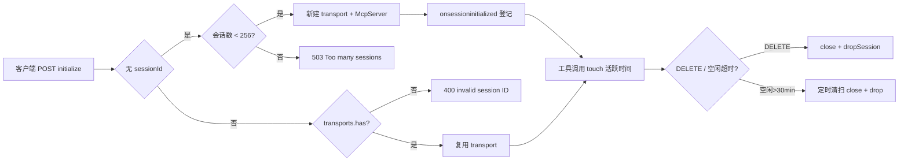
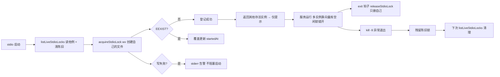
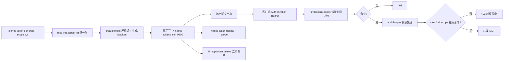
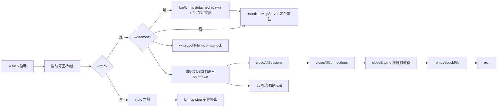

# 03-数据流转：MCP 服务专家

**本文引用的文件**
- [src/mcp-server.ts](file:///root/knowledge-indexer/src/mcp-server.ts)
- [src/lib/mcp-http.ts](file:///root/knowledge-indexer/src/lib/mcp-http.ts)
- [src/lib/mcp-stdio-lock.ts](file:///root/knowledge-indexer/src/lib/mcp-stdio-lock.ts)
- [src/lib/mcp-stop.ts](file:///root/knowledge-indexer/src/lib/mcp-stop.ts)
- [src/lib/mcp-token.ts](file:///root/knowledge-indexer/src/lib/mcp-token.ts)

## 目录
1. [简介](#简介)
2. [HTTP 会话生命周期](#http-会话生命周期)
3. [stdio lock 生命周期](#stdio-lock-生命周期)
4. [托管 Token 生命周期](#托管-token-生命周期)
5. [服务进程生命周期](#服务进程生命周期)
6. [结论](#结论)

## 简介

本文件追踪本专家的核心生命周期：HTTP 会话、stdio lock、托管 Token 与服务进程。

## HTTP 会话生命周期

图表来源：[src/lib/mcp-http.ts](file:///root/knowledge-indexer/src/lib/mcp-http.ts)（`createMcpHttpServer` 的 `handleMcpPost` / `sweepTimer`）

**生命周期要点**：
- 每个 initialize 建一个 transport + 一个 McpServer（`buildServer` 工厂），共享模块级单例 engine
- `lastActive` 追踪最近活跃；`SESSION_SWEEP_INTERVAL_MS=60s` 周期清扫空闲会话（`sessionIdleMs=30min`）
- 客户端异常断开（未发 DELETE）的残留会话不会无限堆积

## stdio lock 生命周期（多实例登记）

图表来源：[src/lib/mcp-stdio-lock.ts](file:///root/knowledge-indexer/src/lib/mcp-stdio-lock.ts)（`acquireStdioLock` / `listLiveStdioLocks` / `releaseStdioLock`）

**生命周期要点**：
- **lock 只用于进程管理定位（stop/restart/status），不再用于互斥**：多实例可并存，靠向量库空闲释放锁（3s）+ 撞锁重试（2s×3）错开共享
- 每实例一个文件（`~/.ki/mcp-stdio-<pid>.lock`），天然不误删他人
- 陈旧锁（pid 已死）在读取时自动清理，不阻塞新实例
- lock 写失败**不阻塞启动**但必须告警（否则该实例对 stop/status "失明"）

## 多 Token 生命周期（生成 → 授权 → 鉴权 → 吊销）

图表来源：[src/lib/mcp-token.ts](file:///root/knowledge-indexer/src/lib/mcp-token.ts)（`createToken` / `findTokenScopes` / `updateTokenScopes` / `deleteToken`）与 [src/lib/mcp-http.ts](file:///root/knowledge-indexer/src/lib/mcp-http.ts)（`findScopeViolation`）

**生命周期要点**：
- 生成：`wx` 独占创建（无 TOCTOU 竞态）；已存在拒绝覆盖（防已配置客户端断连）
- 读取优先级：`--token > KI_MCP_TOKEN > 托管文件`；回环绑定不读托管文件（鉴权本就禁用）
- **轮换改为按 ID 精确管理**：`ki mcp token update <id> --scope <...>` 改授权（无需换 Token）、`ki mcp token delete <id>` 吊销（立即失效，已建会话保留但新请求 401）
- 存储文件损坏时：鉴权路径 fail-closed（全部失效不崩溃），写操作与 `list` 报 `MCP_TOKEN_CORRUPT` 拒绝（防损坏静默扩散）
- `--token` / `KI_MCP_TOKEN` 为**全权**临时 Token，绕过 scope 限制，优先级高于存储

## 服务进程生命周期

图表来源：[src/mcp-server.ts](file:///root/knowledge-indexer/src/mcp-server.ts)（`startMcpServer` shutdown）与 [src/lib/mcp-http.ts](file:///root/knowledge-indexer/src/lib/mcp-http.ts)（`startHttpMcpServer` shutdown）与 [src/lib/mcp-stop.ts](file:///root/knowledge-indexer/src/lib/mcp-stop.ts)（`stopMcpInstances`）

**生命周期要点**：
- HTTP 单例 shutdown 有序：会话 → 连接 → engine（释放向量锁）→ http server → lock
- 兜底超时 5s 强制 exit，避免残留进程仍持锁
- `ki mcp stop` 定位真实持锁进程（stdio 全实例 lock + http lock + healthz 兜底），身份校验防误杀
- **daemon 在 `bin/ki.mjs` 层 detached spawn**，spawn 后 3s 存活探测：退出即 fail-loud 附前台复跑指引；**网络类慢失败（超时未退出）按成功处理**，可能假报成功，需 `ki mcp --status` 兜底；日志不落盘、无崩溃自动拉起
- `ki mcp restart` 探测目标优先级 CLI > lock > 配置 > 默认（与 `--status` 一致），强制 `--http --daemon`

## 结论

本专家的生命周期设计贯穿"接入 → 会话 → 停止"全链路：HTTP 会话有治理（上限/空闲回收）、lock 每实例独立且有陈旧清理、Token 有多租户生命周期与损坏保护、daemon 有存活探测、shutdown 有序释放向量锁。契约层已覆盖使用视角，本文件补充内部状态机供排查导航。

出处行：生成日期 2026-08-06（合并补全 2026-08-28，基线 commit 9841255）
