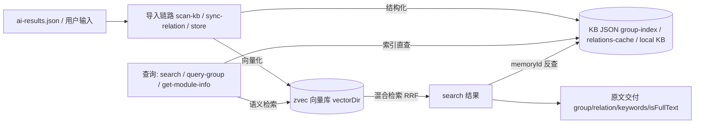

# kisearch 项目全局

## 1. 项目基本信息
- **业务领域**：AI Agent 知识索引整理工具——对外部知识进行结构化索引（Group 树 / Relation）与向量语义检索
- **项目用途**：为 AI Agent 提供跨会话长期记忆库：知识写入（scan-kb / sync-relation / store）→ 混合检索（语义 + BM25 + RRF）→ 原文交付（memoryId 反查定位），主要通过 MCP 协议暴露（同时提供 CLI 直接使用）

## 2. 技术栈
- 后端：TypeScript（ESM，Node ≥ 18），运行时用 jiti 直接执行 `.ts`（无需编译）；zvec-engine 子项目用 tsc 编译到 `dist/zvec-engine`
- 前端：React 18 + TypeScript + Vite 5（`web/` 独立工程 ki-web；react-router-dom v7 / @tanstack/react-query v5 / marked / mermaid / MCP SDK 浏览器端）
- 中间件/存储：
  - 向量库：@zvec/zvec（阿里巴巴开源，`src/zvec-engine` 自研封装）；官方 AI 向导文档（专为 AI 设计）：<https://zvec.org/llms.txt>
  - KB 数据：本地 JSON 文件（默认 `~/.ki/kb/{scope}/`：group-index / relations-cache / local KB），WAL 原子写入；备份 `~/.ki/backup`、向量库 `~/.ki/vector`（**不做存量路径继承**）
  - 配置：YAML（`~/.ki/config.yaml`，`--config` 可覆盖）；加载时经 `src/lib/config-schema.ts` 做字段名/类型/取值校验，非法 fail-loud

## 3. 架构形态
- **前后端**：前端 `web/`（React SPA，构建产物 `web/dist` 由 `ki mcp --http --web` 同源静态托管）；后端纯 CLI + MCP Server（无独立后端 API 进程，`/api/*` 扩展接口挂在 MCP HTTP 服务上）
- **部署形态**：单体本地工具；MCP 支持 stdio 模式（**多实例并存**，靠向量库空闲释放锁错开共享）与 HTTP 共享单例模式（多 IDE 共享同一持锁进程，可 `--daemon` 后台常驻）

## 4. 核心功能
- 知识导入：`ki scan-kb import/scan/vectorize` 5-Phase 导入链路（校验 → 批量向量化 → Group 树 → relations-cache → local KB → source 记录）；`--group` 指定落点的**幂等追加**承载增量（重复执行同命令即更新），断点续跑走向量化进度文件。*（`diff` 子命令与 `incremental/diff` 模块已删除，勿再引用）*
- 混合检索：zvec 语义向量 + BM25 全文 + RRF 融合；camelCase 符号精确召回；tag 分层过滤（ki-search/ki-relation/ki-path）
- 索引直查：Group 树导航 / Relation 热缓存 / 模块原文查询，已知路径时 100% 精准命中
- 原文交付：search 结果按 memoryId 反查定位（group/relation/keywords/isFullText），交付原文全文
- MCP 集成：`ki mcp` 暴露 13 个工具（stdio / HTTP / daemon 守护进程 / 多 Token + scope 授权 / 启动预检）
- 数据治理：评分衰减 + 冷热分区 + 使用计数；WAL 原子写 + 跨进程锁；备份 / 还原 / 导出

## 5. 核心服务清单（本仓库内）

| 服务/模块名 | 一句话职责 | 代码位置 | 测试可执行性 |
|---|---|---|---|
| 向量引擎（zvec-engine） | ZvecEngine 基座：worker 代理、embedding（SiliconFlow）、schema/filter/搜索路由、RRF 混合检索、11 种类型化异常 | `src/zvec-engine/`（独立子项目，tsconfig.src.json 构建到 dist） | ✅ 可跑（`npm run test:zvec-engine`，7 个 node --test；embedding 用例 ⚠️ 依赖外部 API Key） |
| 存储与配置基础 | JSON 落盘（WAL 原子写+跨进程锁）、scope 隔离、配置加载与**字段级校验**、备份/还原/导出、doctor 诊断、scope 生命周期 | `src/lib/{store,wal,scope,config,config-schema,...}.ts` + `src/{backup,restore,export,config,scope,doctor}.ts` | ✅ 可跑（test:config-doctor / test:restore / test:scope-* 等；⚠️ 本机需 `env -u NODE_OPTIONS -u BASH_ENV`） |
| 知识索引导入 | 5-Phase 导入、**幂等追加**（替代原增量 diff）、批量向量化、断点续跑、向量重建 | `src/lib/{import,batch-vectorize,path-vectorize,rebuild-vector,...}.ts` + `src/scan-kb.ts` | ✅ 可跑（test:scan-kb / test:rebuild-vector 等；import-vector-rebuild 需 embedding 环境未纳入常规回归） |
| 检索与向量客户端 | Vector Adapter（async 封装引擎）、hybridSearch、tag 优先级、isFullText、memoryId 反查 | `src/lib/{vector-client,relation-map}.ts` + `src/{search,store,doc,tag,bulk-store}.ts` | ✅ 可跑（test:vector-cli-functions / test:relation-map 等）；⚠️ 真实召回需 embedding API Key |
| 关系与索引管理 | 关系回写、评分冷热分区、Group 树 CRUD、Wiki 写回、模块信息查询、关系四层删除 | `src/lib/{scoring,group-resolve,wiki-sync}.ts` + `src/{sync-relation,query-group,manage-index,get-module-info,delete-relation}.ts` | ✅ 可跑（test:sync-relation / test:query-group / test:manage-index / test:get-module-info） |
| MCP 服务 | MCP Server（stdio/HTTP 单例/daemon）、13 工具注册、多实例锁管理、**多 Token + scope 授权（RBAC）**、启动预检、`/api/*` 与 `--web` 静态托管 | `src/mcp-server.ts` + `src/lib/mcp-tools/*` + `src/lib/{mcp-http,mcp-http-api,mcp-stdio-lock,mcp-stop,mcp-token,net-addr,version-guard}.ts` | ✅ 可跑（test:mcp-http / mcp-http-api / mcp-daemon / mcp-stdio-lock / mcp-stop / mcp-token）；e2e ⚠️ 依赖网络 |
| 可视化前端（ki-web） | React SPA：总览/浏览/语义搜索/上传导入/知识写入，经同源 MCP + /api 双通道与后端通信 | `web/`（独立 Vite 工程，构建产物 web/dist 由 --web 托管） | ⚠️ web 内无单测（tsc typecheck + 后端 mcp-http-api 测试间接覆盖 + 手动回归） |

> 测试可执行性标注「❌ 无法运行 / 无测试」的服务，创建/使用其专家时**跳过测试内容**。当前无此标注项。
> 说明：embedding 相关测试需要 `SILICONFLOW_API_KEY` 环境变量；全部单元测试可用 `npm run test:all` 运行。

## 6. 配套服务关系（独立部署的配套服务）

| 服务A | 关系 | 服务B | 说明 |
|---|---|---|---|
| kisearch（CLI/MCP） | 依赖 | zvec（@zvec/zvec 向量库） | 混合检索与向量持久化的底层引擎；官方 AI 向导文档：<https://zvec.org/llms.txt> |
| kisearch（MCP HTTP） | 依赖 | 本地 HTTP 服务（默认 127.0.0.1:7423） | MCP 共享单例模式，多 IDE 接入 |
| kisearch | 依赖 | SiliconFlow Embedding API | 文本向量化（模型 Qwen/Qwen3-Embedding-8B） |
| kisearch | 可选协作 | Zvec Studio | 可视化查看集合/数据/查询调试 |

## 7. 运行环境（解释器/执行方式）

| 场景 | 推荐方式 | 说明 |
|---|---|---|
| CLI 命令 | `ki <command>`（bin/ki.mjs 分发）或 `npx jiti src/<command>.ts` | 已 `npm link` 或源码目录内 |
| 单元测试（.ts） | `npm test` / `npm run test:all` | jiti 直接跑 test/*.test.ts |
| zvec 引擎测试（.mjs） | `npm run test:zvec-engine` | node --test，先 `npm run build:zvec-engine` 构建 dist |
| 构建 zvec-engine | `npm run build:zvec-engine` | tsc -p tsconfig.src.json → dist/zvec-engine |
| MCP Server | `ki mcp`（stdio）/ `ki mcp --http`（HTTP） | embedding API Key 需在环境变量中（MCP 客户端 env 显式传入） |
| e2e 测试 | `npm run test:e2e:...` | 需要网络与真实 API Key |

## 8. 架构图（服务级）

```mermaid
graph LR
    A[AI Agent / IDE] -->|MCP stdio/HTTP| B[MCP Server]
    B --> C[CLI 命令层 src/*.ts]
    C --> D[核心逻辑层 src/lib/]
    D --> E[Vector Adapter vector-client]
    E --> F[ZvecEngine 向量引擎 src/zvec-engine/]
    F --> G[(zvec 向量库)]
    D --> H[(KB JSON kb/{scope}/)]
    H -->|WAL 原子写| I[跨进程锁]
```

## 9. 数据流向图（服务级）


