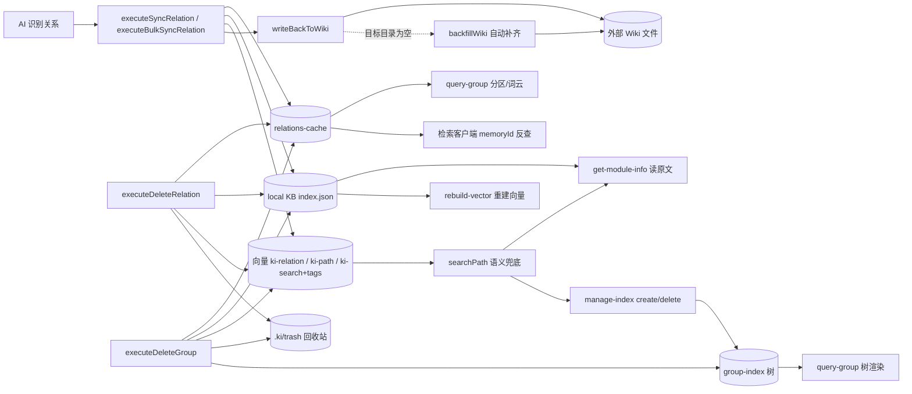

# C4-数据流向与消费：关系与索引管理专家

> 本专家是关系数据的**写入与治理端**，产出被检索、导入等模块消费。
> 只写数据"用来干嘛"（黑盒），不写消费方的处理逻辑。
> 上次全量核对：2026-08-28（git commit `9841255`）

## 数据实体总览

| 数据实体 | 来源接口 | 去向 | 消费方 | 业务用途 |
|----------|----------|------|--------|----------|
| `relations-cache.json` | `executeSyncRelation` / `executeBulkSyncRelation` / `executeGetModuleInfo` / `executeDeleteRelation` / `executeDeleteGroup` / `manage-index delete` | `~/.ki/kb/{scope}/relations-cache.json` | 检索客户端（memoryId 反查）、query-group（分区数据源）、知识导入（共用格式）、export（收集） | 关系元数据与评分分区的唯一权威源 |
| local KB `index.json` | `executeSyncRelation` / `executeBulkSyncRelation`（写入）；`executeDeleteRelation` / `executeDeleteGroup`（删除） | `~/.ki/kb/{scope}/{groupPath}/index.json` | get-module-info（读原文）、rebuild-vector（重建向量）、export、restore | Group 级 Markdown 原文（moduleInfo），向量丢失后据此重建 |
| 关系向量（`ki-relation`） | `executeSyncRelation` / `executeBulkSyncRelation` | 向量集合（tag `ki-relation`） | `searchPath(…, 'ki-relation', …)` 的 Relation 语义兜底（get-module-info） | Relation 名称模糊定位 |
| 路径向量（`ki-path`） | `executeSyncRelation` / `executeBulkSyncRelation` | 向量集合（tag `ki-path`） | `resolveGroupPath` 与 query-group 的语义兜底 | Group 路径模糊定位 |
| 内容向量（`ki-search` + 自定义 tags） | `executeSyncRelation` / `executeBulkSyncRelation` | 向量集合 | `ki search` / MCP `ki_search` 语义召回 | 关系内容可被检索召回（唯一对外可见的检索面） |
| `group-index.json` | `executeManageCreate` / `executeManageDeleteEmpty` / `executeDeleteGroup` / `manage-index delete` | `~/.ki/kb/{scope}/group-index.json` | query-group（树渲染）、group-resolve（路径解析）、知识导入（建树）、export（子树收集） | Group 树层级结构 |
| Wiki 文件（外部） | `writeBackToWiki` / `backfillWiki` | `{sourceDir}/{group}/{relation}.md` | 外部 Wiki 用户 / git 仓库 | moduleInfo 回写外部知识源，形成"AI 整理 → Wiki 落盘"闭环 |
| 回收站（`.ki/trash/`） | `executeDeleteRelation`（文件）/ `executeDeleteGroup`（目录） | `{sourceDir}/.ki/trash/{group}/…` | 人工恢复 | 删除不物理销毁，保留原 group 结构与可恢复性 |
| `relation.tags`（KB 层字段） | `executeSyncRelation` / `executeBulkSyncRelation` | `relations-cache.json` 内 `hot_relations[].tags` | rebuild-vector / restore（恢复 tag 向量）、`/api/doc/list` tag 过滤 | 自定义标签持久化，使重建与还原后标签不丢 |

## 逐实体详述

### 1. relations-cache.json
- **来源接口**：`executeSyncRelation`、`executeBulkSyncRelation`（写入/更新）、`executeGetModuleInfo`（记使用改评分）、`executeDeleteRelation` / `executeDeleteGroup`（删除）、`manage-index delete`（级联删键）
- **去向**：`~/.ki/kb/{scope}/relations-cache.json`
- **消费方**（>3 归纳）：检索客户端（memoryId 反查召回源）、query-group（分区与词云数据源）、知识索引导入（共用同一格式追加）、export / rebuild / restore（遍历源）
- **业务用途**：关系的元数据中心——`groups` 为**平铺完整路径键**（如 `wiki/docs` 与 `wiki` 是彼此独立的键），级联操作靠 `startsWith(group + '/')` 前缀匹配；`partition_config` 承载该 scope 的冷热分区参数

### 2. local KB index.json
- **来源接口**：`executeSyncRelation` / `executeBulkSyncRelation`（写）、`executeDeleteRelation`（删条目）、`executeDeleteGroup`（递归删目录）
- **去向**：`~/.ki/kb/{scope}/{groupPath}/index.json`
- **消费方**：get-module-info（直查读原文）、rebuild-vector（按原文重建向量）、备份/还原、export（收集）
- **业务用途**：原始文档持久层；向量丢失或损坏后可据此重建（双层数据：local KB 存原文，向量存清洗后 chunk）

### 3. 向量（ki-relation / ki-path / ki-search / 自定义 tags）
- **来源接口**：`executeSyncRelation`（一次批量 embed）、`executeBulkSyncRelation`（全批一次 embed + 一次 upsert）
- **去向**：嵌入式向量库（tag 区分类型）
- **消费方**：`ki search` 语义召回（内容向量）；`searchPath` 语义兜底（`ki-path` / `ki-relation`）
- **业务用途**：内容向量支撑"能被搜到"；路径/关系向量是辅助定位面，不参与主检索
- **回收**：`executeDeleteRelation` 按 `memoryIds` 精确清理（缺省走 search 严格匹配兜底）；`executeDeleteGroup` 聚合全部 `memoryIds` 一次删除，失败时以 `vectorRemoved: false` 显式暴露残留

### 4. group-index.json
- **来源接口**：`executeManageCreate`（建节点）、`executeManageDeleteEmpty`（删空节点）、`executeDeleteGroup`（删节点并级联清理空父节点）、`manage-index delete --force`
- **去向**：`~/.ki/kb/{scope}/group-index.json`
- **消费方**：query-group（树渲染）、group-resolve（路径解析与补全）、知识导入（ensureGroups 建树）、export（子树收集）、`getSource`（source 块）
- **业务用途**：Group 树层级结构；其 `source` 块同时决定 wiki 写回目录的第一优先级

### 5. Wiki 文件（外部）
- **来源接口**：`writeBackToWiki`（单条，含目标目录为空时的 autoBackfill）、`backfillWiki`（历史全量补齐，幂等）
- **去向**：`{sourceDir}/{group}/{relation}.md`（group 即完整相对路径，无前缀剥离）
- **消费方**：外部 Wiki 用户 / 版本库
- **业务用途**：把 AI 整理的知识同步回外部知识源

### 6. 回收站 `.ki/trash/`
- **来源接口**：`executeDeleteRelation`（文件级 `moveToTrash`）、`executeDeleteGroup`（目录级 `moveDirToTrash`）
- **去向**：`{sourceDir}/.ki/trash/{group}/…`（保留 group 完整相对路径；重名追加 ISO 时间戳）
- **消费方**：人工恢复
- **业务用途**：删除可恢复——替代此前的物理删除，避免误删不可挽回

## 数据流图

图表来源：[src/sync-relation.ts](file:///root/knowledge-indexer/src/sync-relation.ts)、[src/delete-relation.ts](file:///root/knowledge-indexer/src/delete-relation.ts)、[src/lib/wiki-sync.ts](file:///root/knowledge-indexer/src/lib/wiki-sync.ts)

## 备注

- **`memoryId` 与 `memoryIds` 并存**：`memoryId` 是 `ki-search` 主条 docId（向后兼容），`memoryIds` 是全部内容向量 docId（每个自定义 tag 各一）。删除以 `memoryIds` 为准，避免多 tag 场景残留孤儿向量。
- **消费方结论基于引用扫描**，模块外消费方（如 export / rebuild）未深入验证其内部处理逻辑。
