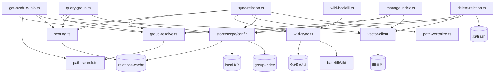

# 01-架构：关系与索引管理专家

**本文引用的文件**
- [src/sync-relation.ts](file:///root/knowledge-indexer/src/sync-relation.ts)
- [src/delete-relation.ts](file:///root/knowledge-indexer/src/delete-relation.ts)
- [src/query-group.ts](file:///root/knowledge-indexer/src/query-group.ts)
- [src/manage-index.ts](file:///root/knowledge-indexer/src/manage-index.ts)
- [src/get-module-info.ts](file:///root/knowledge-indexer/src/get-module-info.ts)
- [src/wiki-backfill.ts](file:///root/knowledge-indexer/src/wiki-backfill.ts)
- [src/lib/scoring.ts](file:///root/knowledge-indexer/src/lib/scoring.ts)
- [src/lib/group-resolve.ts](file:///root/knowledge-indexer/src/lib/group-resolve.ts)
- [src/lib/wiki-sync.ts](file:///root/knowledge-indexer/src/lib/wiki-sync.ts)
- [src/lib/path-search.ts](file:///root/knowledge-indexer/src/lib/path-search.ts)

## 目录
1. [简介](#简介)
2. [模块职责与边界](#模块职责与边界)
3. [架构分层](#架构分层)
4. [依赖关系](#依赖关系)
5. [关键设计决策](#关键设计决策)
6. [对外接口与契约层索引](#对外接口与契约层索引)
7. [术语表](#术语表)
8. [关键发现与主要风险](#关键发现与主要风险)
9. [结论](#结论)

## 简介

本专家是 kisearch 的**关系（Relation）与索引管理**：关系写入（四层联动）、批量写入、评分冷热分区、Group 树 CRUD、目录级级联删除、Wiki 写回与历史补齐、模块信息查询与关系四层删除。

当前代码形态（2026-08-28 核对）相比 2026-08-06 首版有四处结构性变化：**rootName 概念移除**（group 即完整相对路径）、**批量写入路径独立**（`executeBulkSyncRelation` 一次 embed + 一次 upsert）、**目录级删除**（`executeDeleteGroup` + `.ki/trash` 回收站）、**Wiki 补齐与自动补齐**（`backfillWiki` + autoBackfill）。

章节来源：[src/sync-relation.ts](file:///root/knowledge-indexer/src/sync-relation.ts)（关键符号：`executeSyncRelation` / `executeBulkSyncRelation`）与 [src/delete-relation.ts](file:///root/knowledge-indexer/src/delete-relation.ts)（关键符号：`executeDeleteRelation` / `executeDeleteGroup`）

## 模块职责与边界

**职责**：
- 关系回写：单条（`executeSyncRelation`）与批量（`executeBulkSyncRelation`），四层（cache + local KB + 向量 + Wiki）
- 评分引擎：使用密度评分、防刷、新兴识别、冷热分区、边界衰减
- Group 树 CRUD：create / 空节点删除 / `--force` 级联删除 / list-scopes
- Group 查询：分区渲染 + 词云 + 树渲染（文本输出）
- 模块信息查询：local KB 直查 + 语义兜底 + 记一次使用
- 关系删除：文档级四层联动 + 目录级子树级联 + 批量删除
- Wiki 写回：单条写回 + 历史补齐（`backfillWiki`）+ 目录为空自动补齐

**边界**（不做什么）：
- 不提供批量知识导入（属知识索引导入专家，共用 relations-cache / group-index / local KB 格式）
- 不提供语义检索与原文定位（属检索与向量客户端专家）
- 不提供备份 / 还原（属存储与配置基础专家）
- 不做内容生成（moduleInfo 由调用方 AI 生成）
- 不向 MCP 暴露级联删除（NEG-15 决策，仅 CLI 可达）

章节来源：[src/manage-index.ts](file:///root/knowledge-indexer/src/manage-index.ts)（关键符号：`executeManageCreate` / `executeManageDeleteEmpty`）与 [src/lib/mcp-tools/manage-index.ts](file:///root/knowledge-indexer/src/lib/mcp-tools/manage-index.ts)（关键符号：`registerManageIndexTools`）

## 架构分层

```
CLI 层      sync-relation  query-group  manage-index  get-module-info  delete-relation  wiki-backfill
（commander）      │            │             │               │                │               │
MCP 工具层   mcp-tools/{sync-relation, bulk-sync-relation, query-group, manage-index,
             get-module-info, delete-relation}.ts  ── 全部转调下方 execute* 纯函数
                   │
纯函数层     executeSyncRelation / executeBulkSyncRelation / executeQueryGroup /
（可复用）    executeManageCreate|DeleteEmpty|ListScopes / executeGetModuleInfo /
             executeDeleteRelation|DeleteGroup|BatchDelete / backfillWiki
                   │
核心逻辑层    scoring.ts    group-resolve.ts   wiki-sync.ts   path-search.ts
                   │
基础层        vector-client.ts（写入/删除/探测）   store.ts / scope.ts / config.ts
                   │
数据层        relations-cache  local KB  group-index  向量库  外部 Wiki  .ki/trash
```



图表来源：[src/sync-relation.ts](file:///root/knowledge-indexer/src/sync-relation.ts)（关键符号：`executeSyncRelation` 四层调用链）与 [src/delete-relation.ts](file:///root/knowledge-indexer/src/delete-relation.ts)（关键符号：`executeDeleteGroup` 级联链）

章节来源：[src/sync-relation.ts](file:///root/knowledge-indexer/src/sync-relation.ts)（关键符号：`executeSyncRelation` / `syncSingleRelation`）与 [src/delete-relation.ts](file:///root/knowledge-indexer/src/delete-relation.ts)（关键符号：`executeDeleteRelation` / `executeDeleteGroup`）

## 依赖关系

| 依赖方 | 被依赖方 | 说明 |
|--------|----------|------|
| `sync-relation.ts` | `scoring.ts` / `group-resolve.ts` / `wiki-sync.ts` / `path-vectorize.ts` / `vector-client.ts` / `store.ts` / `scope.ts` / `constants.ts` | 关系回写四层；`path-vectorize.buildRelationContent` 构造 `ki-relation` 文本 |
| `delete-relation.ts` | `group-resolve.ts` / `vector-client.ts` / `store.ts` / `scope.ts` / `config.ts` | 四层删除 + 回收站；wiki 定位复用 `getSource`/`getScopeWikiSync` 同一优先级 |
| `query-group.ts` | `scoring.ts`（`partitionByScore`）/ `group-resolve.ts` / `vector-client.ts` / `store.ts` / `constants.ts` | 分区渲染 + 语义兜底 |
| `manage-index.ts` | `store.ts` / `scope.ts` / `group-resolve.ts` / `vector-client.ts` / `config.ts` | 树 CRUD + 级联清向量 |
| `get-module-info.ts` | `group-resolve.ts` / `path-search.ts` / `scoring.ts` / `store.ts` / `vector-client.closeEngine` | 读原文 + 更新评分 |
| `wiki-backfill.ts` | `wiki-sync.backfillWiki` / `config.ts` / `scope.ts` / `cli-args.ts` | 历史补齐 CLI 壳 |
| `group-resolve.ts` | `path-search.ts` / `scope.ts` | 路径解析（向量兜底需传 scope） |
| `wiki-sync.ts` | `scope.ts` / `config.ts` / `markdown-gen.ts` | Wiki 写回与补齐 |

**外部依赖**：`dist/zvec-engine`（经 `vector-client`）、`commander`（CLI）、`zod`（MCP 参数 schema）。

章节来源：[src/query-group.ts](file:///root/knowledge-indexer/src/query-group.ts)（关键符号：`executeQueryGroup` / `partitionRelations`）与 [src/lib/group-resolve.ts](file:///root/knowledge-indexer/src/lib/group-resolve.ts)（关键符号：`resolveGroupPath`）

## 关键设计决策

1. **纯函数层与入口层分离**：所有 CLI 命令与 MCP 工具都转调同名的 `execute*` 纯函数（`src/lib/mcp-tools/*` 只做 zod 参数校验 + 超时包装 + RBAC 过滤）。新增能力只需加纯函数，两个入口复用。
2. **批量写入取代并发单条**（2026-08-13）：`executeBulkSyncRelation` 先在内存中逐条改 cache 并收集 entries，再一次 `vectorBulkStore`（一次 embedding HTTP + 一次 worker upsert）后统一落盘，解决"MCP 并发调 `ki_sync_relation` 慢"。
3. **数据守恒（M1/M2）**：向量写入顺序为"先写新、成功后再清旧"。部分失败时保留旧向量，避免"删旧丢新"；`vectorStored` 区分"全部成功 / 部分成功（带 `vectorReason`）/ 全部失败"。
4. **同批去重**：同 `(group, relation)` 后一条覆盖前一条，前一条的 entries 被剔除，避免产生两个 docId 的孤儿向量，以及后一条的 stale 清理误删前一条刚写入的向量。
5. **`rootName` 已移除**（2026-08-14）：group 即完整相对路径，wiki 落盘路径不再剥离前缀；路径解析的"自动补全"改为"在顶层 Group 下整段补全"。
6. **级联删除靠平铺键前缀**：relations-cache 的 `groups` 是平铺完整路径键，`executeDeleteGroup` 用 `key === group || key.startsWith(group + '/')` 收集级联范围；空路径卫兵拦截（防 `rmSync` 删到整个 scope）。
7. **删除不物理销毁**：wiki 文件/目录统一移入 `{sourceDir}/.ki/trash/{group}/`（保留结构、重名加时间戳）。
8. **向量残留显式反馈**：`executeDeleteGroup` 的 `vectorRemoved: false` 让"索引已删但仍能搜到"浮出水面；`NOT_FOUND` 视为已清理（幂等重删不误报）。
9. **wikiSync 门禁统一**（2026-08-27）：`enabled === false` 时同时禁用单条写回与 `backfillWiki`（此前只对 fallback 路径生效，source.dir 存在时会绕过）。
10. **autoBackfill 防递归**：`writeBackToWikiInner` 以 `allowAutoBackfill` 参数控制，`backfillWiki` 内部逐条写回时传 `false`。
11. **Wiki 补齐缺省幂等**：跳过已存在文件，避免 `generateMarkdown` 的 `exportedAt` 刷新造成 git 全量脏 diff；`--force` 才覆盖写。
12. **MCP 删除能力受限**（NEG-15）：级联删除属不可逆操作且 MCP 无二次确认交互，只开放"空节点删除"这一非破坏性子集；非空一律拒绝并引导 CLI。

章节来源：[src/sync-relation.ts](file:///root/knowledge-indexer/src/sync-relation.ts)（关键符号：`executeBulkSyncRelation`）与 [src/lib/wiki-sync.ts](file:///root/knowledge-indexer/src/lib/wiki-sync.ts)（关键符号：`writeBackToWikiInner` / `backfillWiki`）

章节来源：[src/lib/mcp-tools/manage-index.ts](file:///root/knowledge-indexer/src/lib/mcp-tools/manage-index.ts)（关键符号：`registerManageIndexTools`）与 [src/lib/mcp-tools/delete-relation.ts](file:///root/knowledge-indexer/src/lib/mcp-tools/delete-relation.ts)（关键符号：`registerDeleteRelationTool`）

## 对外接口与契约层索引

- 契约层：`../C0-使用总览.md`、`../C1-能力契约.md`、`../C2-使用流程.md`、`../C4-数据流向与消费.md`
- 实现层索引：`02-实现.md`、`03-数据流转.md`、`04-模型.md`、`06-测试.md`、`07-运维.md`

章节来源：[src/lib/mcp-tools/query-group.ts](file:///root/knowledge-indexer/src/lib/mcp-tools/query-group.ts)（关键符号：`registerQueryGroupTool`）与 [src/lib/mcp-tools/get-module-info.ts](file:///root/knowledge-indexer/src/lib/mcp-tools/get-module-info.ts)（关键符号：`registerGetModuleInfoTool`）

## 术语表

| 术语 | 含义 |
|------|------|
| 冷热分区 | 按评分与新兴识别把条目分为 hot / warm / cold 三区（另有 emerging 视图） |
| 新兴（emerging） | `recentHours` 内被使用过的条目，有独立热区保留席位 |
| 四层联动 | relations-cache + local KB + 向量 + Wiki 的一致性写入/删除 |
| 平铺完整路径键 | relations-cache 的 `groups` 用完整路径作键（`wiki` 与 `wiki/docs` 彼此独立） |
| 目录级删除 | 删除整个 group 子树（含子 group）的数据与树节点 |
| 回收站 | `{sourceDir}/.ki/trash/{group}/`，删除的 wiki 文件/目录的落点 |
| autoBackfill | wiki 目标目录不存在或为空时，写回前自动全量补齐历史关系 |
| memoryId / memoryIds | 内容向量主 docId / 全部内容向量 docId（多 tag 各一） |

## 关键发现与主要风险

- **relations-cache 是跨模块共享契约**：与知识索引导入专家共用 `Relation` 结构与文件格式；改动须连带导入链路（已记入 ki 强关联）。
- **删除路径有两条且语义不同**：`manage-index --force`（不动 wiki）vs `delete-relation -g <group>`（连 wiki 一起移入回收站）。误用会留下 wiki 残留或过度删除。
- **孤儿向量风险**：写入向量失败、或 `memoryId` 缺失时，删除只能靠 `vectorSearch` 严格匹配兜底（依赖 relation 名作标题前缀），改名后的旧向量可能残留。
- **`get-module-info` 有写副作用**：读取即记一次使用并回写 cache，只读语义不成立。
- **wiki 文件会随 sync 增长**：每个 relation 一个 `.md`，需定期用 `delete-relation` 或目录级删除清理。

章节来源：[src/lib/scoring.ts](file:///root/knowledge-indexer/src/lib/scoring.ts)（关键符号：`PartitionConfig` / `Relation`）与 [src/lib/wiki-sync.ts](file:///root/knowledge-indexer/src/lib/wiki-sync.ts)（关键符号：`WikiBackfillResult`）

## 结论

本专家以"纯函数层 + 双入口"为骨架，用四层联动保证一致性，用批量 embed、数据守恒、级联前缀匹配、回收站与显式残留反馈保证治理可靠性；rootName 移除后路径语义更直白，Wiki 补齐链路补齐了"先导入后开启"的历史数据缺口。

出处行：更新 2026-08-28  git commit：`9841255`
