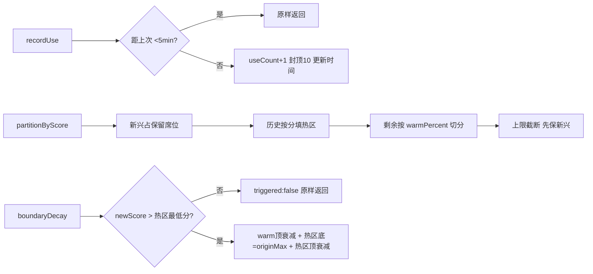
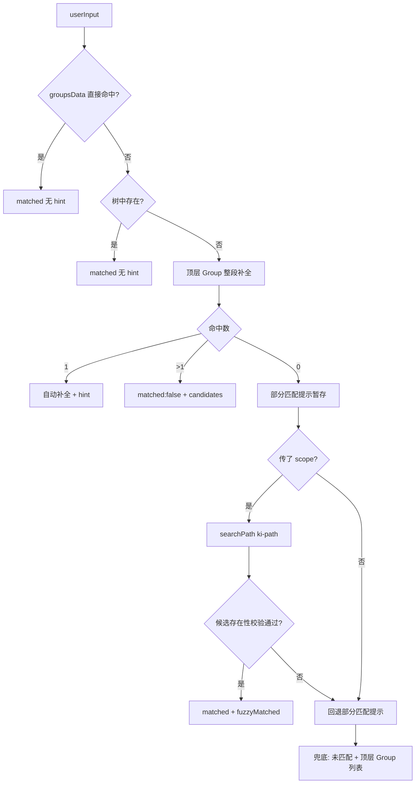
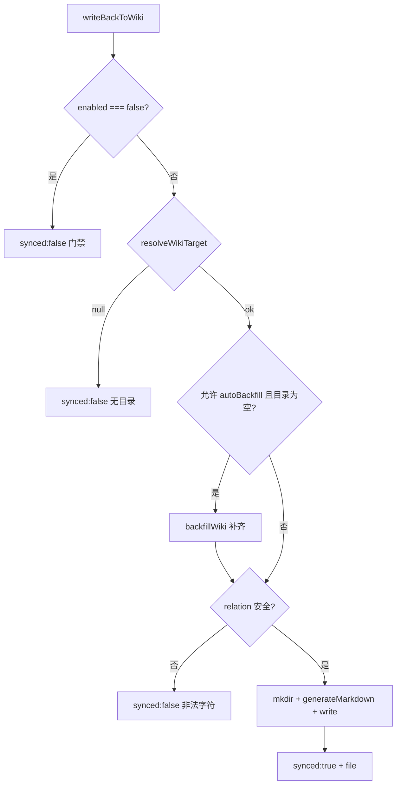
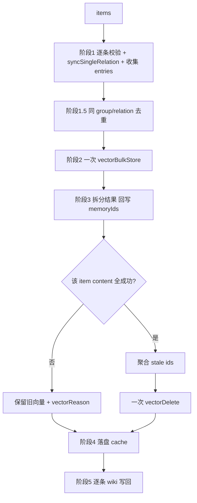
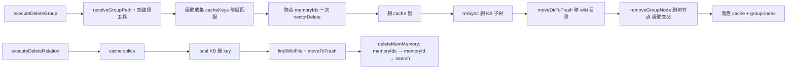

# 02-实现：关系与索引管理专家

**本文引用的文件**
- [src/lib/scoring.ts](file:///root/knowledge-indexer/src/lib/scoring.ts)
- [src/lib/group-resolve.ts](file:///root/knowledge-indexer/src/lib/group-resolve.ts)
- [src/lib/wiki-sync.ts](file:///root/knowledge-indexer/src/lib/wiki-sync.ts)
- [src/lib/path-search.ts](file:///root/knowledge-indexer/src/lib/path-search.ts)
- [src/sync-relation.ts](file:///root/knowledge-indexer/src/sync-relation.ts)
- [src/query-group.ts](file:///root/knowledge-indexer/src/query-group.ts)
- [src/manage-index.ts](file:///root/knowledge-indexer/src/manage-index.ts)
- [src/delete-relation.ts](file:///root/knowledge-indexer/src/delete-relation.ts)
- [src/wiki-backfill.ts](file:///root/knowledge-indexer/src/wiki-backfill.ts)

## 目录
1. [简介](#简介)
2. [评分引擎实现](#评分引擎实现)
3. [Group 路径解析实现](#group-路径解析实现)
4. [路径语义搜索实现](#路径语义搜索实现)
5. [Wiki 写回与补齐实现](#wiki-写回与补齐实现)
6. [关系回写实现](#关系回写实现)
7. [批量关系回写实现](#批量关系回写实现)
8. [Group 查询实现](#group-查询实现)
9. [Group 树管理实现](#group-树管理实现)
10. [关系与目录删除实现](#关系与目录删除实现)
11. [结论](#结论)

## 简介

本文件剖析关系与索引管理的核心实现：评分引擎、路径解析、语义兜底、Wiki 写回/补齐、关系回写（单条与批量）、Group 查询、树管理与删除链路。

章节来源：[src/lib/scoring.ts](file:///root/knowledge-indexer/src/lib/scoring.ts)（关键符号：`calculateScore` / `partitionByScore`）与 [src/sync-relation.ts](file:///root/knowledge-indexer/src/sync-relation.ts)（关键符号：`executeSyncRelation`）

## 评分引擎实现

`scoring.ts` 全部导出为纯函数（返回新对象，不修改入参）：

- `calculateScore(useCount, lastUsedTime, now, halfLifeHours = 24)`：`useCount === 0` 时短路返回 `0`；否则 `useCount / (1 + hoursSinceLastUse / halfLifeHours)`，`lastUsedTime` 为空时 `hoursSinceLastUse` 取 0。
- `recordUse(relation, now)`：`now - lastUsedTime < MIN_RECORD_INTERVAL_MINUTES * 60_000` 时原样返回入参；否则 `useCount = min(useCount + 1, MAX_USE_COUNT)` 并更新 `lastUsedTime`。**不重算 score**，由调用方自行调用 `calculateScore`。
- `hybridPartition(items, now, config)`：先用 `calculateScore` 刷新每条 score，再按 `recentHours` 构造 `emergingIdSet`，委托 `partitionByScore`，新兴项以 `lastUsedTime` 作排序依据。
- `partitionByScore<T>(items, accessors, config)`：泛型核心。算法顺序为 ① 全量按分降序；② 新兴项按 `getEmergingSortScore ?? getScore` 降序占 `min(reservedEmerging, 新兴数)` 个热区席位；③ 历史席位 `max(minHotCount, ceil(n * hotPercent))` 按分填充；④ 剩余按 `ceil(n * warmPercent)` 切 warm/cold；⑤ 上限截断——`maxHotCount` 触发时若 `emergingHeldCount >= maxHotCount` 直接截断，否则保留全部新兴席位再补历史。
- `boundaryDecay(hotItems, warmItems, newScore, decayStep = 5)`：触发条件为 `hotItems.length > 0 && newScore > 热区最低分`。步骤为保存 warm[0].score 为 `originMax` → warm[0].score 减 `decayStep`（下限 0）→ 热区最低分置为 `originMax` → 热区最高分减 `decayStep`。**单元素退化**：热区仅 1 项时只执行最后一步，不覆盖为 `originMax`。

图表来源：[src/lib/scoring.ts](file:///root/knowledge-indexer/src/lib/scoring.ts)（关键符号：`recordUse` / `partitionByScore` / `boundaryDecay`）

章节来源：[src/lib/scoring.ts](file:///root/knowledge-indexer/src/lib/scoring.ts)（关键符号：`calculateScore` / `hybridPartition`）与 [src/lib/constants.ts](file:///root/knowledge-indexer/src/lib/constants.ts)（关键符号：`DEFAULT_PARTITION_CONFIG` / `MAX_USE_COUNT`）

## Group 路径解析实现

`resolveGroupPath(userInput, groupIndex, groupsData, scope?)` 四级降级：

1. **直接匹配**：`groupsData[userInput]` 命中（relations-cache 有数据的 Group）；
2. **树直接匹配**：`pathExistsInTree(groupIndex.groups, userInput)`（路径存在但无 Relation 数据也算成功）；
3. **整段补全**：对每个顶层 Group 拼 `${top}/${userInput}` 试探——唯一命中自动补全并给出 `hint`，多命中返回 `candidates` + `matched: false`；
4. **部分匹配 + 语义兜底**：先用 `findLongestExistingPrefix` 生成"补全过程 + 失败段 + 最近前缀的子节点"提示（暂不返回），再在**传了 scope 时**调用 `searchPath(userInput, 'ki-path', scope)`；向量候选须通过 `pathExistsInTree` 或 `groupsData` 存在性校验才采纳（`fuzzyMatched: true`）。两者皆失败才用部分匹配提示，最后兜底为"未匹配到任何 Group + 可用顶层 Group 列表"。

工具函数 `pathExistsInTree` / `findLongestExistingPrefix` 逐级遍历树；`getDirectChildren` 传空串等价于取顶层节点。

图表来源：[src/lib/group-resolve.ts](file:///root/knowledge-indexer/src/lib/group-resolve.ts)（关键符号：`resolveGroupPath`）

章节来源：[src/lib/group-resolve.ts](file:///root/knowledge-indexer/src/lib/group-resolve.ts)（关键符号：`resolveGroupPath` / `pathExistsInTree` / `findLongestExistingPrefix` / `getDirectChildren`）

## 路径语义搜索实现

`searchPath(query, tag, scope, threshold = 0)`：空 query 返回 `null`；调用 `vectorSearch({ scope, query, tags: tag, limit: 1 })`（走 hybrid RRF）。无结果返回 `{ matched: false, rawText: '', extractedPath: '', score: 0 }`；有结果时 `extractPathFromContent` 提取路径，再按 `score >= threshold` 判定 `matched`（低于阈值保留 `rawText` 与 `score` 但 `extractedPath` 为空）。任何异常 stderr 提示后返回 `null`。

`extractPathFromContent(content, tag)`：先剥离 `^【标签:[^】]*】\s*` 前缀；`ki-path` 取 `|` 前部分并把空白转 `/`；`ki-relation` 取 `|` 前的名称部分。

章节来源：[src/lib/path-search.ts](file:///root/knowledge-indexer/src/lib/path-search.ts)（关键符号：`searchPath` / `extractPathFromContent` / `PathSearchResult`）

## Wiki 写回与补齐实现

`writeBackToWiki` 是 `writeBackToWikiInner(..., allowAutoBackfill = true)` 的薄封装，内部顺序：

1. **统一门禁**：`getScopeWikiSync(config, scope)?.enabled === false` → 直接返回 `{ synced: false, reason }`（未配置 wikiSync 时视为启用）。
2. **目标目录**：`resolveWikiTarget` 按 `getSource(scope).dir` > `wikiSync.sourceDir` 优先，都没有则返回"无可用 wiki 写回目录"。
3. **autoBackfill**：`allowAutoBackfill && wikiSync?.autoBackfill !== false` 时，若目标目录不存在或 `readdirSync` 为空 → 先跑 `backfillWiki(scope)` 并 stderr 提示补齐数量；`backfillWiki` 内部逐条写回传 `allowAutoBackfill = false` 防递归。
4. **安全校验**：`isUnsafeRelationName` 二次校验（防其他调用方绕过入口）。
5. **落盘**：`path.join(sourceDir, group, `${relation}.md`)` → `mkdirSync(recursive)` → `generateMarkdown(group, relation, moduleInfo, ISO 时间)` → `writeFileSync`。异常转为 `{ synced: false, reason }`，不抛。

`backfillWiki(scope, opts)`：先做三项 fail-loud 前置（`enabled === false` / 无目标目录 / relations-cache 缺失或解析失败），再遍历 `cache.groups`（平铺完整路径键）的 `hot_relations`，从 local KB 取内容（`moduleInfo` → `content` 兜底），逐条调 `writeBackToWikiInner(..., false)`。缺省跳过已存在文件（计入 `stats.existed`），`opts.force` 时全量覆盖。非法路径字符与无内容条目分别计入 `skipped` / `empty`。

`src/wiki-backfill.ts` 仅为 CLI 壳：`detectUnknownFlags` 只放行 `--force`，位置参数取 scope，其余错误经 `toErrorPayload` 输出并置退出码 1。

图表来源：[src/lib/wiki-sync.ts](file:///root/knowledge-indexer/src/lib/wiki-sync.ts)（关键符号：`writeBackToWikiInner` / `backfillWiki` / `resolveWikiTarget`）

章节来源：[src/lib/wiki-sync.ts](file:///root/knowledge-indexer/src/lib/wiki-sync.ts)（关键符号：`writeBackToWiki` / `isUnsafeRelationName` / `WikiBackfillResult`）与 [src/wiki-backfill.ts](file:///root/knowledge-indexer/src/wiki-backfill.ts)（关键符号：`WIKI_BACKFILL_HELP` / `main`）

## 关系回写实现

`executeSyncRelation(params)` 顺序：`resolveScope` 护栏 → 参数非空/非空白校验 → `isUnsafeRelationName` 拒绝 → `validateScope` + `ensureScopeDir` → 读 relations-cache → `resolveGroupPath`（**不传 scope，无向量兜底**）生成 `pathHint` → `syncSingleRelation` 改内存 cache → 写 `relRec.tags`（无 tag 时 `delete` 字段）→ `writeJson` 落盘 → `vectorWriteBack`（`vector === false` 时跳过）→ `writeBackToWiki`（try/catch 兜底）。

`syncSingleRelation` 是共享内核（单条与批量复用）：
- `ensureGroupPath`：group 路径中缺失的中间节点在 group-index 里自动补建。
- 已存在同名 relation → `recordUse` 计一次使用 + 重算 score + 重新按分降序（**覆盖写 local KB，语义为"更新"**）。
- 新增 → `generateNextId` 取全局 `rel_NNN` 最大值 +1；若该 Group 关系数已达 `config.maxHotCount`，淘汰 score 最低的一条并记入 `evicted`。
- 末尾统一写 local KB（`localKb[relationText] = moduleInfo`）。

`vectorWriteBack`：`ensureVectorAvailable` 探测 → 一次 `vectorBulkStore` 写 `[ki-relation, ki-search, ...自定义 tags]` → **全部失败则不删任何旧向量**（数据守恒）→ 成功后按 `generateDocId` 计算本次新 tag 集合，删掉 `priorIds` 中不在新集合的 stale docId → 回写 `rel.memoryIds`（全部内容 docId）与 `rel.memoryId`（ki-search 主条）。失败仅 warn 并返回 `{ stored, reason }`，不阻塞。

`SyncRelationResult` 透出 `vectorPending: false`、`vectorStored`、`contentTags`（`['ki-search', ...tags]`；非向量化为 `[]`）、`wikiSynced/wikiFile/wikiReason`。

章节来源：[src/sync-relation.ts](file:///root/knowledge-indexer/src/sync-relation.ts)（关键符号：`executeSyncRelation` / `syncSingleRelation` / `vectorWriteBack` / `ensureGroupPath`）

## 批量关系回写实现

`executeBulkSyncRelation`（CLI `--input` 且向量化时走此路径）五阶段：

1. **阶段 1**：循环参数校验 → `resolveGroupPath`（复用一次读到的 `groupIndex`，**不传 scope**）→ `syncSingleRelation` 改内存 cache → 写 `tags` → 收集 `allEntries` 与 `entryMetas`（每条 item 产出 `ki-relation` + `ki-search` + 每个自定义 tag 各一条）。
2. **阶段 1.5 去重**：`lastIdxByRel` 按 `(group, relation)` 保留最后一条，剔除被覆盖条目的 entries，并给被覆盖条目标 `vectorStored: false` + `vectorReason`（区别于失败）。
3. **阶段 2**：一次 `vectorBulkStore` 后按 `entryMetas` 拆分结果——`ki-search` 的 memoryId 作 `memoryId`，全部 content memoryId 作 `memoryIds`；**仅当该 item 的 content entries 全部成功**才计算并聚合 stale 删除（避免"删旧丢新"）。
4. **阶段 3**：聚合一次 `vectorDelete` 清理 stale（先写后删）；再标记全部失败条目。顶层 `vectorStored` = 排除 skipped 与去重覆盖后所有条目 `vectorStored === true && !vectorReason`。
5. **阶段 4/5**：一次 `writeJson` 落盘 cache，再逐条 `writeBackToWiki`（用**补全后的** `results[i].group`）。

`--input --no-vector` 走遗留的 `syncBatch`：只做 KB 层 + wiki，不写向量，输出含 `vector: false` 与 `vectorNote`。

图表来源：[src/sync-relation.ts](file:///root/knowledge-indexer/src/sync-relation.ts)（关键符号：`executeBulkSyncRelation` / `syncBatch`）

章节来源：[src/sync-relation.ts](file:///root/knowledge-indexer/src/sync-relation.ts)（关键符号：`executeBulkSyncRelation` / `readBulkInput` / `BulkSyncResultItem`）

## Group 查询实现

`executeQueryGroup` 先校验 `modes`（`ALLOWED_MODES = hot|warm|cold|emerging|full`）并 `parseCliOpts` 归一化 `depth`（1–10）/ `hotCount`（正整数）。

- **分组聚合**：`getGroupAggregateScores` 把 Group 下所有 relation 的 `calculateScore` 求和作为 Group 分；`partitionGroups` 用 `partitionByScore` 以路径为 id 分区，`isGroupEmerging` 判断该 Group 下是否有 `recentHours` 内使用过的 relation。
- **传 `groupsParam`**：并行 `resolveGroupPath`（**传 scope，启用向量兜底**）→ 逐路径 `formatGroupRelations`（分区 + Top `hotCount`，`full` 模式各分区上限 50 条）→ `full` 模式再递归展示子 Group（跳过已显式指定的路径）。未命中时若 `autoFallback` 为真，追加一次 `vectorSearch(tags: 'ki-path', limit: 5)` 的通用语义匹配作为提示。
- **不传 `groupsParam`**：按 `PARTITION_DISPLAY_ORDER` 输出各分区 Top N（`formatHotRelations` 先按 Group 取最高分去重）+ `full` 模式追加 `renderTree` + 统计信息。
- **输出形态**：只返回渲染好的 `output: string`（非结构化），CLI 打印时前置 `[scope: xxx]`。

渲染辅助：`renderTree` / `renderCompactTree` 递归出树形文本，`hasVisibleDescendant` 在分区过滤时保留"自身不匹配但子孙匹配"的分支。

章节来源：[src/query-group.ts](file:///root/knowledge-indexer/src/query-group.ts)（关键符号：`executeQueryGroup` / `partitionGroups` / `formatGroupRelations` / `renderTree`）

## Group 树管理实现

`manage-index.ts` 分三层：

- **纯函数层**：`executeManageCreate`（`findContainer` 定位父容器，失败时 `resolveGroupPath` 补全——**不传 scope，无向量兜底**）、`executeListScopes`（`listAllScopes` ∪ `config.scopes`，补 `topGroups` / `registered` / `initialized`）、`executeManageDeleteEmpty`（三重空性检查：子节点 / relation 数 / local KB 条目，空壳顺带清理）。
- **CLI 级联删除**：`--action delete` 时 `isEmptyNode` 判空，非空须 `--force`；删节点后调 `cascadeDeleteGroupData`，按前缀匹配收集 cache 键 → 聚合 `memoryId` 一次 `vectorDelete` → 删 local KB 文件 → 删 cache 键并落盘。**不清理 wiki 文件**。
- **CLI 分支**：`list-scopes` 不需要 scope，其余经 `resolveScope` + `validateScope`；`finally` 里统一 `closeEngine`。

章节来源：[src/manage-index.ts](file:///root/knowledge-indexer/src/manage-index.ts)（关键符号：`executeManageCreate` / `executeListScopes` / `executeManageDeleteEmpty` / `cascadeDeleteGroupData`）

## 关系与目录删除实现

**文档级** `executeDeleteRelation`：读 cache → `resolveGroupPath`（**传 scope**，支持模糊）→ 按 `r.text === relation` 找条目（找不到也继续清 wiki/向量，处理"cache 已清但残留"）→ 依次：
1. cache `splice`；
2. local KB 删 key；
3. `findWikiFile`（`getSource` > `wikiSync.sourceDir` 同优先级）+ `moveToTrash` 移入 `.ki/trash/{group}/`（重名加时间戳）；
4. `deleteMemMemory`：`memoryIds` 批量删 → 全未命中时 `deleteBySearch` 兜底；无 id 直接走 search。
   最后落盘 cache，`deleted = cacheRemoved`。

`deleteBySearch` 的严格匹配：剥离 `【标签:xxx】` 后，relation 名须匹配 `^#\s*` / `^###\s*` / 行首三种标题模式之一，且后接非字母数字非中文边界（自定义 `boundary`，因 `\b` 对中文无效）；命中多条时**全部删除**（多 tag 各有独立 doc）。

**目录级** `executeDeleteGroup`：解析路径 → **空路径卫兵**（防 `rmSync` 删到 scope 根）→ `cascadeKeys = key === group || key.startsWith(group + '/')` 收集级联范围 → 顺序为 ① 聚合全部 `memoryIds` 一次 `vectorDelete`（`NOT_FOUND` 不算错误，其余错误置 `vectorRemoved: false`）② 删 cache 键 ③ `rmSync` 递归删 `kb/<scope>/<group>/` ④ `moveDirToTrash` 移 wiki 目录 ⑤ `removeGroupNode` 删树节点（子节点删空后连带清父引用）→ 落盘 cache 与 group-index。

`executeBatchDelete` 串行调 `executeDeleteRelation`，汇总 `DeleteResult[]` 与 `failed`。

图表来源：[src/delete-relation.ts](file:///root/knowledge-indexer/src/delete-relation.ts)（关键符号：`executeDeleteGroup` / `executeDeleteRelation` / `deleteMemMemory`）

章节来源：[src/delete-relation.ts](file:///root/knowledge-indexer/src/delete-relation.ts)（关键符号：`executeDeleteRelation` / `executeDeleteGroup` / `deleteBySearch` / `moveToTrash` / `removeGroupNode`）

## 结论

本专家实现以"纯函数层共用 + 四层联动 + 数据守恒 + 显式残留反馈"为核心：批量路径把 N 次 embed 收敛为一次，删除路径用前缀级联与回收站兼顾彻底性与可恢复性，Wiki 链路用统一门禁与 autoBackfill 补齐"先导入后开启"的缺口。所有模糊兜底都带下游存在性/严格匹配校验，防止误判。

出处行：更新 2026-08-28  git commit：`9841255`
