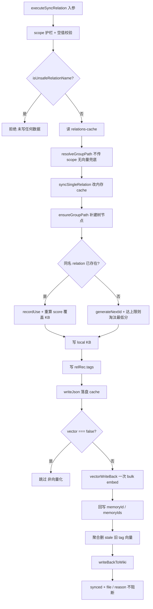
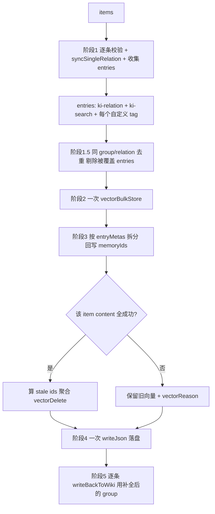
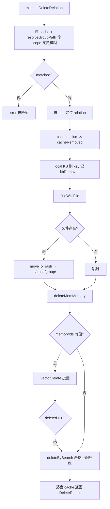
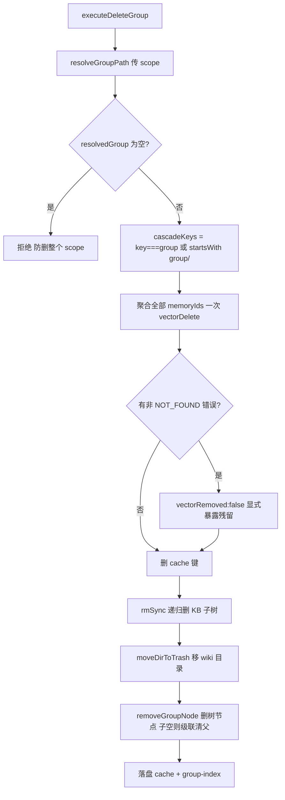
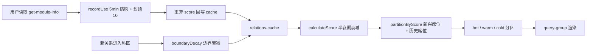
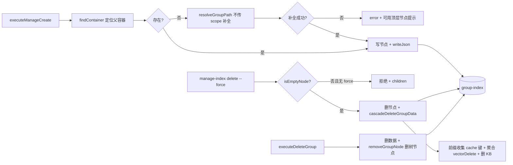
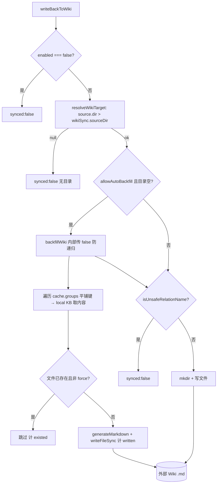

# 03-数据流转：关系与索引管理专家

**本文引用的文件**
- [src/sync-relation.ts](file:///root/knowledge-indexer/src/sync-relation.ts)
- [src/delete-relation.ts](file:///root/knowledge-indexer/src/delete-relation.ts)
- [src/manage-index.ts](file:///root/knowledge-indexer/src/manage-index.ts)
- [src/get-module-info.ts](file:///root/knowledge-indexer/src/get-module-info.ts)
- [src/lib/wiki-sync.ts](file:///root/knowledge-indexer/src/lib/wiki-sync.ts)
- [src/lib/scoring.ts](file:///root/knowledge-indexer/src/lib/scoring.ts)

## 目录
1. [简介](#简介)
2. [关系写入数据流转](#关系写入数据流转)
3. [批量写入数据流转](#批量写入数据流转)
4. [关系删除数据流转](#关系删除数据流转)
5. [目录级删除数据流转](#目录级删除数据流转)
6. [评分与分区数据流转](#评分与分区数据流转)
7. [Group 树数据流转](#group-树数据流转)
8. [Wiki 写回数据流转](#wiki-写回数据流转)
9. [结论](#结论)

## 简介

本文件追踪本专家的核心数据流转：关系写入（单条/批量）、关系与目录删除、评分分区、Group 树、Wiki 写回与补齐。黑盒视角（数据去哪、被谁消费）见 `../C4-数据流向与消费.md`。

章节来源：[src/sync-relation.ts](file:///root/knowledge-indexer/src/sync-relation.ts)（关键符号：`executeSyncRelation`）与 [src/delete-relation.ts](file:///root/knowledge-indexer/src/delete-relation.ts)（关键符号：`executeDeleteGroup`）

## 关系写入数据流转

图表来源：[src/sync-relation.ts](file:///root/knowledge-indexer/src/sync-relation.ts)（关键符号：`executeSyncRelation` / `syncSingleRelation` / `vectorWriteBack`）

**流转要点**：
- 落盘顺序为 **cache 先落盘、向量后补写**——向量写入失败不影响 KB 层可查，只以 `vectorStored` / `vectorReason` 透出。
- 向量写入遵循"**先写新、成功后再清旧**"：全部失败时不删任何旧向量；部分成功时保留旧向量并给 `vectorReason`。
- `memoryIds`（多 tag 各一）与 `memoryId`（ki-search 主条）同时回填，删除时以 `memoryIds` 为准。

章节来源：[src/sync-relation.ts](file:///root/knowledge-indexer/src/sync-relation.ts)（关键符号：`syncSingleRelation` / `vectorWriteBack` / `generateNextId`）

## 批量写入数据流转

图表来源：[src/sync-relation.ts](file:///root/knowledge-indexer/src/sync-relation.ts)（关键符号：`executeBulkSyncRelation`）

**流转要点**：
- 与单条路径的关键差异：**cache 只在阶段 4 落盘一次**（单条是写入后立即落盘），向量写入一次而非 N 次。
- `entryMetas` 记录每条 entry 归属的 `itemIdx` / `tagKind` / `contentTag`，是拆分批量结果回写 `memoryIds` 的索引。
- `--input --no-vector` 走遗留 `syncBatch`：只做 KB 层 + wiki，不产生 entries 与 memoryId。

章节来源：[src/sync-relation.ts](file:///root/knowledge-indexer/src/sync-relation.ts)（关键符号：`executeBulkSyncRelation` / `syncBatch` / `readBulkInput`）

## 关系删除数据流转

图表来源：[src/delete-relation.ts](file:///root/knowledge-indexer/src/delete-relation.ts)（关键符号：`executeDeleteRelation` / `deleteMemMemory` / `deleteBySearch`）

**流转要点**：
- 即使 cache 中找不到该 relation（已清），仍继续清理 wiki 与向量，处理"索引已删但残留"的情况。
- wiki 文件不再 `unlink`，统一 `moveToTrash`；回收站保留 group 完整结构，重名追加 ISO 时间戳。
- 向量删除三级降级：`memoryIds` → `memoryId` → `vectorSearch` 严格匹配；`memMethod` 记录实际路径，供排查孤儿向量。

章节来源：[src/delete-relation.ts](file:///root/knowledge-indexer/src/delete-relation.ts)（关键符号：`executeDeleteRelation` / `moveToTrash` / `deleteBySearch`）

## 目录级删除数据流转

图表来源：[src/delete-relation.ts](file:///root/knowledge-indexer/src/delete-relation.ts)（关键符号：`executeDeleteGroup` / `removeGroupNode` / `moveDirToTrash`）

**流转要点**：
- 级联依赖 relations-cache 的**平铺完整路径键**：`wiki` 与 `wiki/docs` 是独立键，必须靠前缀匹配一起收走，否则树节点已删而数据残留成"查不到却删不掉"的幽灵数据。
- 向量先删（聚合一次），cache/KB/wiki 后删——顺序保证即使向量失败也能继续，且用 `vectorRemoved` 把残留暴露出来而不是静默。
- 与 `manage-index --force` 的差异：后者**不动 wiki 文件**。

章节来源：[src/delete-relation.ts](file:///root/knowledge-indexer/src/delete-relation.ts)（关键符号：`executeDeleteGroup` / `removeGroupNode`）与 [src/manage-index.ts](file:///root/knowledge-indexer/src/manage-index.ts)（关键符号：`cascadeDeleteGroupData`）

## 评分与分区数据流转

图表来源：[src/lib/scoring.ts](file:///root/knowledge-indexer/src/lib/scoring.ts)（关键符号：`calculateScore` / `recordUse` / `partitionByScore` / `boundaryDecay`）

**流转要点**：
- 分区是**读取时计算**而非存储时固化：relations-cache 只存 `hot_relations` 数组与 `partition_config`，hot/warm/cold 由 `partitionByScore` 在查询时算（`query-group` 内 `partitionRelations` / `partitionGroups`）。
- `boundaryDecay` 是**纯函数**，返回新数组；当前代码库中它不被 `syncSingleRelation` 自动调用（淘汰走 `maxHotCount` 截断），调用方需自行落盘。
- `get-module-info` 是唯一的"读即写入"路径（记使用改评分）；`query-group` 只读不写。

章节来源：[src/get-module-info.ts](file:///root/knowledge-indexer/src/get-module-info.ts)（关键符号：`executeGetModuleInfo`）与 [src/query-group.ts](file:///root/knowledge-indexer/src/query-group.ts)（关键符号：`partitionRelations` / `partitionGroups`）

## Group 树数据流转

图表来源：[src/manage-index.ts](file:///root/knowledge-indexer/src/manage-index.ts)（关键符号：`executeManageCreate` / `cascadeDeleteGroupData`）与 [src/delete-relation.ts](file:///root/knowledge-indexer/src/delete-relation.ts)（关键符号：`removeGroupNode`）

**流转要点**：
- 树节点写入只有两个来源：`manage-index create`（含 `syncSingleRelation` 里的 `ensureGroupPath` 自动补建）与导入链路；删除有三个来源（空节点删除 / `--force` 级联 / `executeDeleteGroup`）。
- `removeGroupNode` 在子节点删空后连带删除父引用，避免留下空壳层级。

章节来源：[src/manage-index.ts](file:///root/knowledge-indexer/src/manage-index.ts)（关键符号：`executeManageDeleteEmpty` / `isEmptyNode`）与 [src/sync-relation.ts](file:///root/knowledge-indexer/src/sync-relation.ts)（关键符号：`ensureGroupPath`）

## Wiki 写回数据流转

图表来源：[src/lib/wiki-sync.ts](file:///root/knowledge-indexer/src/lib/wiki-sync.ts)（关键符号：`writeBackToWikiInner` / `backfillWiki` / `resolveWikiTarget`）

**流转要点**：
- `wikiSync.enabled` 是总闸，同时管单条写回与 `backfillWiki`；`autoBackfill` 只管"目录为空时是否自动补齐"。
- backfill 的数据源是 **relations-cache 的 `hot_relations` + local KB**，不是向量层——只有 KB 里有原文的关系才能补齐。
- 缺省幂等（跳过已存在文件）是为了避免 `generateMarkdown` 的 `exportedAt` 每次刷新，给 git 管理的 wiki 目录造成全量脏 diff。

章节来源：[src/lib/wiki-sync.ts](file:///root/knowledge-indexer/src/lib/wiki-sync.ts)（关键符号：`backfillWiki` / `readLocalKbIndex` / `generateMarkdown`）与 [src/wiki-backfill.ts](file:///root/knowledge-indexer/src/wiki-backfill.ts)（关键符号：`main`）

## 结论

本专家的数据流转呈"**写入四层一致、删除三层可达（cache/KB/向量）+ wiki 进回收站、分区读取时计算、wiki 事件驱动 + 补齐兜底**"的形态。三处关键一致性保障：批量路径的一次落盘与数据守恒、目录删除的前缀级联与残留显式反馈、wiki 的统一门禁与幂等补齐。

出处行：更新 2026-08-28  git commit：`9841255`
