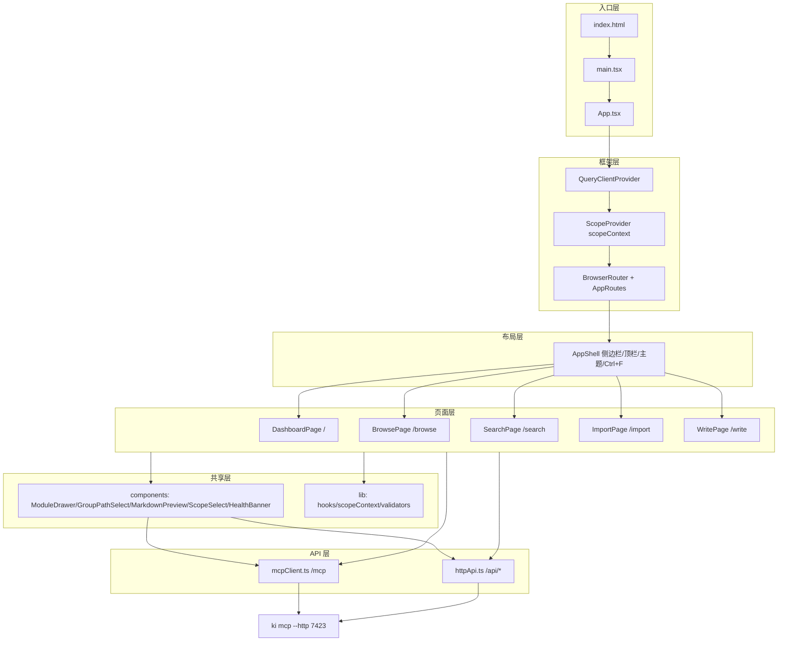
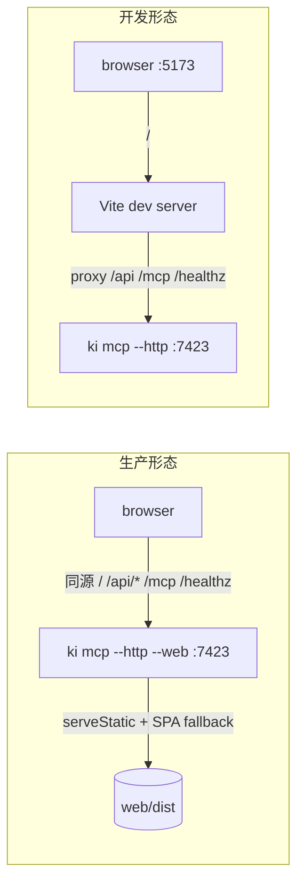

# ki 可视化前端（ki-web）—— 架构

**本文引用的文件**
- [vite.config.ts](file://web/vite.config.ts)
- [index.html](file://web/index.html)
- [main.tsx](file://web/src/main.tsx)
- [App.tsx](file://web/src/App.tsx)
- [routes.tsx](file://web/src/router/routes.tsx)
- [AppShell.tsx](file://web/src/layouts/AppShell.tsx)
- [ki.css](file://web/src/styles/ki.css)
- [mcp-http.ts](file://src/lib/mcp-http.ts)

## 目录
1. [简介](#简介)
2. [模块职责与边界](#模块职责与边界)
3. [分层架构](#分层架构)
4. [依赖图](#依赖图)
5. [与后端的部署拓扑](#与后端的部署拓扑)
6. [术语表](#术语表)
7. [结论](#结论)

## 简介

`web/` 是 ki 的独立 Vite 前端工程（package name `ki-web`），提供知识索引系统的可视化界面：总览、浏览、语义搜索、上传导入、知识写入五个页面。与后端 `ki mcp --http` **同源**通信——MCP 工具经 StreamableHTTP 走 `/mcp`，扩展接口走 `/api/*`；构建产物 `web/dist` 由 `ki mcp --http --web` 静态托管。

章节来源：[vite.config.ts](file://web/vite.config.ts)（关键符号：`defineConfig` 注释「构建产物 web/dist 由 ki mcp --http --web 静态服务」）；[mcpClient.ts](file://web/src/api/mcpClient.ts)（关键符号：`StreamableHTTPClientTransport`）

## 模块职责与边界

- **职责**：知识库状态可视化、文档浏览与原文查看、语义搜索验证、文档导入、手工知识写入；scope 与主题的浏览器侧持久化
- **边界（不做）**：不启动/停止后端（HealthBanner 仅检测+指引）；无用户/鉴权 UI；无删除/编辑回写；无移动端适配承诺；无服务端持久化
- **规模**：`web/src` 22 文件约 4000 行（含 965 行 ki.css），无路由级代码分割（mermaid 除外，动态 import）

章节来源：[HealthBanner.tsx](file://web/src/components/HealthBanner.tsx)（关键符号：`HealthBanner` 注释「前端不启动/关闭服务」）

## 分层架构

图表来源：[App.tsx](file://web/src/App.tsx)（关键符号：`App` Provider 嵌套顺序）；[routes.tsx](file://web/src/router/routes.tsx)（关键符号：`AppRoutes`）；[vite.config.ts](file://web/vite.config.ts)（关键符号：`server.proxy`）

分层约定：

| 层 | 目录 | 职责 | 依赖方向 |
|---|---|---|---|
| 入口/框架 | `main.tsx` `App.tsx` `router/` | Provider 装配与路由表 | → 布局/页面 |
| 布局 | `layouts/AppShell.tsx` | 导航壳、主题、健康徽标、全局快捷键 | → lib/components |
| 页面 | `pages/`（5 个） | 业务编排（表单状态 + 调 API + 渲染） | → api/lib/components |
| 通用组件 | `components/`（5 个） | 无路由依赖的可复用 UI | → lib/api（仅 ModuleDrawer 经 fetcher 注入） |
| 数据 hooks | `lib/hooks.ts` | TanStack Query 封装（缓存策略集中地） | → api |
| 全局状态 | `lib/scopeContext.tsx` | scope Context + localStorage | 独立 |
| 输入校验 | `lib/validators.ts` | group/relation/tag 规则（与后端对齐） | 独立零依赖 |
| API 封装 | `api/mcpClient.ts` `api/httpApi.ts` | 后端双通道类型化封装 | → 后端契约 |

章节来源：[AppShell.tsx](file://web/src/layouts/AppShell.tsx)（关键符号：`useTheme`、`ServiceBadge`、`AppShell`）；[hooks.ts](file://web/src/lib/hooks.ts)（关键符号：`useHealth`、`useDocList`、`useGroupDocs`）

## 依赖图

关键依赖决策：

- **页面 → api 直连与 hooks 并存**：查询类数据（有缓存诉求）统一走 `lib/hooks.ts`（queryKey 集中管理）；动作类/一次性调用（搜索、写入、原文拉取）由页面直连 `api/` 用组件 state 承载——避免把不可复现的搜索结果污染查询缓存
- **ModuleDrawer 的 fetcher 注入**：抽屉不直接 import 具体 API，由调用方传 `fetcher`（Browse 传 `kiGetModuleInfo`，Search 靠 `initialContent` 免请求），保持组件与数据源解耦
- **validators 零依赖**：与后端校验规则人工对齐（注释中点名 `isUnsafeRelationName` / `resolveGroupPath`），无运行时共享代码——前后端是两个独立工程，这是刻意的低耦合取舍（代价：规则变更需双处同步，见 05-接口.md 契约耦合表）

章节来源：[ModuleDrawer.tsx](file://web/src/components/ModuleDrawer.tsx)（关键符号：`ModuleDrawerProps.fetcher`）；[validators.ts](file://web/src/lib/validators.ts)（关键符号：`isUnsafeRelationName`、`groupError`）；[BrowsePage.tsx](file://web/src/pages/BrowsePage.tsx)（关键符号：`BrowsePage` 中 `fetcher={kiGetModuleInfo}`）

## 与后端的部署拓扑

图表来源：[mcp-http.ts](file://src/lib/mcp-http.ts)（关键符号：`serveStatic`、`STATIC_MIME`、`webDir`）；[vite.config.ts](file://web/vite.config.ts)（关键符号：`server.proxy`、`build.target: 'es2022'`）

- 生产：`--web` 开启静态托管（`webDir` 缺省禁用），非 `/api` `/mcp` 的 404 回退 `index.html`（SPA 路由），静态服务带路径穿越防护
- 开发：Vite strictPort 5173，三个路径代理到 7423；`@` alias 指向 `web/src`
- 样式：单一 `ki.css`（965 行）全局引入于 App.tsx，CSS 设计令牌 `--ki-*` 于 `:root`，暗色经 `[data-theme="dark"]` 覆盖

章节来源：[mcp-http.ts](file://src/lib/mcp-http.ts)（关键符号：`serveStatic`）；[App.tsx](file://web/src/App.tsx)（关键符号：`import './styles/ki.css'`）；[ki.css](file://web/src/styles/ki.css)（关键符号：`:root`、`[data-theme="dark"]`）

## 术语表

| 术语 | 含义 |
|---|---|
| scope | 知识库物理隔离键（KB/向量库/备份按 scope 分目录） |
| Group | 知识分组路径（`/` 分隔层级，如 `wiki/部署运维`） |
| Relation | Group 下的文档名（同 Group 内唯一） |
| ki-search / ki-relation / ki-path | 后端内部保留 tag（分层向量数据），`/api/tags` 已排除 |
| memoryId | 向量数据标识，搜索结果 meta 中展示前 12 位 |
| SPA fallback | 非接口路径 404 时回退 index.html，交由前端路由接管 |

## 结论

ki-web 是一个刻意保持轻量的单页应用：两层 API 封装对齐后端双通道契约，react-query 只管可缓存查询，动作类交互走组件 state；组件库小而复用（抽屉/Group 选择器/Markdown 渲染三件套支撑全部页面）。架构上最重要的外部约束是**同源通信**与**前端校验和后端规则人工对齐**——改后端接口必须同步 `web/src/api/` 与 `validators.ts`（详见 [05-接口.md](05-接口.md)）。

契约层索引：[../C0-使用总览.md](../C0-使用总览.md) · [../C1-能力契约.md](../C1-能力契约.md) · [../C2-使用流程.md](../C2-使用流程.md) · [../C4-数据流向与消费.md](../C4-数据流向与消费.md)
实现层切面索引：[02-实现.md](02-实现.md) · [03-数据流转.md](03-数据流转.md) · [05-接口.md](05-接口.md) · [06-测试.md](06-测试.md) · [07-运维.md](07-运维.md)

**关键发现**：① 后端 `ok === false` 业务错误不抛异常，是 api 层与页面的隐式约定（C1 已记录）；② MarkdownPreview 丢 HTML 是 XSS 防线的唯一一道，放宽需配 sanitize；③ Browse/Search 两页 tag 来源不同（KB 层 vs 向量层）是有意设计，易被误判为 bug。

**主要风险**：前端零测试（仅 tsc）；validators 与后端规则双处维护；`useDocList` 全量拉取在大知识库（>500 条）下依赖后端分页截断 + group 精确查询兜底。

**常见坑（Top3）**：dev 模式必须先起 7423；导入后需手动「刷新」看新 Group（30s 缓存）；预览丢 HTML 属安全设计非渲染 bug。

出处：生成日期 2026-08-28 · git commit 8adc487
