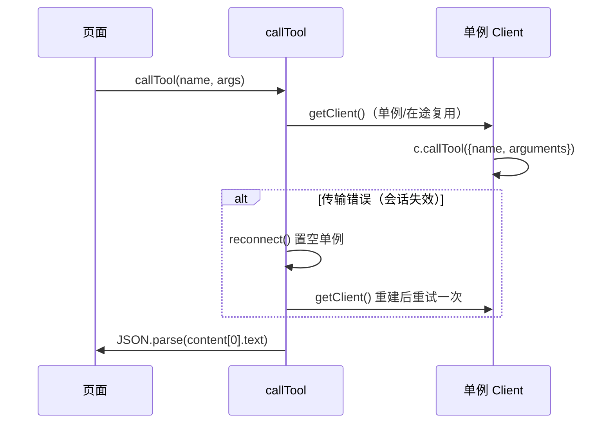
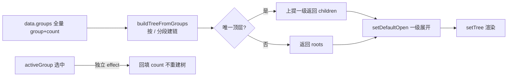
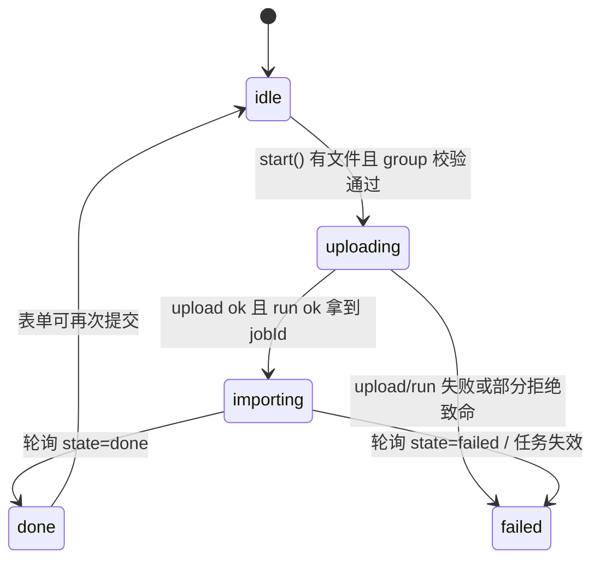

# ki 可视化前端（ki-web）—— 实现

**本文引用的文件**
- [mcpClient.ts](file://web/src/api/mcpClient.ts)
- [httpApi.ts](file://web/src/api/httpApi.ts)
- [hooks.ts](file://web/src/lib/hooks.ts)
- [scopeContext.tsx](file://web/src/lib/scopeContext.tsx)
- [validators.ts](file://web/src/lib/validators.ts)
- [ModuleDrawer.tsx](file://web/src/components/ModuleDrawer.tsx)
- [GroupPathSelect.tsx](file://web/src/components/GroupPathSelect.tsx)
- [MarkdownPreview.tsx](file://web/src/components/MarkdownPreview.tsx)
- [BrowsePage.tsx](file://web/src/pages/BrowsePage.tsx)
- [ImportPage.tsx](file://web/src/pages/ImportPage.tsx)
- [SearchPage.tsx](file://web/src/pages/SearchPage.tsx)
- [WritePage.tsx](file://web/src/pages/WritePage.tsx)
- [AppShell.tsx](file://web/src/layouts/AppShell.tsx)

## 目录
1. [简介](#简介)
2. [MCP 客户端实现（连接单例与会话自愈）](#mcp-客户端实现连接单例与会话自愈)
3. [数据缓存层实现（TanStack Query 约定）](#数据缓存层实现tanstack-query-约定)
4. [Group 树构建算法](#group-树构建算法)
5. [Markdown 与 mermaid 安全渲染](#markdown-与-mermaid-安全渲染)
6. [表单校验与 tag combobox 模式](#表单校验与-tag-combobox-模式)
7. [导入状态机与轮询](#导入状态机与轮询)
8. [全局交互（主题 / 快捷键 / 抽屉）](#全局交互主题--快捷键--抽屉)
9. [关键设计模式汇总](#关键设计模式汇总)
10. [风险点与边界条件](#风险点与边界条件)
11. [结论](#结论)

## 简介

本文按切面拆解 ki-web 的核心实现：连接管理、缓存约定、树构建、安全渲染、校验模式、导入状态机与全局交互。全部实现为无测试的 React 函数组件 + 少量模块级单例，正确性依赖 TypeScript 类型与代码注释中的约定。

章节来源：[App.tsx](file://web/src/App.tsx)（关键符号：`App`）

## MCP 客户端实现（连接单例与会话自愈）

[mcpClient.ts](file://web/src/api/mcpClient.ts) 维护浏览器端 MCP `Client` 单例：

- **单例 + 在途去重**：模块级 `client` 与 `connecting` 两个变量；并发首调共享同一个 `connect` Promise（`finally` 清空 `connecting`），避免 StrictMode 双调用创建双连接（关键符号：`getClient`）
- **传输**：`StreamableHTTPClientTransport(new URL('/mcp', window.location.origin))`——同源硬编码，无 CORS 问题（关键符号：`getClient`）
- **会话自愈**：`callTool` 捕获任何传输错误 → `reconnect()`（置空单例）→ 重试**一次**；服务重启/空闲回收场景由这里兜底（关键符号：`callTool`、`reconnect`）
- **响应解包**：`res.content[0].text` 尝试 `JSON.parse`，失败原样返回字符串——ki 工具统一返回结构化 JSON 字符串（关键符号：`callTool`）

图表来源：[mcpClient.ts](file://web/src/api/mcpClient.ts)（关键符号：`callTool`、`reconnect`）

章节来源：[mcpClient.ts](file://web/src/api/mcpClient.ts)（关键符号：`getClient`、`callTool`、`reconnect`）

## 数据缓存层实现（TanStack Query 约定）

[App.tsx](file://web/src/App.tsx) 全局默认 `retry: 1, refetchOnWindowFocus: false`。[hooks.ts](file://web/src/lib/hooks.ts) 四个 hook 的策略差异：

| hook | queryKey | staleTime | retry | 设计动机 |
|---|---|---|---|---|
| `useHealth` | `['health']` | 60s | false | 健康检查每次触发后端 zvec 探活，昂贵且不宜自动重试 |
| `useScopeList` | `['scopeList']` | 30s | 1 | scope 集合低频变化 |
| `useDocList` | `['docList', scope]` | 30s | 1 | 全量列表一次拉取，前端内存过滤 |
| `useGroupDocs` | `['docList', scope, 'group', group, tag]` | 30s | 1 | `enabled: !!group` 门禁，null 不发请求 |

- 手动刷新：Browse 页「刷新」按钮 `queryClient.invalidateQueries()`（全量失效），配合 `useIsFetching()` 在途时禁用按钮（关键符号：`BrowsePage`）
- Browse 页全局搜索独立建 query：`['docList', scope, 'search', q, tag]`，`enabled: q.trim().length > 0`（关键符号：`searchQuery`）
- queryKey 含 scope ⇒ ScopeProvider 切换 scope 时所有派生查询自动重新拉取——**scope 全局刷新无需任何事件广播**（关键符号：`useDocList`）

章节来源：[hooks.ts](file://web/src/lib/hooks.ts)（关键符号：`useHealth`、`useGroupDocs`）；[BrowsePage.tsx](file://web/src/pages/BrowsePage.tsx)（关键符号：`useIsFetching`、`searchQuery`）；[App.tsx](file://web/src/App.tsx)（关键符号：`QueryClient` 默认项）

## Group 树构建算法

两处独立实现同一算法（BrowsePage 主树带 count，GroupPathSelect 下拉树不带）：

- **建树**：groups 数组按 `/` split + `filter(Boolean)` 去空段，逐段经 `map`（path→node 复用）挂成父子链（关键符号：`buildTreeFromGroups` / `buildGroupTree`）
- **唯一顶层上提**：roots 只有 1 个且有子级时返回其 children——避免 UI 出现只有一个根文件夹的冗余层（关键符号：`buildTreeFromGroups` 尾部）
- **默认展开**：`setDefaultOpen` 深度 0 展开、更深折叠（关键符号：`setDefaultOpen`）
- **展开/折叠更新**：递归 walk 原地 mutate `open` 后返回 `[...prev]` 新数组引用触发渲染（关键符号：`toggleOpen`）

BrowsePage 的树状态管理有一个防折叠细节：建树 effect **只依赖 `data?.groups`**，`activeGroup` 变化不重建树；选中组文档回填走第二个 effect（深拷贝首层后定位节点改 `count`）——否则每次点选都会 `setDefaultOpen` 把用户展开的层级收回去（关键符号：两个 `useEffect` 的注释）。

图表来源：[BrowsePage.tsx](file://web/src/pages/BrowsePage.tsx)（关键符号：`buildTreeFromGroups`、`setDefaultOpen`）

章节来源：[BrowsePage.tsx](file://web/src/pages/BrowsePage.tsx)（关键符号：`buildTreeFromGroups`、`TreeNode`）；[GroupPathSelect.tsx](file://web/src/components/GroupPathSelect.tsx)（关键符号：`buildGroupTree`、`isPathInTree`）

## Markdown 与 mermaid 安全渲染

[MarkdownPreview.tsx](file://web/src/components/MarkdownPreview.tsx)：

- **安全策略**：模块级共享 `renderer`，`renderer.html = () => ''` 丢弃文档内嵌原始 HTML；输出经 `dangerouslySetInnerHTML` 注入——因为 HTML 已清空，该用法是安全的；这是**唯一防线**，改动必须同步评估（关键符号：`renderer`、`renderMarkdownHtml`）
- **mermaid 懒加载**：`loadMermaid()` 模块级 Promise 单例 + `import('mermaid')` 动态导入；effect 先检查 `html.includes('language-mermaid')` 才加载，无图表文档不付出 ~1MB chunk 代价（关键符号：`loadMermaid`）
- **渲染替换**：遍历 `pre > code.language-mermaid`，`mermaid.render` 产 SVG 后用 `.ki-mermaid` div 替换原 `pre`；失败保留源码块；`cancelled` 标志防卸载后 setState（关键符号：`MarkdownPreview` effect）

章节来源：[MarkdownPreview.tsx](file://web/src/components/MarkdownPreview.tsx)（关键符号：`renderMarkdownHtml`、`loadMermaid`）

## 表单校验与 tag combobox 模式

- **校验时机模式**：`const err = value.trim() ? xxxError(value) : null`——空值不报错（避免进场满屏红），非空即实时校验；提交时再全量校验一次兜底（关键符号：`WritePage` 的 `groupErr`/`relationErr`、`ImportPage` 的 `groupErr`）
- **tag combobox**（ImportPage/WritePage 各自内联实现，非共享组件）：输入过滤已有 tag + 回车新建（小写归一）+ 外部点击关闭 + 已选 pills 可删除；新建 tag 前端不做存在性检查，交后端落库（关键符号：`addTagFromInput`、`toggleTag`、`tagRef` 外点关闭 effect）
- **两页重复的代价**：tag combobox 逻辑在 Import/Write 各复制一份（~70 行），是已知的轻度冗余（重构候选：抽 `TagCombobox` 组件）

章节来源：[validators.ts](file://web/src/lib/validators.ts)（关键符号：`groupError`、`tagError`）；[ImportPage.tsx](file://web/src/pages/ImportPage.tsx)（关键符号：`addTagFromInput`）；[WritePage.tsx](file://web/src/pages/WritePage.tsx)（关键符号：`submit`）

## 导入状态机与轮询

ImportPage 用一个五态字符串驱动整个导入生命周期：`'idle' | 'uploading' | 'importing' | 'done' | 'failed'`（关键符号：`phase`）。

图表来源：[ImportPage.tsx](file://web/src/pages/ImportPage.tsx)（关键符号：`phase`、`start`、轮询 `useEffect`）

- **轮询 effect**：`phase !== 'importing' || !job` 时短路；`setInterval 2000ms` 调 `getImportStatus(job.id)`，`state` 终态即 `clearInterval` + 转移；轮询异常仅更新 `progressText` 不断链（关键符号：轮询 `useEffect`）
- **文件读取**：`f.file.text()` → `btoa(unescape(encodeURIComponent(text)))` 转 base64（UTF-8 安全的经典写法）（关键符号：`start`）
- **目录选择**：`openDirPicker` 动态创建原生 `<input webkitdirectory>` 挂 body 后 `click()`——绕开 React 托管 input 上 webkitdirectory 属性被覆盖导致 macOS 无法点击的问题；`cancel` 事件清理 DOM（关键符号：`openDirPicker`）
- **拖拽**：`onDrop` 仅取 `item.getAsFile()`（目录条目丢弃，V1 简化，注释明示）（关键符号：`onDrop`）

章节来源：[ImportPage.tsx](file://web/src/pages/ImportPage.tsx)（关键符号：`phase`、`openDirPicker`、`collectFiles`）

## 全局交互（主题 / 快捷键 / 抽屉）

- **主题**：AppShell 内 `useTheme` 局部 hook——初始化读 localStorage，effect 写 `<body data-theme>` + 持久化；dark/light 双 SVG 靠 `display` 切换（关键符号：`useTheme`）
- **Ctrl/Cmd+F 劫持**：window keydown 捕获查找键 → 若抽屉打开则放行（用户可能要在原文内查找）→ 否则聚焦当前页 `[data-ki-search-input]` 标记的输入框并全选（关键符号：`AppShell` 的 handler effect）
- **抽屉**：ESC 关闭 + body overflow 锁定与恢复；复制走 Clipboard API（安全上下文判断 `window.isSecureContext`）失败回退隐藏 textarea + `execCommand('copy')`，再失败显示独立提示条（`copyFailed` 不覆盖正文错误态）（关键符号：`ModuleDrawer` 的 `handleCopy`、滚动锁定 effect）

章节来源：[AppShell.tsx](file://web/src/layouts/AppShell.tsx)（关键符号：`useTheme`、keydown handler）；[ModuleDrawer.tsx](file://web/src/components/ModuleDrawer.tsx)（关键符号：`handleCopy`）

## 关键设计模式汇总

| 模式 | 落点 | 说明 |
|---|---|---|
| 连接单例 + 在途去重 | mcpClient `getClient` | 并发首调共享 connect Promise |
| 自愈重试 | mcpClient `callTool` | 失败 reconnect 后重试一次 |
| queryKey 携带 scope | hooks.ts | 切 scope 全局刷新零事件 |
| fetcher 注入 | ModuleDrawer | 组件与数据源解耦 |
| 唯一根上提 | 两处树构建 | 消除单根冗余层 |
| 防重建分离 effect | BrowsePage | 树重建与选中回填解耦 |
| 状态机字符串 | ImportPage `phase` | 五态驱动导入生命周期 |
| 懒加载单例 Promise | MarkdownPreview `loadMermaid` | 重 chunk 按需拉取 |
| 校验对齐后端 | validators.ts | 人工镜像后端规则 |

章节来源：[mcpClient.ts](file://web/src/api/mcpClient.ts)（关键符号：`getClient`）；[MarkdownPreview.tsx](file://web/src/components/MarkdownPreview.tsx)（关键符号：`loadMermaid`）

## 风险点与边界条件

- **双处树算法漂移**：`buildTreeFromGroups` 与 `buildGroupTree` 逻辑相同但各自维护，改一处易漏另一处
- **tag combobox 双份实现**：Import/Write 各 ~70 行内联，行为已出现细微分叉风险（如未来加删除反选）
- **base64 体积**：uploadFiles 的 size 用 `content.length * 3 / 4` 估算，仅展示用；大文件（逼近 1MB 限制）在 `btoa` 前无前端硬校验，超限由后端拒绝进 `errors`
- **轮询泄漏防护**：interval effect 依赖 `[phase, job?.id]`，卸载/phase 变化自动清理；但 `progressText` 轮询错误路径不终止 interval（设计如此：短暂网络抖动不断链）
- **`kiStore` 未消费**：mcpClient 导出但无页面使用，属预留封装
- **StrictMode 双挂载**：连接单例的在途去重已处理 connect 双发；树构建 effect 在 StrictMode 下执行两次，因幂等无碍

章节来源：[mcpClient.ts](file://web/src/api/mcpClient.ts)（关键符号：`kiStore`）；[ImportPage.tsx](file://web/src/pages/ImportPage.tsx)（关键符号：`start`、`openDirPicker`）

## 结论

ki-web 的实现是「小而直」的风格：无状态管理库、无请求层抽象框架，靠 4 个 hook + 2 个 API 文件 + 少量模块级单例支撑；正确性关键点（连接自愈、树防折叠、mermaid 懒加载、HTML 丢弃）都有注释固化。主要技术债是三组双份实现（树算法、tag combobox、校验规则的后端镜像），均已在风险点标注同步义务。

出处：生成日期 2026-08-28 · git commit 8adc487
