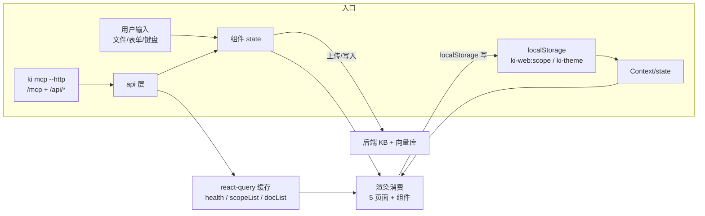
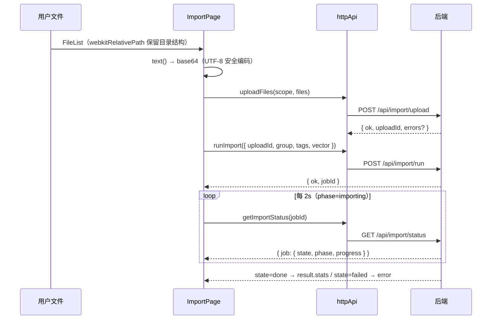

# ki 可视化前端（ki-web）—— 数据流转

**本文引用的文件**
- [scopeContext.tsx](file://web/src/lib/scopeContext.tsx)
- [hooks.ts](file://web/src/lib/hooks.ts)
- [mcpClient.ts](file://web/src/api/mcpClient.ts)
- [httpApi.ts](file://web/src/api/httpApi.ts)
- [ImportPage.tsx](file://web/src/pages/ImportPage.tsx)
- [SearchPage.tsx](file://web/src/pages/SearchPage.tsx)
- [ModuleDrawer.tsx](file://web/src/components/ModuleDrawer.tsx)
- [AppShell.tsx](file://web/src/layouts/AppShell.tsx)

## 目录
1. [简介](#简介)
2. [数据入口与出口全景](#数据入口与出口全景)
3. [scope 状态流转（唯一全局状态）](#scope-状态流转唯一全局状态)
4. [查询缓存生命周期](#查询缓存生命周期)
5. [导入链路数据流（两阶段 + 轮询）](#导入链路数据流两阶段--轮询)
6. [搜索与原文交付流](#搜索与原文交付流)
7. [异步流与错误传播](#异步流与错误传播)
8. [结论](#结论)

## 简介

本文追踪前端的数据生命周期：从后端接口/浏览器存储流入，经 Context/react-query 缓存/组件 state 三种驻留形态，到渲染消费或回传后端流出。前端无服务端持久化，所有「落地」仅 localStorage 两键。

章节来源：[scopeContext.tsx](file://web/src/lib/scopeContext.tsx)（关键符号：`STORAGE_KEY`）

## 数据入口与出口全景



图表来源：[App.tsx](file://web/src/App.tsx)（关键符号：`App` Provider 结构）；[scopeContext.tsx](file://web/src/lib/scopeContext.tsx)（关键符号：`ScopeProvider`）

章节来源：[App.tsx](file://web/src/App.tsx)（关键符号：`App`）；[scopeContext.tsx](file://web/src/lib/scopeContext.tsx)（关键符号：`useScope`）

## scope 状态流转（唯一全局状态）

- **初始化**：`useState` 惰性初始化读 `localStorage['ki-web:scope']`，异常/缺失回退 `'default'`（关键符号：`ScopeProvider`）
- **流转**：ScopeSelect onChange → `setScope` → 同步 setState + localStorage（写失败静默）→ Context value 更新
- **传播**：两条路径——① 组件直接 `useScopeValue()` 拿值作请求参数；② 作为 queryKey 组成部分触发 react-query 自动 refetch。**无跨组件事件、无 reducer**，状态传播完全靠 Context + queryKey
- **主题**走同构但独立的路径（AppShell 局部 `useTheme`，`ki-theme` 键，写 `<body data-theme>`），与 scope 无联动

章节来源：[scopeContext.tsx](file://web/src/lib/scopeContext.tsx)（关键符号：`ScopeProvider`、`setScope`）；[AppShell.tsx](file://web/src/layouts/AppShell.tsx)（关键符号：`useTheme`）

## 查询缓存生命周期

| 缓存 | 写入方 | 读取方 | 失效方式 |
|---|---|---|---|
| `['health']` | `getHealth` | HealthBanner / ServiceBadge / Dashboard | 60s stale 后 refetch；HealthBanner「重试」按钮 refetch |
| `['scopeList']` | `kiScopeList` | ScopeSelect / Dashboard | 30s stale；invalidateQueries |
| `['docList', scope]` | `getDocList` | Browse 树/Dashboard/GroupPathSelect | 30s stale；「刷新」invalidateQueries |
| `['docList', scope, 'group', …]` | `getDocList` | Browse 文档列表 | 同上 |
| `['docList', scope, 'search', q, tag]` | `getDocList` | Browse 搜索结果 | 10s stale；q 变化即新 key |

要点：查询缓存是「可复现数据」的唯一驻留形态；搜索结果/导入任务等「不可复现或短命数据」刻意绕开缓存走组件 state（`kiSearch` 结果、`ImportJob`、ModuleDrawer 的原文）。

章节来源：[hooks.ts](file://web/src/lib/hooks.ts)（关键符号：`useHealth`、`useDocList`）；[BrowsePage.tsx](file://web/src/pages/BrowsePage.tsx)（关键符号：`searchQuery`）

## 导入链路数据流（两阶段 + 轮询）



图表来源：[ImportPage.tsx](file://web/src/pages/ImportPage.tsx)（关键符号：`start`、轮询 effect）；[httpApi.ts](file://web/src/api/httpApi.ts)（关键符号：`uploadFiles`、`runImport`、`getImportStatus`）

数据驻留：`PendingFile[]`（含 File 引用）→ 上传后仅存 `job`/`phase`/`progressText`；完成后 `job.result.stats` 直接驱动完成文案。上传成功但部分文件被拒（`up.errors` 非空）时**不阻断**，仅提示后继续 run（可用文件照常导入）。

章节来源：[ImportPage.tsx](file://web/src/pages/ImportPage.tsx)（关键符号：`PendingFile`、`start`）

## 搜索与原文交付流

- **快路径**：`kiSearch` 固定 `include_original: true`，命中自带 `original` → 点击结果直接 `setViewing({ module, content: original })`，ModuleDrawer 有 `initialContent` 不再请求（关键符号：`SearchPage.run`、`ModuleDrawer` 的 `content !== null` 短路）
- **慢路径**：Browse 无原文 → ModuleDrawer effect 检测 `content === null && fetcher && group` → `kiGetModuleInfo(scope, group, module)` 回填（关键符号：ModuleDrawer 拉取 effect）
- 错误传播：`kiSearch` 的后端业务错误（`ok === false`）在页面层转 `error` state 展示；抽屉内 fetcher 异常转抽屉内 `error` 状态（不冒泡）

```mermaid
flowchart LR
    A[kiSearch<br>include_original=true] -->|hits[].original| B[SearchPage results state]
    B -->|点击| C[ModuleDrawer<br>initialContent 快路径]
    D[BrowsePage 文档点击] --> E[ModuleDrawer<br>无 initialContent]
    E --> F[fetcher=kiGetModuleInfo<br>group+relation 精确回查]
    F --> C
```

图表来源：[SearchPage.tsx](file://web/src/pages/SearchPage.tsx)（关键符号：`setViewing`）；[ModuleDrawer.tsx](file://web/src/components/ModuleDrawer.tsx)（关键符号：拉取 effect）

章节来源：[SearchPage.tsx](file://web/src/pages/SearchPage.tsx)（关键符号：`Result`、`run`）；[ModuleDrawer.tsx](file://web/src/components/ModuleDrawer.tsx)（关键符号：`ModuleDrawerProps`）

## 异步流与错误传播

统一错误分层（无全局 error boundary、无 toast 系统）：

1. **httpApi `req`**：非 2xx/非 JSON → 抛 `Error(error ?? HTTP <status>`)`（传输/协议层错误走异常）（关键符号：`req`）
2. **mcpClient `callTool`**：传输错误内部自愈重试一次，仍失败抛异常（关键符号：`callTool`）
3. **页面 catch**：异常转局部 `error` state，以「空状态卡」形式展示（SearchPage「搜索失败」/ WritePage「写入失败」/ ImportPage「导入失败」）
4. **后端业务错误**：MCP 工具返回 `ok === false` 时**不抛异常**，由调用方检查（仅 SearchPage 实现了此检查；`kiSyncRelation` 等写操作依赖后端抛 MCP error 走异常路径）
5. **静默容忍**：`fetchTags` 失败 `.catch(() => {})`（tag 选择器空列表可接受）；localStorage 读写 try/catch

章节来源：[httpApi.ts](file://web/src/api/httpApi.ts)（关键符号：`req`）；[SearchPage.tsx](file://web/src/pages/SearchPage.tsx)（关键符号：`ok === false` 检查）；[ImportPage.tsx](file://web/src/pages/ImportPage.tsx)（关键符号：`fetchTags` catch）

## 结论

前端数据流的三条主线：**Context + queryKey** 驱动 scope 全局刷新（零事件广播）、**两阶段 + 轮询**承载异步导入、**快慢双路径**交付原文。错误传播分四层且行为不均一（MCP 业务错误需调用方自查是最易踩的隐式契约）。与 [../C4-数据流向与消费.md](../C4-数据流向与消费.md) 的分工：C4 回答「数据是什么、谁用」，本文回答「数据怎么流、在哪驻留」。

出处：生成日期 2026-08-28 · git commit 8adc487
