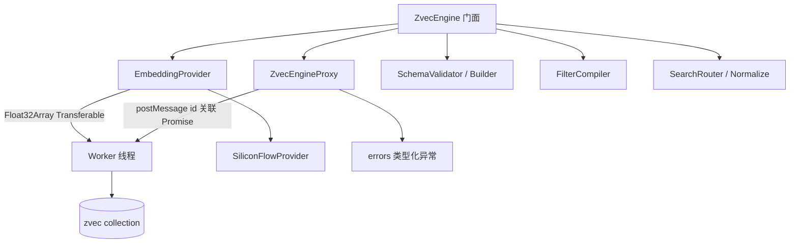

# 01-架构：向量引擎专家

**本文引用的文件**
- [src/zvec-engine/engine.ts](file:///root/knowledge-indexer/src/zvec-engine/engine.ts)
- [src/zvec-engine/proxy.ts](file:///root/knowledge-indexer/src/zvec-engine/proxy.ts)
- [src/zvec-engine/worker.ts](file:///root/knowledge-indexer/src/zvec-engine/worker.ts)
- [src/zvec-engine/worker-protocol.ts](file:///root/knowledge-indexer/src/zvec-engine/worker-protocol.ts)
- [src/zvec-engine/types.ts](file:///root/knowledge-indexer/src/zvec-engine/types.ts)
- [src/zvec-engine/errors.ts](file:///root/knowledge-indexer/src/zvec-engine/errors.ts)
- [src/zvec-engine/embedding/siliconflow.ts](file:///root/knowledge-indexer/src/zvec-engine/embedding/siliconflow.ts)
- [src/zvec-engine/schema/validator.ts](file:///root/knowledge-indexer/src/zvec-engine/schema/validator.ts)
- [src/zvec-engine/search/router.ts](file:///root/knowledge-indexer/src/zvec-engine/search/router.ts)
- [tsconfig.src.json](file:///root/knowledge-indexer/tsconfig.src.json)

## 目录
1. [简介](#简介)
2. [模块职责与边界](#模块职责与边界)
3. [架构分层](#架构分层)
4. [依赖关系](#依赖关系)
5. [关键设计决策](#关键设计决策)
6. [对外接口与契约层索引](#对外接口与契约层索引)
7. [术语表](#术语表)
8. [结论](#结论)

## 简介

本专家是 kisearch 的向量检索引擎基座，基于 `@zvec/zvec` 封装，采用 **Node `worker_threads` 多线程隔离架构**：主线程负责 embedding（HTTP 调用）与编排，一个 dedicated worker 持有唯一 collection 句柄并串行执行所有 db 操作（actor 模型）。

章节来源：[src/zvec-engine/engine.ts](file:///root/knowledge-indexer/src/zvec-engine/engine.ts)（`ZvecEngine` 类 / `create` / `open`）

## 模块职责与边界

**职责**：
- 引擎生命周期（create/open/probe/close/destroy）
- 检索（语义/FTS/Hybrid + RRF）、写入（幂等 upsert）、删除
- Embedding（provider 抽象 + SiliconFlow 参考实现）
- Schema 构建与校验（白名单 scalarFields）
- Filter 编译、结果归一化
- 11 种核心契约异常 + Worker/Embedding 族补充异常（共 18 类，跨线程反序列化）

**边界**（不做什么）：
- 不做 kisearch 业务层 scope/tag 过滤语义（属检索客户端专家）
- 不做 memoryId 反查 / 原文定位（属检索客户端专家）
- 不持久化业务 JSON（属存储专家）

## 架构分层

```
门面层           engine.ts（ZvecEngine）
                   │
代理层           proxy.ts（spawn worker + postMessage Promise 关联）
                   │  worker-protocol.ts（消息协议 / 零拷贝）
Worker 层        worker.ts（持 collection 句柄，串行 db 操作）
                   │
能力子模块        schema/{builder,validator}.ts
                filter/compiler.ts
                search/{router,normalize}.ts
                embedding/{provider,siliconflow}.ts
                errors.ts（类型化异常）
```



图表来源：[src/zvec-engine/engine.ts](file:///root/knowledge-indexer/src/zvec-engine/engine.ts)（`create` 编排：validator → builder → proxy.spawn）与 [src/zvec-engine/proxy.ts](file:///root/knowledge-indexer/src/zvec-engine/proxy.ts)（`ZvecEngineProxy`）

## 依赖关系

| 依赖方 | 被依赖方 | 说明 |
|--------|----------|------|
| `engine.ts` | `proxy.ts` / `filter/compiler.ts` / `embedding/provider.ts` / `search/router.ts` / `search/normalize.ts` / `schema/validator.ts` / `errors.ts` / `types.ts` | 门面编排 |
| `proxy.ts` | `worker.ts`（`new Worker`）/ `worker-protocol.ts` / `errors.ts` | 线程通信 |
| `worker.ts` | `worker-protocol.ts` | 处理消息 |
| `embedding/siliconflow.ts` | `embedding/provider.ts` / `errors.ts` | provider 实现 |
| `schema/validator.ts` | `schema/builder.ts` / `errors.ts` / `types.ts` | 校验 |
| `search/router.ts` | `types.ts` | 路由 |
| `index.ts` | 全部 | 公开导出门面 |

**外部依赖**：`@zvec/zvec`（原生向量库）、`worker_threads`（Node 内建）、`node:http`（siliconflow）。

**构建**：`tsconfig.src.json` 独立编译 `src/zvec-engine/**/*.ts` → `dist/zvec-engine`（`npm run build:zvec-engine`）。

## 关键设计决策

1. **Worker 多线程隔离（actor 模型）**：db 操作全部在 dedicated worker 串行执行，主线程只做 embedding 与编排 → 避免原生库线程安全问题；查询插队通过写入分批 + `setImmediate` 让出事件循环实现。
2. **零拷贝传输**：embedding 结果（Float32Array）经 `collectTransferables` 以 Transferable 传给 worker，避免结构化克隆开销。
3. **Schema 白名单**：集合 schema 创建时固定（scalarFields 白名单），open 时 schemaAssert 逐项比对；无 alter API → 加字段需重建集合。
4. **Embedding 主线程执行**：embed 在主线程（HTTP 调用），产出经 Transferable 传 worker（方案 X）。
5. **搜索路由退化矩阵**：`search/router.ts` 按请求类型路由（semantic/vector/fts/hybrid），决定 query/multiQuery、是否 embed。
6. **类型化异常跨线程**：`errors.ts` 维护 `ERROR_CONSTRUCTORS` 名称→构造器映射，worker 侧错误序列化后主线程反序列化为类型化异常。
7. **probe 空目录预检**：空目录直接返回 NOT_FOUND，避免 ZVecOpen 原生挂起导致误判 locked（AGENTS.md 变更记录）。
8. **串行化引擎操作**：同进程并发 ZVecOpen 会触发原生竞态，`serializeEngineOp` 排队（属 vector-client 侧）。

## 对外接口与契约层索引

- 契约层：`../C0-使用总览.md`、`../C1-能力契约.md`、`../C4-数据流向与消费.md`
- 实现层索引：`02-实现.md`、`04-模型.md`、`05-接口.md`、`06-测试.md`

## 术语表

| 术语 | 含义 |
|------|------|
| HNSW | 近似最近邻图索引（dense 向量） |
| RRF | Reciprocal Rank Fusion，混合检索融合排序 |
| jieba | 中文分词器（FTS 字段） |
| schemaAssert | open 时逐项比对集合 schema 与配置 |
| Transferable | 可转移所有权对象（零拷贝线程传输） |

## 关键发现 / 主要风险

- **加字段成本高**：schema 白名单 + 无 alter API，加字段需删集合重建（影响所有 scope，需重新导入）
- **probe 超时判定局限**：无法区分"真持锁"与"目录存在但无集合"，已用空目录预检兜底
- **worker crash**：持有 collection 句柄的 worker 崩溃后引擎不可用（`WorkerCrashedError`），需重建

## 结论

本专家通过 worker 多线程隔离 + 零拷贝传输 + 类型化异常体系，为 kisearch 提供稳定高效的向量检索基座；契约层覆盖全部公开 API，实现层为底层诊断与扩展提供导航。

出处行：生成日期 2026-08-06（更新 2026-08-28，对齐 58c12ca：Worker 族异常补导出）
