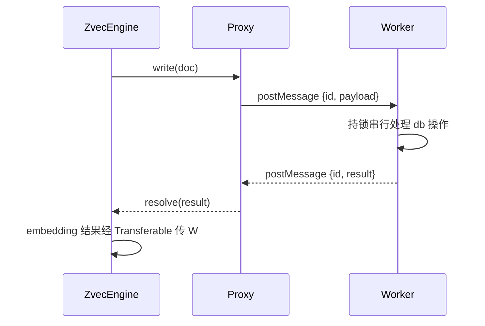
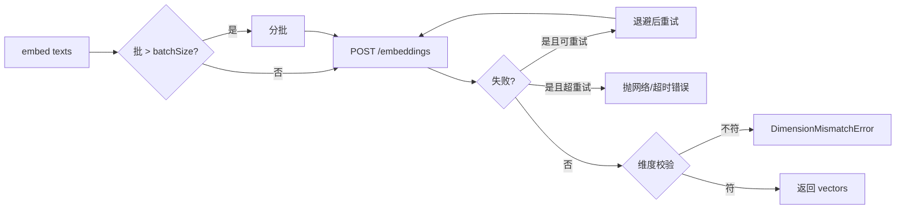

# 02-实现：向量引擎专家

**本文引用的文件**
- [src/zvec-engine/engine.ts](file:///root/knowledge-indexer/src/zvec-engine/engine.ts)
- [src/zvec-engine/proxy.ts](file:///root/knowledge-indexer/src/zvec-engine/proxy.ts)
- [src/zvec-engine/worker.ts](file:///root/knowledge-indexer/src/zvec-engine/worker.ts)
- [src/zvec-engine/worker-protocol.ts](file:///root/knowledge-indexer/src/zvec-engine/worker-protocol.ts)
- [src/zvec-engine/embedding/siliconflow.ts](file:///root/knowledge-indexer/src/zvec-engine/embedding/siliconflow.ts)
- [src/zvec-engine/filter/compiler.ts](file:///root/knowledge-indexer/src/zvec-engine/filter/compiler.ts)
- [src/zvec-engine/search/router.ts](file:///root/knowledge-indexer/src/zvec-engine/search/router.ts)
- [src/zvec-engine/search/normalize.ts](file:///root/knowledge-indexer/src/zvec-engine/search/normalize.ts)

## 目录
1. [简介](#简介)
2. [Worker 代理与协议](#worker-代理与协议)
3. [引擎门面实现](#引擎门面实现)
4. [Embedding 实现](#embedding-实现)
5. [Filter 编译实现](#filter-编译实现)
6. [搜索路由与归一化](#搜索路由与归一化)
7. [异常跨线程实现](#异常跨线程实现)
8. [结论](#结论)

## 简介

本文件剖析向量引擎的核心实现：worker 代理、引擎门面、embedding、filter、搜索路由与异常跨线程。

## Worker 代理与协议

**`ZvecEngineProxy`**（`proxy.ts`）：
- `spawn(config, mode: 'create'|'open')`：`new Worker(new URL('./worker.js', import.meta.url))` 加载 worker，发 create/open 消息
- async 调用：postMessage 带 UUID 消息 id，内部 Map<id, {resolve, reject}> 关联 Promise
- 生命周期：`close`（drain → worker closeSync → terminate）、`destroy`、crash 处理

**`worker-protocol.ts`**：
- 消息类型定义（Info/Query/Write/Search 等 payload）
- `serializeError` / `deserializeError`：worker 侧错误 → 类型化异常（用 `ERROR_CONSTRUCTORS` 映射）
- `collectTransferables`：从 embedding 结果提取 Float32Array 做零拷贝传输

**`worker.ts`**：
- 启动时经 create/open 消息获得 collection 句柄
- 串行处理所有 db 操作（actor 模型）
- 写入分批（`DEFAULT_WRITE_BATCH_SIZE=100`）+ `setImmediate` 让出事件循环 → 长写入期间查询可插队

图表来源：[src/zvec-engine/proxy.ts](file:///root/knowledge-indexer/src/zvec-engine/proxy.ts)（`ZvecEngineProxy`）与 [src/zvec-engine/worker-protocol.ts](file:///root/knowledge-indexer/src/zvec-engine/worker-protocol.ts)（`collectTransferables`）

## 引擎门面实现

**`create(config)`**（`engine.ts`）：
1. `assertAbsolutePath`：dbPath 必须绝对
2. `dbPathExists` → 抛 `CollectionAlreadyExistsError`（V-07）
3. `validateCreateConfig` → `builder.buildSchema` → `proxy.spawn(config, 'create')`

**`open(config)`**：
1. 路径不存在 → 抛 `CollectionNotFoundError`
2. `proxy.spawn(config, 'open')` → `validateOpenConfig`（schemaAssert 比对）

**写入**：按是否需 embed 切分（`EMBED_BATCH_SIZE=64` 小批）→ `embed` → Float32Array 转换 → `proxy.send`。

**检索**：`search/router.ts` 路由 → 必要时 embed → `proxy.send` → `search/normalize.ts` 归一化。

**`probe(dbPath, timeoutMs=3000)`**：
- 空目录预检 → 直接 NOT_FOUND
- 非空 → 加 3s 超时执行 ZVecOpen（持锁时阻塞）→ 按结果判定 locked/healthy/corrupted
- 用 `dummyEmbeddingProvider`（不实际 embed）

## Embedding 实现

**`SiliconFlowProvider.embed(texts, {timeoutMs, retries, batchSize})`**（`siliconflow.ts`）：
- 调 OpenAI 兼容 `/embeddings`（POST `{model, input}`）
- 重试/退避：`retries` 次重试，退避间隔递增
- 超时：`timeoutMs` 上限
- 维度校验：返回向量维度 ≠ config.dimension → 抛 `DimensionMismatchError`（带 `data.actualDim`）

图表来源：[src/zvec-engine/embedding/siliconflow.ts](file:///root/knowledge-indexer/src/zvec-engine/embedding/siliconflow.ts)（`embed` 流程）

## Filter 编译实现

**`compileFilter(filter, allowedFields)`**（`filter/compiler.ts`）：
- 结构化 Filter → zvec 类 SQL 字符串
- 字段白名单：仅 `allowedFields`（`buildAllowedFields` 从 schema 提取）
- 转义（值中特殊字符）、嵌套深度上限
- 非法字段/深度超限 → `InvalidFilterError`

## 搜索路由与归一化

**`routeSearch(req, ctx)`**（`search/router.ts`）：
- 按请求类型路由：
  - `semantic`：`SemanticSearchReq` → 需 embed query
  - `vector`：`VectorSearchReq`（已有向量）→ 不 embed
  - `fts`：`FtsSearchReq` → 不 embed
  - `hybrid`：`HybridSearchReq` → embed + fts
- 决定 query/multiQuery（多路查询）

**`toHit(raw)`**（`search/normalize.ts`）：
- worker 返回 `RawHitPayload` → `Hit`
- vector 路：distance → score 归一化（越大越相关）
- fts/hybrid 路：score 直通

## 异常跨线程实现

**`errors.ts`**：
- 基类 `ZvecEngineError` + 11 种核心契约异常 + Worker/Embedding 族补充异常（共 18 类，各带 `code`）
- `ERROR_CONSTRUCTORS`：名称 → 构造器映射
- worker 侧 `serializeError`（序列化 name+message+code+data）→ 主线程 `deserializeError`（按名称实例化类型化异常）

## 结论

本专家实现以"worker 多线程隔离 + 零拷贝 + 类型化异常"为核心，保证原生向量库线程安全与错误可诊断；embedding 批量、filter 编译、搜索路由均为模块化设计，扩展新能力（提供商/检索类型）成本可控。

出处行：生成日期 2026-08-06（更新 2026-08-28，对齐 58c12ca：Worker 族异常补导出）
