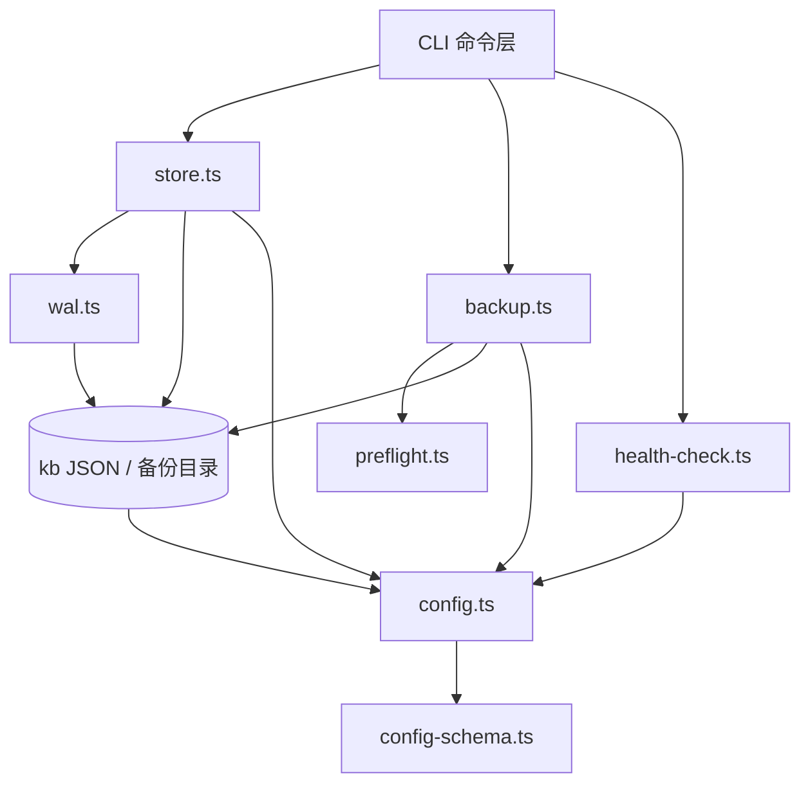

# 01-架构：存储与配置基础专家

**本文引用的文件**
- [src/lib/store.ts](file:///root/knowledge-indexer/src/lib/store.ts)
- [src/lib/wal.ts](file:///root/knowledge-indexer/src/lib/wal.ts)
- [src/lib/scope.ts](file:///root/knowledge-indexer/src/lib/scope.ts)
- [src/lib/config.ts](file:///root/knowledge-indexer/src/lib/config.ts)
- [src/lib/config-schema.ts](file:///root/knowledge-indexer/src/lib/config-schema.ts)
- [src/lib/constants.ts](file:///root/knowledge-indexer/src/lib/constants.ts)
- [src/lib/backup.ts](file:///root/knowledge-indexer/src/lib/backup.ts)
- [src/lib/preflight.ts](file:///root/knowledge-indexer/src/lib/preflight.ts)
- [src/lib/cli-args.ts](file:///root/knowledge-indexer/src/lib/cli-args.ts)
- [src/lib/health-check.ts](file:///root/knowledge-indexer/src/lib/health-check.ts)
- [src/restore.ts](file:///root/knowledge-indexer/src/restore.ts)
- [src/export.ts](file:///root/knowledge-indexer/src/export.ts)
- [src/scope.ts](file:///root/knowledge-indexer/src/scope.ts)

## 目录
1. [简介](#简介)
2. [模块职责与边界](#模块职责与边界)
3. [架构分层](#架构分层)
4. [依赖关系](#依赖关系)
5. [关键设计决策](#关键设计决策)
6. [对外接口与契约层索引](#对外接口与契约层索引)
7. [术语表](#术语表)
8. [关键发现 / 主要风险](#关键发现--主要风险)
9. [结论](#结论)

## 简介

本专家是 kisearch 的**数据落盘与配置基座**：所有 KB JSON 数据（group-index / relations-cache / local KB）的读写都经由本专家，所有模块的配置加载也依赖本专家。核心价值是"安全写 + 严格隔离 + 可恢复"。

章节来源：[src/lib/store.ts](file:///root/knowledge-indexer/src/lib/store.ts)（`writeJson` / `readJson`）

## 模块职责与边界

**职责**：
- JSON 原子读写（WAL）
- scope 隔离与路径构造、scope 生命周期（list/delete/clear）
- 配置加载、默认路径解析与 scope 护栏
- 配置字段级校验（名称/类型/取值）
- 备份/还原/导出
- 健康诊断（doctor）
- 初始化（config init）

**边界**（不做什么）：
- 不做向量检索/写入（`lib/vector-client` 属检索专家，本专家仅调用其 `closeEngine`）
- 不做业务评分/Group 树逻辑（属关系专家）
- 不做导入 5-Phase（属导入专家）

## 架构分层

```
CLI 层（薄壳）          src/backup.ts  src/restore.ts  src/export.ts
                       src/config.ts  src/doctor.ts  src/scope.ts
                                      │
核心逻辑层（lib/）       store.ts  wal.ts  scope.ts  config.ts  config-schema.ts
                       constants.ts  backup.ts  preflight.ts  cli-args.ts
                       health-check.ts  markdown-gen.ts
                                      │
数据层                 kb/{scope}/*.json  backupDir  ~/.ki/config.yaml  _template/
```



图表来源：[src/lib/store.ts](file:///root/knowledge-indexer/src/lib/store.ts)（`writeJson` → `walWrite` 调用链）

## 依赖关系

| 依赖方 | 被依赖方 | 说明 |
|--------|----------|------|
| `lib/store.ts` | `lib/wal.ts` / `lib/scope.ts` / `lib/config.ts` / `lib/constants.ts` | 写走 WAL，路径走 scope，配置走 config |
| `lib/config.ts` | `lib/config-schema.ts` | `parseAndExpand` 语法解析后调用 `validateConfigFields` |
| `lib/scope.ts` | `lib/config.ts` | `getKbDir` 用 `getScopeDataDir` |
| `lib/constants.ts` | `lib/config.ts` | `getKbBaseDir` 用 `loadConfig` |
| `lib/backup.ts` | `lib/scope.ts` / `lib/config.ts` / `lib/preflight.ts` | 快照打包 + 预检 |
| `lib/health-check.ts` | `lib/config.ts` / `dist/zvec-engine` | embedding 检查用 `SiliconFlowProvider` |
| `src/restore.ts` | `lib/backup.ts` / `lib/rebuild-vector.ts` / `lib/vector-client.ts` / `lib/preflight.ts` | 还原链路跨重建向量（导入专家）与向量客户端（检索专家） |
| `src/export.ts` | `lib/markdown-gen.ts` / `lib/scope.ts` / `lib/config.ts` / `lib/preflight.ts` | 导出 |
| `src/scope.ts` | `lib/scope.ts` / `lib/config.ts` / `lib/vector-client.ts` | scope 三层（KB/向量/配置）并集与清理 |

**外部依赖**：`@zvec/zvec`（经 `dist/zvec-engine`）、`yaml`（配置解析）、`commander`（CLI 框架）、`tar`（系统命令，快照）。

**循环依赖处理**：`lib/config.ts` 自行计算 `KI_ROOT`（不 import `lib/constants.ts`），避免 `lib/store.ts → lib/config.ts` 与 `lib/constants.ts → lib/config.ts` 形成环。

## 关键设计决策

1. **WAL 原子写**（`wal.ts`）：加锁 → 写 `.tmp` → `fs.renameSync` 原子替换 → 释放锁。跨进程文件锁用 `O_CREAT|O_EXCL` 创建 `.lock` 文件，锁陈旧（>30s）或超时（10s）自动抢占，防死锁。
2. **JSON version 兼容**（`store.ts`）：`readJson` 检查 `version > CURRENT_DATA_VERSION` 仅警告；`writeJson` 自动补 version + updatedAt。
3. **scope 严格隔离**（`scope.ts`）：正则 `^[a-zA-Z0-9_-]+$` 拒绝路径遍历；`scopeMode=strict` 时白名单注册才放行（`resolveScope`）。
4. **配置查找优先级**（`config.ts`）：`--config` > `~/.ki/config.yaml|yml|json` > 内置默认值；apiKey 支持 `${ENV_VAR}` 引用，不做隐式回退。
5. **备份防覆盖**（`backup.ts`）：时间戳到秒 + 同名加 `-N` 序号 + 毫秒兜底。
6. **只读诊断**（`health-check.ts`）：doctor 全程只读；embedding 用 1 条最短请求三合一验证连通性/密钥/维度；zvec collection 用目录非空判定（不 open，避免与常驻 server 抢锁）。
7. **预检前移**（`preflight.ts`）：写盘操作前试写探针 + 磁盘空间（statfs，10% 余量），避免中途 EACCES / ENOSPC。
8. **配置字段级校验**（`config-schema.ts`）：语法正确 ≠ 内容合法。声明式 schema（ConfigNode 树）在宽容归一化之前校验字段名/类型/取值，errors 一次性 fail-loud（附 Levenshtein 拼写建议），warns 走告警通道由 doctor 报告——杜绝"拼错字段静默落默认值 / NaN"的隐性错配。

**已移除的设计**：增量 diff（`diff.ts`，随 rootName 概念与增量导入模式一并删除，基线 commit 由 source 块承载的历史结束）；ai-results 备份与 `--from-results` 重放（ai-results 输入契约移除）。

## 对外接口与契约层索引

- 契约层：`../C0-使用总览.md`、`../C1-能力契约.md`、`../C2-使用流程.md`、`../C4-数据流向与消费.md`
- 实现层索引：`02-实现.md`、`03-数据流转.md`、`04-模型.md`、`06-测试.md`、`07-运维.md`

## 术语表

| 术语 | 含义 |
|------|------|
| WAL | Write-Ahead Log，先写临时文件再原子 rename 的写入机制 |
| scope | 项目隔离标识（KB 数据目录名） |
| source 块 | group-index.json 中的 `{dir, chunkSize?, chunkOverlap?}`，记录知识源目录与切分参数 |
| `kb/{scope}` | 某 scope 的 KB 数据目录 |
| 用户数据根 | `~/.ki`（默认 dataDir/backupDir/vectorDir/config.yaml 均落此，不做存量继承） |

## 关键发现 / 主要风险

- **WAL 锁与 zvec 向量库锁是两套独立锁**，`mcp stop` 管不到向量库锁（见 AGENTS.md 变更记录）
- **`setSource` 直接 `fs.writeFileSync`**（不走 walWrite），多进程并发写 group-index 时存在 Last-Write-Wins 风险（scope.ts 源码，未走 WAL）
- **`walWrite` 同步阻塞事件循环**：等锁用 `Atomics.wait`（最长 10s），常驻 MCP 进程内会冻结其它 handler 与定时器，工具层 `withTimeout` 在阻塞期间不触发
- **配置 schema 需人工同步**：新增配置字段必须同步改 `config-schema.ts`，否则 fail-loud 判为"非预期字段"
- **restore 依赖 rebuild-vector 与 vector-client**，跨专家链路，还原失败需排查三个模块

## 结论

本专家是全项目数据与配置基座，安全写、严格隔离、可恢复是核心设计目标；契约层覆盖全部公开能力，实现层为深入排查提供导航。近期演进主线：默认数据目录统一 `~/.ki`（不继承存量）、配置从"宽容静默"转为"字段级 fail-loud"、备份收敛为单通道快照。

出处行：生成日期 2026-08-06（合并补全 2026-08-28，基线 commit 9841255）
