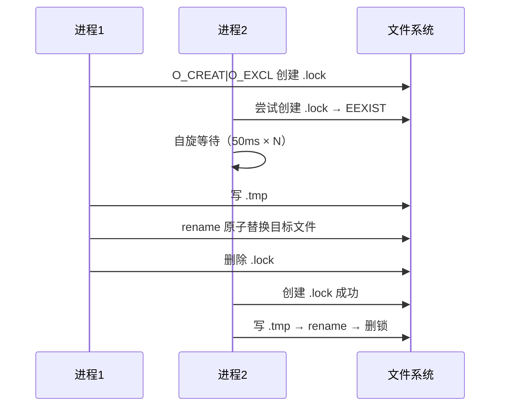

# 02-实现：存储与配置基础专家

**本文引用的文件**
- [src/lib/wal.ts](file:///root/knowledge-indexer/src/lib/wal.ts)
- [src/lib/store.ts](file:///root/knowledge-indexer/src/lib/store.ts)
- [src/lib/scope.ts](file:///root/knowledge-indexer/src/lib/scope.ts)
- [src/lib/config.ts](file:///root/knowledge-indexer/src/lib/config.ts)
- [src/lib/config-schema.ts](file:///root/knowledge-indexer/src/lib/config-schema.ts)
- [src/lib/backup.ts](file:///root/knowledge-indexer/src/lib/backup.ts)
- [src/lib/preflight.ts](file:///root/knowledge-indexer/src/lib/preflight.ts)
- [src/lib/cli-args.ts](file:///root/knowledge-indexer/src/lib/cli-args.ts)
- [src/lib/health-check.ts](file:///root/knowledge-indexer/src/lib/health-check.ts)

## 目录
1. [简介](#简介)
2. [WAL 原子写实现](#wal-原子写实现)
3. [JSON 存储层实现](#json-存储层实现)
4. [Scope 校验与路径实现](#scope-校验与路径实现)
5. [配置加载与字段级校验实现](#配置加载与字段级校验实现)
6. [备份与预检实现](#备份与预检实现)
7. [健康检查实现](#健康检查实现)
8. [CLI 参数与错误契约实现](#cli-参数与错误契约实现)
9. [结论](#结论)

## 简介

本文件深入剖析存储与配置基础专家的核心实现：WAL 原子写、JSON 存储、scope 校验、配置加载与字段级校验、备份预检、健康检查、CLI 参数。

> 增量 diff（`lib/diff.ts`）已随 rootName 概念删除，本文件不再包含该章节。

## WAL 原子写实现

**`walWrite(filePath, data)`**（`wal.ts`）核心流程：
1. `acquireLock(filePath)`：用 `O_CREAT|O_EXCL` 创建 `${filePath}.lock`；`EEXIST` 时检查锁文件年龄：
   - 锁陈旧（mtime 超过 `LOCK_STALE_MS=30s`）→ 删除旧锁重试
   - 未陈旧但自旋超过 `LOCK_ACQUIRE_TIMEOUT_MS=10s` → 视为对方异常退出，抢占锁
   - 自旋间隔 `LOCK_RETRY_INTERVAL_MS=50ms`
2. 写 `${filePath}.tmp`（临时文件）
3. `fs.renameSync(tmp, filePath)` 原子替换
4. `releaseLock` 删除锁文件

图表来源：[src/lib/wal.ts](file:///root/knowledge-indexer/src/lib/wal.ts)（`walWrite` / `acquireLock`）

**`cleanupTmpFiles(dir)`**：遍历目录删除 `*.tmp` 残留文件，返回清理数。

## JSON 存储层实现

**`readJson<T>(filePath)`**（`store.ts`）：
- 文件不存在 → `null`
- 解析失败 → 抛 `Error`，`code='CORRUPT_JSON'`，文案含"从备份恢复或从 _template 重新初始化"建议
- `version > CURRENT_DATA_VERSION` → `console.warn` 不抛错（兼容未来版本读取）

**`writeJson(filePath, data)`**：
- 补 `version`（缺省 `CURRENT_DATA_VERSION=1`）+ `updatedAt`（ISO 时间戳）
- 调 `walWrite(filePath, JSON.stringify(enriched))`

**`ensureScopeDir(scope)`**：创建 `kb/{scope}/` 目录；`scopeMode=strict` 且存在 `_configPath` 且 scope 未注册时抛 `ScopeError`。
**`initScope(scope)`**：从 `_template/` 复制模板文件初始化新 scope。

## Scope 校验与路径实现

**`validateScope(scope)`**（`scope.ts`）：正则 `^[a-zA-Z0-9_-]+$`；空 → `EMPTY_SCOPE`；含非法字符 → `INVALID_SCOPE` 且列出具体非法字符（去重）。

**路径构造**：`getKbDir` 优先 scope 级 `kbDir`（`getScopeDataDir` 拼接 `kb/{scope}`），fallback `dataDir/{scope}`。

**`migrateGroupIndex(data)`**：旧格式 `roots` → 新格式 `groups`：
- `roots['项目根']` 的子节点平铺进 `groups`
- 其他 root 保留为一级 `groups[key]`
- 返回迁移后的 `GroupIndex`；无需迁移返回 `null`

**`ensureGroupPathInTree(index, groupPath)`**：按 `/` 分段，逐级确保对象存在（缺失补 `{}`）。

**`getSource` / `setSource`**：读写 group-index 的 `source` 块。`GroupIndexSource = {dir, chunkSize?, chunkOverlap?}`；`setSource` 仅校验 `dir` 非空，`chunkSize`/`chunkOverlap` 有值才写入。**注意：`setSource` 用 `fs.writeFileSync` 直接写（未走 WAL）**。

**`listAllScopes()`**：并集两路——扫 `config.dataDir` 下含 `relations-cache.json` 的合法目录名，加上 `config.scopes` 中已注册且目录下有 `relations-cache.json` 的 scope。

## 配置加载与字段级校验实现

**`loadConfig(explicitPath?)`**（`config.ts`）：
- 进程内缓存 `_cached`（只读一次）；`resetConfigCache()` 供测试与配置写回后使用
- 查找顺序：`--config` / `KI_CONFIG_PATH`（按扩展名 YAML/JSON）→ `~/.ki/config.yaml|yml|json` → 内置默认值（`buildDefaults()`，stderr 提示一次）
- **`parseAndExpand` 三段式**：
  1. **语法解析**：`.yaml|.yml` 用 `YAML.parse`，其余 `JSON.parse`；失败抛「配置文件解析失败」（含底层错误详情）
  2. **字段级校验**：`validateConfigFields(raw)` → errors 非空则抛 `CONFIG_FIELD_INVALID`（最多展示 10 条，超出提示"另有 N 处"）
  3. **宽容归一化**：路径展开（`$HOME`/`~` → home；相对路径 → 相对配置目录）、默认值合并、类型转换
- `resolveApiKey`：`/^\$\{([A-Za-z_][A-Za-z0-9_]*)\}$/` 匹配环境变量，未设置/空返回 `undefined`（不做隐式回退）
- **默认路径**：`resolveDefaultDataPaths()` 恒返回 `~/.ki/kb` + `~/.ki/backup`；`vectorDir` 默认 `~/.ki/vector`。**不做存量路径继承**（旧的 `{项目根}/kb`、`~/.ki-data` 不自动沿用）
- `KI_DATA_DIR` 仅 `config init` 模板探测时读（`resolveDefaultDataPaths(true)`），运行时不读

**`validateConfigFields(raw)`**（`config-schema.ts`）：
- 声明式 schema：`ConfigNode {type, values?, fields?, value?, nullHandling?, deprecated?, validate?}`，与 `docs/configuration.md` 字段表一一对应
- 遍历：`walkValue` 按 type 分支（string/number/boolean/literal/stringArray/object）+ `node.validate` 取值校验（`positiveInt` / `portRange` / `httpUrl`）；`walkObject` 分「固定键 fields」与「自由键 map（scopes）」两分支
- 固定键分支顺序：已知键 → 递归；`<<` 合并键 → 报错（解析器不展开）；`x-` 前缀 → 跳过（锚点模板载体）；`deprecated` → warn；其余 → error（附拼写建议）
- map 分支：`null` 值走 `nullHandling`（scopes 声明为 warn：「YAML 裸写会解析为 null，该 scope 将被忽略」）；空 scope 名报错
- 拼写建议：`editDistance` Levenshtein，阈值 `max(2, ceil(len/3))`
- 收集策略：errors/warns 双通道，全量收集一次性报告（不"改一个报一个"）

章节来源：[src/lib/config-schema.ts](file:///root/knowledge-indexer/src/lib/config-schema.ts)（`validateConfigFields` / `walkValue` / `walkObject` / `suggestSuffix`）

**`resolveScope(config, scope?)`**：
- `default` 档：`trimmed || 'default'`，任意值放行
- `strict` 档：未传 → 抛"必须显式传入"；未注册 → 抛"unknown scope"（附已注册列表）
- 只管模式策略，字符集合法性由 `validateScope` 负责

**`removeScopeFromConfigFile(scope)`**：YAML 用 `YAML.parseDocument`（保留注释与格式）`doc.deleteIn(['scopes', scope])`；JSON 解析后 `delete` 写回；写回后 `resetConfigCache()`。无配置文件或条目不存在返回 `removed:false`（非错误）。

**scope 级子配置解析**：`scopes[name]` 支持 `kbDir` / `wikiSync`（enabled 默认 true、sourceDir、autoBackfill 默认 true）/ `clean`（enabled 默认 true + rules 8 项规则 + hooks）/ `import`（extensions、maxFileSize）。未配置子对象时对应 getter 返回 `null`，由调用方决定默认值。

## 备份与预检实现

**`backupScopeSnapshot(backupDir, scope, scopeDataDir)`**（`backup.ts`）：
1. `ensureTarAvailable()`：`tar --version` 探活
2. 预检：`checkWritable` + `checkDiskSpace`（按 `estimateDirSize` 估算）
3. `execFileSync('tar', ['-czf', target, '-C', parent, basename])`
4. 失败清理半截产物后抛错

**`autoBackup(config, scope)`**：只做一件事——调 `backupScopeSnapshot` 打快照；失败时捕获后 stderr 警告并返回 `ok:false`，不阻断调用方（供 import 成功后调用）。ai-results 备份通道已删除。

**`listBackups(config, scope, backupDirOverride?)`**：扫 `<backupDir>/<scope>/snapshots` 下 `snapshot.{ts}.tar.gz`（正则捕获 `(\d{8}-\d{6}(?:-\d+)?)`），按 timestamp 升序返回 `{snapshots:[{file,timestamp,size}]}`。

**`avoidCollision(targetFile, ext)`**：目标存在时插入 `-1`/`-2`…序号，极端兜底毫秒时间戳。

**`preflight.ts`**：
- `firstExistingAncestor(dir)`：向上找第一个存在的祖先目录
- `checkWritable`：试写探针 `.ki-write-probe.{pid}.{ts}` → 写入+删除；失败抛 `DIR_NOT_WRITABLE`
- `checkDiskSpace`：`statfsSync` 可用空间 × 0.9（预留 10%）> needed 才放行；不可探测跳过
- `estimateDirSize`：递归 stat，出错返回 0

## 健康检查实现

**`runHealthCheck(config)`**（`health-check.ts`）11 项检查：
1. 配置文件存在且字段合法（无 `_configPath` → fail，建议 init）
1b. **配置字段**：读 `config._fieldWarnings`——空则 pass；非空按 message 归组（最多展示 3 类，超出提示"另有 N 类"），状态 warn
2-4. dataDir / backupDir / vectorDir 存在且可写
5. apiKey 已解析（明文或 `${VAR}`，不做隐式回退）
6-8. embedding 三合一（`provider.embed(['test'], {timeoutMs:8000, retries:1})`）：
   - 成功且维度匹配 → 三项 pass
   - `actualDim !== config.dimension` → 维度 fail
   - `HTTP_401/403` → 密钥 fail
   - `TIMEOUT/NETWORK/其他` → 连通性 fail
9. zvec collection 目录非空判定（不 open，避开锁冲突）→ 未创建为 warn
10. `scopes.default` 配置检查 → 未配置为 warn

**设计要点**：只读不修改；embedding 检查用 `SiliconFlowProvider` 现成错误语义（`code` + `data.actualDim`）拆分三报告项。

## CLI 参数与错误契约实现

**`cli-args.ts`**：
- `failJson(error, code?)`：`{ok:false, error, code?}` → `process.exit(1)`（统一 JSON 错误契约，返回 `never`）
- `toErrorPayload(err)`：从任意抛出值提取 `{ok:false, error, code?}`（`Error.code` 存在时回显），不退出进程——命令层自行输出后退出
- `detectUnknownFlags`：Levenshtein 编辑距离近似建议（阈值 `max(1, min(3, floor(len/2)))`）；支持 `--flag=value`；`valueFlags` 跳过值 token；`helpText` 先写 stderr 再 failJson
- `parseIntArg`：非法回退 + warn；超 max 限幅；`parseFloatArg` 返回 `undefined` 表示不过滤

**破坏性操作的非交互确认**（`src/restore.ts`）：`previewAndRequireYes(overview)` 把「将被覆盖的数据规模」总览写 stderr，输出 `code='CONFIRMATION_REQUIRED'` 后退出 1——**不交互、不挂起**；使用者确认后加 `--yes` 重跑。

## 结论

本专家实现聚焦"安全写 + 严格隔离 + 可恢复 + 配置 fail-loud"：WAL 锁保证并发原子性，scope 正则 + strict 白名单保证隔离，备份/还原/导出保证可恢复，预检前移减少失败中途产物，配置字段级校验杜绝静默错配。注意 `setSource` 未走 WAL、WAL 同步阻塞事件循环是已知实现细节（风险见 01-架构）。

出处行：生成日期 2026-08-06（合并补全 2026-08-28，基线 commit 9841255）
