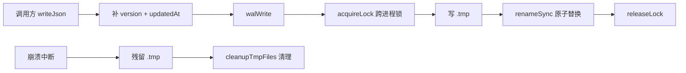
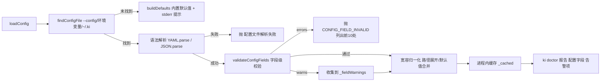

# 03-数据流转：存储与配置基础专家

**本文引用的文件**
- [src/lib/backup.ts](file:///root/knowledge-indexer/src/lib/backup.ts)
- [src/restore.ts](file:///root/knowledge-indexer/src/restore.ts)
- [src/export.ts](file:///root/knowledge-indexer/src/export.ts)
- [src/lib/store.ts](file:///root/knowledge-indexer/src/lib/store.ts)
- [src/lib/wal.ts](file:///root/knowledge-indexer/src/lib/wal.ts)

## 目录
1. [简介](#简介)
2. [备份数据生命周期](#备份数据生命周期)
3. [还原数据生命周期](#还原数据生命周期)
4. [导出数据生命周期](#导出数据生命周期)
5. [JSON 写入生命周期](#json-写入生命周期)
6. [配置加载与校验生命周期](#配置加载与校验生命周期)
7. [结论](#结论)

## 简介

本文件追踪本专家的核心数据生命周期：备份、还原、导出与 JSON 写入。

## 备份数据生命周期

```mermaid
flowchart LR
    A[用户执行 ki backup] --> B[backupScopeSnapshot]
    B --> C{预检 checkWritable + checkDiskSpace}
    C -- 通过 --> D[tar -czf 打包 scope 目录]
    C -- 失败 --> E[PreflightError 抛错]
    D --> F[快照文件 snapshot.{ts}.tar.gz]
    F --> G[avoidCollision 防覆盖 -N 后缀]
    G --> H[(备份目录 snapshots/)]
    I[导入成功后] --> J[autoBackup]
    J --> B
```

图表来源：[src/lib/backup.ts](file:///root/knowledge-indexer/src/lib/backup.ts)（`backupScopeSnapshot` / `autoBackup` / `avoidCollision`）

**生命周期要点**：
- `autoBackup` 在 import 成功后触发，**只打快照单通道**（ai-results 备份通道已移除）
- 备份失败不阻断调用方（仅 stderr 警告，`result.ok=false`）
- 时间戳到秒 + `-N` 序号防覆盖
- `ki backup` 手动执行时先校验 scope 已初始化（存在 relations-cache.json），否则报错提示先 import

## 还原数据生命周期

```mermaid
flowchart LR
    A[用户执行 ki restore] --> B{模式判断}
    B -- 无参数/--list --> C[listBackups 列可用备份]
    B -- --from-snapshot --> D[summarizeScopeDir 输出覆盖总览]
    D --> E{--yes?}
    E -- 否 --> F[CONFIRMATION_REQUIRED 退出1]
    E -- 是 --> G[安全网快照到受管 backupDir]
    G --> H[解包 tar.gz 覆盖 scope 目录]
    H --> I{--rebuild-vector?}
    I -- 是 --> J[rebuildScopeVectors（可配 --group/--tags）]
    B -- --rebuild-vector 独立 --> J
```

图表来源：[src/restore.ts](file:///root/knowledge-indexer/src/restore.ts)（`restoreFromSnapshot` / `previewAndRequireYes` / 命令分发）

**生命周期要点**：
- `--from-snapshot` 破坏性覆盖，需 `--yes`；未加 `--yes` 时输出「将被覆盖的数据规模」总览后以 `CONFIRMATION_REQUIRED` 退出 1（非交互、不挂起）
- 还原前先打安全网快照，**始终写入受管默认 `backupDir`**（`--backup-dir` 只控制「从哪读」，避免自定义只读目录导致还原中断）
- 还原后重建向量为独立步骤（`--rebuild-vector`），走 `lib/rebuild-vector.ts`（跨导入专家）+ `lib/vector-client.ts`（跨检索专家）
- `--from-results` 重放链路已随 ai-results 输入契约删除

## 导出数据生命周期

```mermaid
flowchart LR
    A[用户执行 ki export] --> B[checkWritable 预检输出目录]
    B --> C[遍历 group-index.json Group 树]
    C --> D[读 relations-cache + local KB index.json]
    D --> E[generateMarkdown 生成 frontmatter MD]
    E --> F[(输出目录 {groupPath}/{relation}.md)]
```

图表来源：[src/export.ts](file:///root/knowledge-indexer/src/export.ts)（`main` / `generateMarkdown` 调用）

**生命周期要点**：
- 只读数据源（group-index + relations-cache + local KB），不依赖向量库
- 写目标目录前 `checkWritable` 预检；`--group` 用 `extractSubtree` 把子树提为顶层树后再遍历
- `generateMarkdown(groupPath, relation, content, exportedAt)` 的 frontmatter 格式与 wiki-sync 共用（`yamlSafe` 保证 YAML 合法）；frontmatter 为 `groupPath/relation/exportedAt` 三项（`keywords` 已移除）

## JSON 写入生命周期



图表来源：[src/lib/store.ts](file:///root/knowledge-indexer/src/lib/store.ts)（`writeJson` → `walWrite`）与 [src/lib/wal.ts](file:///root/knowledge-indexer/src/lib/wal.ts)（`walWrite` / `cleanupTmpFiles`）

**生命周期要点**：
- 原子性保证：`renameSync` 在同一文件系统内原子，即使写入中断原文件不损坏
- 跨进程锁防 Last-Write-Wins；锁陈旧/超时抢占防死锁

## 配置加载与校验生命周期



图表来源：[src/lib/config.ts](file:///root/knowledge-indexer/src/lib/config.ts)（`loadConfig` / `parseAndExpand` / `resolveDefaultDataPaths`）与 [src/lib/config-schema.ts](file:///root/knowledge-indexer/src/lib/config-schema.ts)（`validateConfigFields`）

**生命周期要点**：
- 三段式顺序不可换：**语法解析 → 字段校验 → 宽容归一化**。归一化在前会把类型错误（如 `dimension: "4096"`）悄悄转成 NaN 或默认值，正是本流程要消除的隐性错配
- 默认值路径恒为 `~/.ki/{kb,backup,vector}`，不继承存量路径
- 告警不落盘、不改文件，仅在 `ki doctor` 的「配置字段」项展示（按 message 归组，最多 3 类）

## 结论

本专家的数据流转呈现"配置可校验（字段级 fail-loud）→ 写入安全化（WAL）→ 备份单通道（快照）→ 可还原（快照覆盖 + 可选向量重建）→ 可导出（Markdown 交付）"的完整闭环，各环节均带预检/防覆盖/容错设计。

出处行：生成日期 2026-08-06（合并补全 2026-08-28，基线 commit 9841255）
