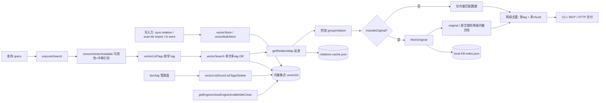

# C4-数据流向与消费：检索与向量客户端专家

> 本专家是向量层的**读写入口**与**原文定位桥接层**：把引擎能力包装为 async API，并把向量层 memoryId 桥接回 KB 层。
> 只写数据"用来干嘛"（黑盒），不写消费方的处理逻辑。
> 上次全量核对：2026-08-28（git commit `9841255`）

## 数据实体总览

| 数据实体 | 来源接口 | 去向 | 消费方 | 业务用途 |
|----------|----------|------|--------|----------|
| 向量文档（doc） | `vectorStore` / `vectorBulkStore` | 向量集合（`config.vectorDir`，单 collection `kisearch`） | 本专家（search/list/delete/枚举）、知识索引导入（批量写入与重建）、关系与索引管理（sync-relation 写关系向量、delete-relation 删除）、运维（doc 管理面） | 语义/全文/混合检索的数据单元，跨模块共享的检索底座 |
| 检索命中（`SearchHit`） | `executeSearch` = `vectorSearch` + `getRelationMap` 反查（+ `fetchOriginal`） | 内存 → CLI stdout / MCP 响应 | CLI 用户、AI Agent（经 MCP `ki_search`）、可视化前端（HTTP `/api/search`） | 语义检索交付物，带 `group`/`relation` 定位与可选原文 |
| memoryId 反查映射 | `getRelationMap` | 进程内存缓存（TTL 10min + mtime/size 双失效） | 本专家（检索结果增强） | memoryId → `{group, relation}`，实现"搜得到 + 定位到原文" |
| doc id | `generateDocId(text, scope, tag)` | 向量集合 id 字段 + KB `relations-cache` 的 `memoryId` / `memoryIds` | 本专家（检索/删除）、知识导入（写 memoryId 关联）、关系管理（四层联动删除定位） | 幂等 upsert 与跨层关联的关键键 |
| 引擎单例 / 锁 | `getEngine` / `closeEngine` / `enableIdleClose` | 进程内存 + 向量库目录的 LOCK | 本专家全部向量操作 | 单进程独占锁的生命周期管理，支撑多实例错开共享 |
| 撞锁来源标注 | `runWithVectorSource` | `AsyncLocalStorage`（异步链内） | `probeWithRetry` 的撞锁日志 | 从服务端日志定位是哪个 HTTP 端点 / MCP 工具触发撞锁 |

## 逐实体详述

### 1. 向量文档（doc）
- **来源接口**：`vectorStore` / `vectorBulkStore`（幂等 upsert，doc id 含 tag）
- **去向**：向量集合（`config.vectorDir`），字段为 `dense`(4096 维)、`content`(FTS，jieba)、`tag`、`scope`、`group`（后三者为 indexed STRING 标量）
- **消费方**（>3 归纳）：本专家（search / list / fetch / delete / 枚举）、知识索引导入（`batchVectorize` 批量写入、`rebuildScopeVectors` 重建）、关系与索引管理（`sync-relation` 写 `ki-relation`/`ki-path`/内容向量、`delete-relation` 按 `memoryIds` 清理）、运维（`ki doc list/delete`）
- **业务用途**：检索数据单元。`scope`/`tag` 支撑过滤隔离，`group` 支撑结构化归属；**content 兼作 FTS 字段**

### 2. 检索命中（`SearchHit`）
- **来源接口**：`executeSearch`（向量检索 → memoryId 反查 → 可选原文召回 → 两级去重）
- **去向**：CLI stdout（JSON）/ MCP 响应 / HTTP 前端
- **消费方**：CLI 用户、AI Agent（`ki_search` 工具）、可视化前端
- **业务用途**：交付语义检索结果。`group`/`relation` 用于定位原文；`includeOriginal` 开启时 `original` 可直接引用，`originalRetrieved: false` 时 `original` 为向量文档兜底并附 `originalHint`
- **去重语义**：① 多 tag 去重——同一 `(group, relation)` 只保留 score 最高的一条；② 多 chunk 原文去重——后续命中 `deduplicated: true` 且不带 `original`

### 3. memoryId 反查映射
- **来源接口**：`getRelationMap`（懒构建，首次 O(N) 后续 O(1)）
- **去向**：进程内存（模块级 `Map<scope, {builtAt, mtimeMs, size, map}>`）
- **消费方**：本专家（`executeSearch` 结果增强）
- **业务用途**：把向量层 memoryId 桥接到 KB 层 `relations-cache.json`。**优先多值 `memoryIds`**（一个文件级 relation 的全部 chunk doc 都指向它），无 `memoryIds` 时回退旧数据单值 `memoryId`
- **约束**：文件缺失或 JSON 损坏 → 空 Map（**降级为不带定位字段，不抛错**）

### 4. doc id
- **来源接口**：`generateDocId(text, scope, tag)` = `sha256(text + scope + tag)` 截 32
- **去向**：向量集合 id 字段；由上层（导入 / 关系管理）写入 KB `relations-cache` 的 `memoryId` / `memoryIds`
- **消费方**：本专家（检索返回 `memoryId`、按 id 删除）、知识导入（写 memoryId 建立跨层关联）、关系管理（`delete-relation` 四层联动按 `memoryIds` 精确定位）
- **业务用途**：幂等 upsert（同 text+scope+tag 覆盖）与跨层数据关联的关键键
- **⚠️ breaking**：tag 参与 hash 后，存量数据的 docId 与新 scheme 失配，需 re-import 或 `ki restore <scope> --rebuild-vector` 迁移

### 5. 引擎单例 / 锁
- **来源接口**：`getEngine`（create/open）、`closeEngine`（关闭 + 释放 LOCK）、`enableIdleClose`（空闲释放）
- **去向**：进程内存单例 + 向量库目录的独占锁
- **消费方**：本专家全部向量操作（统一经 `withEngine`）
- **业务用途**：向量库为单进程独占锁，单例 + 撞锁重试 + 空闲释放三者配合，实现多 MCP 实例与 CLI 短命令**错开共享**同一向量库

## 数据流图

图表来源：[src/search.ts](file:///root/knowledge-indexer/src/search.ts)（关键符号：`executeSearch` / `fetchOriginal`）与 [src/lib/vector-client.ts](file:///root/knowledge-indexer/src/lib/vector-client.ts)（关键符号：`vectorSearch` / `getEngine`）

## 备注

- **本层不写 KB**：`relations-cache.json` 与 local KB 由关系与索引管理专家 / 知识索引导入专家写入，本层只读（反查与原文召回）。唯一例外是 `vectorDelete`，由上层传入 id 删除向量层，KB 侧的同步由上层负责。
- **`ki store` / `ki bulk_store` 写入的数据只存在于向量层**——无 `group`/`relation` 定位字段，原文召回必然降级。
- **消费方结论基于引用扫描**，模块外消费方（如导入链路、前端）未深入验证其内部处理逻辑。
