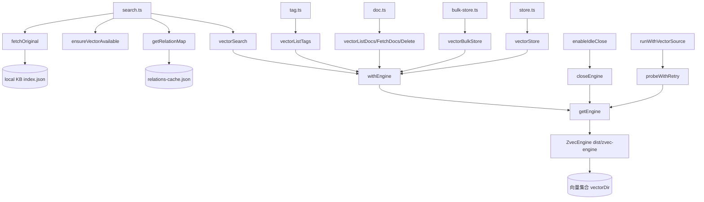

# 01-架构：检索与向量客户端专家

**本文引用的文件**
- [src/lib/vector-client.ts](file:///root/knowledge-indexer/src/lib/vector-client.ts)
- [src/lib/relation-map.ts](file:///root/knowledge-indexer/src/lib/relation-map.ts)
- [src/search.ts](file:///root/knowledge-indexer/src/search.ts)
- [src/store.ts](file:///root/knowledge-indexer/src/store.ts)
- [src/bulk-store.ts](file:///root/knowledge-indexer/src/bulk-store.ts)
- [src/doc.ts](file:///root/knowledge-indexer/src/doc.ts)
- [src/tag.ts](file:///root/knowledge-indexer/src/tag.ts)
- [src/lib/mcp-tools/util.ts](file:///root/knowledge-indexer/src/lib/mcp-tools/util.ts)

## 目录
1. [简介](#简介)
2. [模块职责与边界](#模块职责与边界)
3. [架构分层](#架构分层)
4. [依赖关系](#依赖关系)
5. [关键设计决策](#关键设计决策)
6. [对外接口与契约层索引](#对外接口与契约层索引)
7. [术语表](#术语表)
8. [关键发现与主要风险](#关键发现与主要风险)
9. [结论](#结论)

## 简介

本专家是 kisearch 的**检索与向量写入入口**：`vector-client.ts` 把 ZvecEngine 包装为 async Vector Adapter，`relation-map.ts` 提供 memoryId → 原文定位反查，`search.ts` 编排"检索 + 反查 + 原文召回 + 两级去重"，`store/bulk-store/doc/tag.ts` 是向量层管理面 CLI。

当前代码形态（2026-08-28 核对）相比 2026-08-06 首版有五处结构性变化：**docId 引入 tag 参与 hash**（breaking）、**默认搜全部从逐 tag 分查改为单次多 tag OR**（1 次 embedding）、**isFullText/keywords 字段删除并引入 REQ-09 原文召回**、**idle close + 在途计数 + 自愈重试**（解决 `worker not open` 竞态）、**撞锁重试 + 空闲释放锁**（多实例错开共享向量库）。

章节来源：[src/lib/vector-client.ts](file:///root/knowledge-indexer/src/lib/vector-client.ts)（关键符号：`getEngine` / `vectorSearch` / `generateDocId`）与 [src/search.ts](file:///root/knowledge-indexer/src/search.ts)（关键符号：`executeSearch`）

## 模块职责与边界

**职责**：
- 引擎生命周期：进程内单例、probe/create/open 串行化、open 超时自愈、空闲释放锁、撞锁重试
- 可用性检测：`ensureVectorAvailable`（`LOCKED` / `CORRUPTED` / `PROBE_ERROR` + 中断标记引导 + `fastFail`）
- 混合检索（语义 + FTS + RRF）、单条/批量写入（幂等 upsert）、按 id 删除、清空/计数
- 管理面枚举：`vectorListDocs` / `vectorFetchDocs` / `vectorListScopes` / `vectorListTags`
- 原文定位：`getRelationMap`（TTL + mtime/size 双失效）+ `fetchOriginal`（local KB 文件级原文）
- 检索编排：tag 优先级排序、多 tag 去重、多 chunk 原文去重、原文缺失降级
- CLI 与 MCP 入口：`ki search/store/bulk_store/doc/tag` 与 4 个 MCP 工具

**边界**（不做什么）：
- 不提供向量引擎底层 API（属向量引擎专家）
- 不提供关系写入/评分/Group 树业务（属关系与索引管理专家）
- 不提供知识导入 5-Phase 流程（属知识索引导入专家，但其批量向量化与 rebuild-vector 复用本专家）
- 不持久化 KB JSON（属存储与配置基础专家）
- 不写 relations-cache（本层不感知 KB 结构，仅在反查与原文召回时读取）

章节来源：[src/lib/vector-client.ts](file:///root/knowledge-indexer/src/lib/vector-client.ts)（关键符号：`ensureVectorAvailable` / `vectorDeleteScope`）与 [src/lib/relation-map.ts](file:///root/knowledge-indexer/src/lib/relation-map.ts)（关键符号：`getRelationMap`）

## 架构分层

```
MCP 工具层   mcp-tools/{search,store,bulk-store,tag-list}.ts
             ── zod 参数校验 + TOOL_TIMEOUT 包装 + scope 授权
CLI 层       search.ts   store.ts   bulk-store.ts   doc.ts   tag.ts
（commander）     │           │            │           │        │
纯函数层     executeSearch / executeStore / executeBulkStore /
（可复用）    executeDocList / executeDocDelete / executeTagList
                  │
适配层       vector-client.ts（Vector Adapter）
             ├─ 生命周期：getEngine / closeEngine / enableIdleClose / withEngine
             ├─ 检索写入：vectorSearch / vectorStore / vectorBulkStore / vectorDelete
             └─ 管理面：vectorListDocs/FetchDocs/ListScopes/ListTags/CountScope/DeleteScope
                  │
桥接层       relation-map.ts（memoryId → {group, relation}）
                  │
引擎层       dist/zvec-engine（编译产物，向量引擎专家）
                  │
数据层       向量集合 vectorDir   relations-cache.json   local KB index.json
```



图表来源：[src/lib/vector-client.ts](file:///root/knowledge-indexer/src/lib/vector-client.ts)（关键符号：`withEngine` / `getEngine` / `probeWithRetry`）与 [src/search.ts](file:///root/knowledge-indexer/src/search.ts)（关键符号：`executeSearch`）

章节来源：[src/lib/vector-client.ts](file:///root/knowledge-indexer/src/lib/vector-client.ts)（关键符号：`getEngine` / `withEngine`）与 [src/search.ts](file:///root/knowledge-indexer/src/search.ts)（关键符号：`executeSearch`）

## 依赖关系

| 依赖方 | 被依赖方 | 说明 |
|--------|----------|------|
| `vector-client.ts` | `dist/zvec-engine/index.js`（**编译产物**，非源码）/ `lib/config.ts`（embedding / vectorDir）/ `lib/scope.ts`（validateScope）/ `lib/interrupt.ts`（interruptGuidance） | 引擎 + 配置 + scope 护栏 + 导入中断引导 |
| `relation-map.ts` | `lib/scope.ts`（getRelationsCachePath）/ `lib/scoring.ts`（Relation 类型） | 反查数据源与类型 |
| `search.ts` | `lib/vector-client.ts` / `lib/relation-map.ts` / `lib/store.ts`（readJson）/ `lib/scope.ts`（getLocalKbDir）/ `lib/config.ts` / `lib/cli-args.ts` | 检索编排（向量 + 反查 + 原文） |
| `store.ts` / `bulk-store.ts` | `lib/vector-client.ts` / `lib/config.ts` / `lib/scope.ts` | 写入 CLI 薄壳 |
| `doc.ts` / `tag.ts` | `lib/vector-client.ts` / `lib/cli-args.ts` / `lib/config.ts` | 管理面 CLI 薄壳 |
| `mcp-tools/{search,store,bulk-store,tag-list}.ts` | 对应 `execute*` 纯函数 + `mcp-tools/util.ts`（withTimeout / TOOL_TIMEOUT） | MCP 入口 |

**外部依赖**：`dist/zvec-engine`（构建产物，worker_threads 只能加载编译后的 `worker.js`）、`node:crypto`（doc id）、`node:async_hooks`（AsyncLocalStorage 来源标注）、`commander`（CLI）、`zod`（MCP 参数）。

章节来源：[src/lib/vector-client.ts](file:///root/knowledge-indexer/src/lib/vector-client.ts)（关键符号：`buildCreateConfig` / `buildEmbedding`）与 [src/doc.ts](file:///root/knowledge-indexer/src/doc.ts)（关键符号：`executeDocDelete` / `executeDocList`）

## 关键设计决策

1. **从 dist 而非源码导入引擎**：`worker_threads` 只能加载编译后的 `worker.js`，故改 `src/zvec-engine` 后必须 `npm run build:zvec-engine`，否则"改了源码没生效"。
2. **引擎单例 + 原生操作串行化**：`_enginePromise` 进程内单例；`probe/create/open/close` 全部经 `serializeEngineOp` 排队——同进程并发 `ZVecOpen` 同一 dbPath 实测约 62% 概率触发原生竞态**永久阻塞**。
3. **open 超时自愈**：`withOpenTimeout`（20s，刻意小于工具护栏 READ 30s）超时后 fire-and-forget 关闭孤儿 engine 并 reject，保证 `_enginePromise` 必定 settle，避免原生挂死时失去自愈能力。
4. **撞锁重试 + 空闲释放锁**（2026-08-14）：多 stdio MCP 实例与 CLI 短命令共享同一向量库——`probeWithRetry`（等 2s × 最多 3 次）应对"撞锁"，`enableIdleClose`（常驻层空闲超时自动释放）应对"占着不放"。
5. **在途计数 + 自愈重试**（2026-08-27）：`withEngine` 进入即 `_inFlightOps++`，idle timer 见此计数不打断（修复 embedding 网络期被 idle close 打断导致 `worker not open (state=closed)`）；捕获 `WorkerUnavailableError` 后 `closeEngine` + `getEngine` 重开重试一次。**所有 engine 使用必须经 `withEngine`**，直接 `await getEngine()` 会重演竞态。
6. **closeEngine 先置空再 close**：避免 close 期间新调用拿到正在 closing 的旧 engine（`WorkerCrashedError` 竞态）；close 同样经 `serializeEngineOp` 串行化。
7. **docId 含 tag**（2026-08-10，breaking）：`sha256(text + scope + tag)` 截 32。tag 为单值字段，"一个内容多 tag" 必须各写一 doc，故 tag 必须参与 hash 才能各自独立且幂等。存量数据需 re-import 或 `rebuild-vector` 迁移。
8. **默认搜全部改单次多 tag OR**（2026-08-28）：旧实现逐 tag 分查会对同一 query 重复 embedding N 次。改为一次查询（多 tag OR + `topk = limit × tag数`），再内存按 tag 分组限额 + `TAG_PRIORITY` 排序。**近似等价**而非严格等价——topk 全局分配，极端场景单 tag 可能挤掉其他 tag。
9. **传 tag 数组而非逗号字符串**：tag 值本身可能含逗号，`join/split` 往返会错拆（`search.ts` 注释明确标注）。
10. **REQ-09 默认不返回原文**：`includeOriginal` 默认 false，避免默认返回大段原文撑爆上下文；原文缺失时**降级返回向量文档 content** 并给 `originalHint`，而非静默失败。
11. **两级去重**：多 tag 去重（同 `(group, relation)` 保留 score 最高）+ 多 chunk 原文去重（后续命中 `deduplicated: true` 不带 `original`，`originalRetrieved` 保持 true）。
12. **管理面用 validateScope 而非 resolveScope**：管理命令需能操作"未注册但向量层有数据"的 scope，故只做字符安全校验。
13. **`vectorDeleteScope` 无进展保护**：本批 `res.ok === 0`（全部报错/被锁）时立即退出，避免同一批 ids 死循环空转。
14. **apiKey 无隐式 env 回退**：提供商可经 baseURL 自由配置，回退到固定厂商的密钥变量会注入错误密钥，故缺失即 fail-loud。

章节来源：[src/lib/vector-client.ts](file:///root/knowledge-indexer/src/lib/vector-client.ts)（关键符号：`serializeEngineOp` / `withEngine` / `enableIdleClose`）与 [src/search.ts](file:///root/knowledge-indexer/src/search.ts)（关键符号：`TAG_PRIORITY` / `executeSearch`）

## 对外接口与契约层索引

- 契约层：`../C0-使用总览.md`、`../C1-能力契约.md`、`../C2-使用流程.md`、`../C4-数据流向与消费.md`
- 实现层索引：`02-实现.md`、`03-数据流转.md`、`04-模型.md`、`06-测试.md`、`07-运维.md`

章节来源：[src/lib/mcp-tools/search.ts](file:///root/knowledge-indexer/src/lib/mcp-tools/search.ts)（关键符号：`registerSearchTool`）与 [src/lib/mcp-tools/tag-list.ts](file:///root/knowledge-indexer/src/lib/mcp-tools/tag-list.ts)（关键符号：`registerTagListTool`）

## 术语表

| 术语 | 含义 |
|------|------|
| Vector Adapter | 封装 ZvecEngine 的 async 适配层（`vector-client.ts`） |
| RRF | 混合检索的融合排序（语义 + FTS），分数量级远小于 1 |
| memoryId | 向量 doc id（sha256 截 32），跨层关联键 |
| docId | 同 memoryId（本层视角称 docId，KB 层视角称 memoryId） |
| TAG_PRIORITY | 默认搜全部时的 tag 排序优先级（ki-search > ki-relation > ki-path > 自定义） |
| 文件级原文 | local KB `index.json` 中按 relation 名存的未清洗 Markdown 全文 |
| idle close | 常驻进程空闲超时自动 `closeEngine` 释放独占锁 |
| 在途计数 | `_inFlightOps`，idle timer 据此不打断进行中的 engine 操作（含 embedding 网络阶段） |
| 撞锁重试 | `probeWithRetry`，probe 检测 locked 时等 2s 重试最多 3 次 |

章节来源：[src/lib/vector-client.ts](file:///root/knowledge-indexer/src/lib/vector-client.ts)（关键符号：`DEFAULT_TAG` / `LIST_ALL_LIMIT`）与 [src/tag.ts](file:///root/knowledge-indexer/src/tag.ts)（关键符号：`executeTagList`）

## 关键发现 / 主要风险

- **docId scheme 变更是 breaking**：升级后存量向量与 KB 的 `memoryId` 失配，原文召回/精确删除/幂等重导在迁移前不可靠。部署含存量数据时必须规划 re-import 或 `rebuild-vector`。
- **`ki store` / `ki bulk_store` 写入的是"无根数据"**：只存在于向量层，无 `group`/`relation`，原文召回必然降级。写知识记忆必须用 `ki sync-relation`。
- **默认搜全部是近似等价**：极端场景单 tag 可能挤掉其他 tag 的召回；若业务要求严格 per-tag 配额，需显式传 `tags` 分查。
- **引擎单例跨请求复用**：常驻 MCP/HTTP 进程惰性打开并跨请求复用，仅退出时关闭；未启用 `enableIdleClose` 会长期占锁，导致 CLI 短命令全部撞锁。
- **自定义 engine 使用易绕过 `withEngine`**：直接 `await getEngine()` 不受在途保护，会在 MCP 场景重演 idle close 竞态。
- **管理面枚举是近似值**：引擎无 distinct / 排序 API，`vectorListScopes` / `vectorListTags` / `vectorListDocs` 均受 `scanLimit`（默认 10_000）约束且无顺序保证。
- **`ki doc delete` 不联动 KB**：删关系须用 `ki delete-relation`，否则 relations-cache 的 memoryId 变悬空引用。
- **依赖 dist 编译产物**：改 `src/zvec-engine` 不重建 = 假更新，是跨模块协作的高频坑。

章节来源：[src/lib/vector-client.ts](file:///root/knowledge-indexer/src/lib/vector-client.ts)（关键符号：`generateDocId` / `buildScopeTagFilter`）与 [src/bulk-store.ts](file:///root/knowledge-indexer/src/bulk-store.ts)（关键符号：`executeBulkStore`）

## 结论

本专家以"引擎单例稳定化 + 检索编排智能化"为核心：用串行化、超时自愈、撞锁重试、空闲释放、在途保护解决单进程独占锁下的共享与竞态问题；用单次多 tag OR、TAG_PRIORITY、memoryId 反查、原文召回与两级去重实现"搜得到 + 定位到原文 + 不重复"。作为向量层唯一读写入口，它是知识索引导入与关系索引管理两条链路的共同底座。

出处行：更新 2026-08-28  git commit：`9841255`
