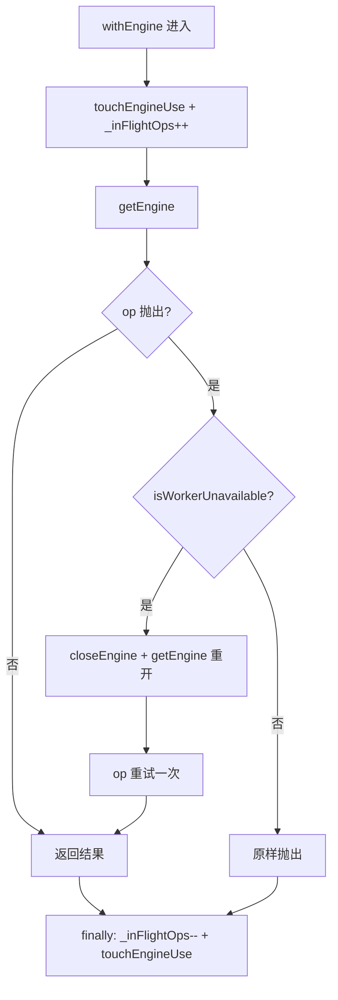
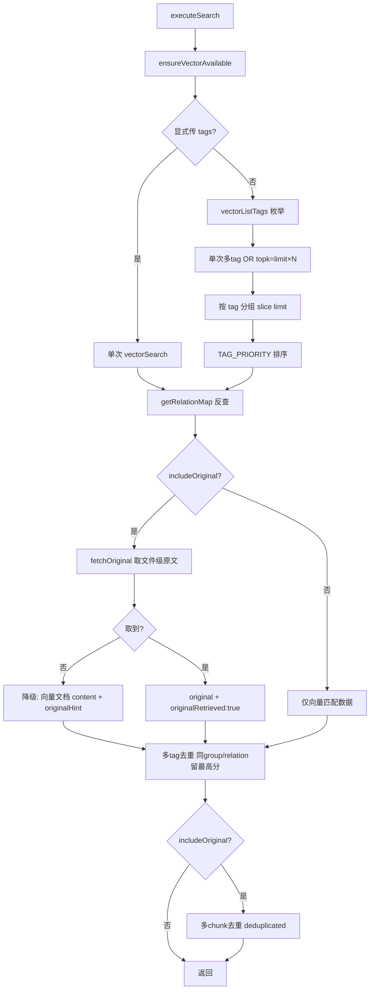

# 02-实现：检索与向量客户端专家

**本文引用的文件**
- [src/lib/vector-client.ts](file:///root/knowledge-indexer/src/lib/vector-client.ts)
- [src/lib/relation-map.ts](file:///root/knowledge-indexer/src/lib/relation-map.ts)
- [src/search.ts](file:///root/knowledge-indexer/src/search.ts)
- [src/store.ts](file:///root/knowledge-indexer/src/store.ts)
- [src/bulk-store.ts](file:///root/knowledge-indexer/src/bulk-store.ts)
- [src/doc.ts](file:///root/knowledge-indexer/src/doc.ts)
- [src/tag.ts](file:///root/knowledge-indexer/src/tag.ts)

## 目录
1. [简介](#简介)
2. [引擎生命周期实现](#引擎生命周期实现)
3. [检索与写入实现](#检索与写入实现)
4. [管理面实现](#管理面实现)
5. [memoryId 反查实现](#memoryid-反查实现)
6. [检索编排实现](#检索编排实现)
7. [存储与管理 CLI 实现](#存储与管理-cli-实现)
8. [结论](#结论)

## 简介

本文件剖析检索与向量客户端的核心实现：引擎生命周期（单例/串行化/超时/锁策略）、检索与写入原语、管理面枚举与删除、memoryId 反查缓存、检索编排（tag 策略 + 原文召回 + 两级去重），以及各 CLI 薄壳。

章节来源：[src/lib/vector-client.ts](file:///root/knowledge-indexer/src/lib/vector-client.ts)（关键符号：`getEngine` / `withEngine` / `enableIdleClose`）与 [src/search.ts](file:///root/knowledge-indexer/src/search.ts)（关键符号：`executeSearch` / `fetchOriginal`）

## 引擎生命周期实现

**`getEngine()`**：`touchEngineUse()` 刷新空闲计时 → 单例未建则经 `serializeEngineOp` 排队执行 `probeWithRetry(dbPath)`：
- `probe.locked` → 抛 `CollectionLockedException(lockedHint(dbPath))`（5 步处置提示）
- `!probe.exists` → 先 `fs.rmdirSync` 试删空目录（probe 对空目录返回 NOT_FOUND 但目录仍存在，zvec create 要求 dbPath 不存在；`rmdirSync` 仅删空目录，非空即抛错回退给 create 报错）→ `withOpenTimeout(ZvecEngine.create(...), '创建')`
- 否则 `withOpenTimeout(ZvecEngine.open(...), '打开')`

失败时 `_enginePromise.catch(() => { _enginePromise = null; })` 重置缓存，下次调用可重试自愈。

**`closeEngine()`**：先取 `const promise = _enginePromise` 再置空 → 经 `serializeEngineOp` 串行执行 `engine.close()`（try/catch 吞异常）。**先置空再 close** 是关键：close 期间新 `getEngine` 会走 reopen + 撞锁重试，而非拿到正在 closing 的旧 engine。

**`withEngine(op)`**：所有 engine 操作的统一包装。

图表来源：[src/lib/vector-client.ts](file:///root/knowledge-indexer/src/lib/vector-client.ts)（关键符号：`withEngine` / `isWorkerUnavailable`）

`isWorkerUnavailable` 用 **duck-typing** 而非 `instanceof`：`err.name === 'WorkerUnavailableError'` 或消息匹配 `/worker not open/i`。原因是不依赖 dist 构建版本的新导出——旧产物缺该导出时 `instanceof undefined` 会直接崩。

**`enableIdleClose(idleMs)`**：设 `_idleCloseMs` 与 `_lastUseAt`，起 `setInterval`（间隔 `max(500, idleMs/2)`，并 `unref()` 不阻止进程退出）。每次 tick 判断 `_enginePromise && _inFlightOps === 0 && Date.now() - _lastUseAt >= _idleCloseMs` 才 `void closeEngine()`。

**`probeWithRetry(dbPath)`**：循环 `ZvecEngine.probe`；未锁或已达 `LOCK_RETRY_MAX = 3` 则返回；否则从 `AsyncLocalStorage` 取来源，stderr 输出 `[kisearch][来源] 向量库被其他进程占用，等待 2s 后重试（n/3）...`，`sleep(LOCK_RETRY_INTERVAL_MS = 2000)` 后重试。

**`ensureVectorAvailable(scope?, opts?)`**：传 scope 时先 `interruptGuidance(scope)` 检测导入中断标记并 stderr 输出引导（不阻断）→ 单例已存在则 `await _enginePromise` 直接返回（`CollectionLockedException` → `LOCKED`，其他 → `PROBE_ERROR`）→ 否则 `serializeEngineOp` 内 `opts.fastFail ? ZvecEngine.probe : probeWithRetry` → `locked` → LOCKED；`exists && !healthy` → CORRUPTED。

章节来源：[src/lib/vector-client.ts](file:///root/knowledge-indexer/src/lib/vector-client.ts)（关键符号：`getEngine` / `closeEngine` / `withEngine` / `enableIdleClose` / `probeWithRetry` / `ensureVectorAvailable`）

## 检索与写入实现

**`vectorSearch`**：`resolveScope` → `tags` 归一化（数组直接用；字符串 `split(',')` + `trim` + 过滤空）→ `buildScopeTagFilter(scope, tagList)` → `withEngine(engine => engine.hybridSearch({ queryText, fts: query, topk: limit ?? 10, filter }))` → 映射为 `{ memoryId: h.id, content: h.text ?? fields.content, score, tag?, group? }` → 按 `threshold` 过滤（`threshold === undefined || score >= threshold`）。

**`buildScopeTagFilter`**：`scope` 必等（`{field:'scope', op:'==', value}`）；`tags` 非空时多 tag 以 `{or:[...]}` 组合，与 scope 条件 `{and:[scopeCond, tagFilter]}`；tags 空 → 只返回 scope 条件（覆盖全部 tag）。

**`vectorStore`**：`text.length > MAX_TEXT_LENGTH(50_000)` 抛错 → `normalizeTag(tags ?? DEFAULT_TAG)` → `generateDocId(text, scope, tag)` → `withEngine(engine => engine.upsert([{ id, text, fields: {tag, scope, group?} }]))` → `result.failed > 0` 抛错。

**`vectorBulkStore`**：空数组直接返回 0 计数 → 逐条算 docId 组装 docs → 一次 `engine.upsert(docs)` → 用 `errorById`（按 doc id 定位 `result.errors`）映射为逐项 `BulkStoreItemResult`。

**`vectorDelete`**：`resolveScope` 护栏 → `withEngine(engine => engine.delete(ids))` → 返回 `{deleted: result.ok, errors: result.errors.map(...)}`。**`NOT_FOUND` 由调用方判定**（幂等重删视为已清理），本层原样透出 `code`。

**`generateDocId(text, scope, tag?)`**：`sha256(text + scope + (tag ?? '')).slice(0, 32)`。

章节来源：[src/lib/vector-client.ts](file:///root/knowledge-indexer/src/lib/vector-client.ts)（关键符号：`vectorSearch` / `vectorStore` / `vectorBulkStore` / `vectorDelete` / `buildScopeTagFilter` / `generateDocId`）

## 管理面实现

四个枚举/删除函数均经 `validateScope`（不做 strict 白名单校验，以便操作未注册 scope）：

- **`vectorListDocs`**：`buildScopeTagFilter` → `engine.listIds(filter, limit ?? 10)` → `engine.fetch(ids, false)` → `toDocInfo` 映射。**顺序为引擎内部顺序，无排序保证**。
- **`vectorFetchDocs`**：空数组返回 `[]`；否则 `engine.fetch(ids, false)`。
- **`vectorListScopes`**：`engine.listIds(undefined, scanLimit)` → fetch → 收集 `fields.scope` 去重。
- **`vectorListTags`**：`engine.listIds(scopeCond, limit)` → `truncated = ids.length >= limit` → fetch → 内存按 `fields.tag` 分组计数 → 按 count 降序、同 count 按 tag 字典序。
- **`vectorCountScope`**：`listIds(filter, LIST_ALL_LIMIT).length`。
- **`vectorDeleteScope`**：循环 `{ listIds → 空则 break → delete → onProgress(total) → res.ok === 0 则 break（无进展保护）→ ids.length < LIMIT 则 break }`。

章节来源：[src/lib/vector-client.ts](file:///root/knowledge-indexer/src/lib/vector-client.ts)（关键符号：`vectorListDocs` / `vectorListTags` / `vectorCountScope` / `vectorDeleteScope` / `toDocInfo`）

## memoryId 反查实现

`getRelationMap(scope, ttlMs = 10min)` 模块级 `Map<scope, {builtAt, mtimeMs, size, map}>`：

1. `relations-cache.json` 不存在 → `cache.delete(scope)` + 返回空 Map。
2. `fs.statSync` 取 `mtimeMs` + `size`；与缓存条目比较——**两者均未变且未超 TTL** → 返回原 Map 实例。
3. 否则 `buildRelationMap(cachePath)` 重建并写入缓存。

`buildRelationMap` 遍历 `data.groups` 的 `hot_relations`：
- **优先多值**：`Array.isArray(rel.memoryIds) && length > 0` → 每个 `mid` 都映射到 `{group, relation: rel.text}`（`if (!map.has(mid))` 防覆盖），然后 `continue`。
- **回退单值**：`rel.memoryId` 存在 → 映射。
- 整个函数包在 `try/catch` 中，读失败或 JSON 损坏 → 返回**空 Map**（调用方降级，不抛错）。
- `keywords` / `isFullText` 字段已删除（REQ-05），旧数据中的这些字段被忽略。

章节来源：[src/lib/relation-map.ts](file:///root/knowledge-indexer/src/lib/relation-map.ts)（关键符号：`getRelationMap` / `buildRelationMap` / `clearRelationMapCache`）

## 检索编排实现

`executeSearch` 六步：

1. **护栏与可用性**：`resolveScope` + `validateScope` → `ensureVectorAvailable(scope)`（传 scope 触发中断标记引导）→ 不可用返回 `{ok:false, error, degraded:true}`。
2. **检索**（分支）：
   - 显式 `tags` → 单次 `vectorSearch`。
   - 否则 → `vectorListTags({scope})`；`tags.length === 0` → `raw = []`；否则单次 `vectorSearch({ limit: limit * tags.length, tags: tags.map(t => t.tag) })`（**传数组防逗号错拆**）→ 按 `h.tag` 分组 → 每组 `slice(0, limit)` → 按 `tagPriority` 排序 → `flatMap` 展开。
3. **反查增强**：`getRelationMap(scope)`；命中则附加 `group` / `relation`。
4. **原文召回**（仅 `includeOriginal === true`）：命中 `(group, relation)` → `fetchOriginal`；成功置 `originalRetrieved: true` + `original`；失败置 `false` + `original` 为 `r.content`（向量文档兜底）+ `originalHint`。未命中反查 → `originalRetrieved: false` + 兜底 + "无法定位本地 KB 原文"提示。
5. **多 tag 去重**：`best` Map 按 `${group}|${relation}` 保留 score 最高的一条；`best.size > 0 && best.size < results.length` 时才替换并按 score 降序重排。
6. **多 chunk 原文去重**（仅 `includeOriginal`）：`seen` Set 按 `${group}/${relation}`；重复命中 `delete hit.original` + `originalRetrieved = true` + `deduplicated = true`。

`TAG_PRIORITY = ['ki-search', 'ki-relation', 'ki-path']`；`tagPriority(tag)` 返回索引，未命中的自定义 tag 返回 `TAG_PRIORITY.length`（垫底）。

图表来源：[src/search.ts](file:///root/knowledge-indexer/src/search.ts)（关键符号：`executeSearch` / `tagPriority` / `fetchOriginal`）

章节来源：[src/search.ts](file:///root/knowledge-indexer/src/search.ts)（关键符号：`executeSearch` / `fetchOriginal` / `TAG_PRIORITY`）

## 存储与管理 CLI 实现

四个 CLI 均为「纯函数 + commander 壳」同构：

- **`store.ts`**：`executeStore` → scope 护栏 → `ensureVectorAvailable()`（**不传 scope，不做中断检测**）→ `vectorStore({tags: params.tags ?? 'ki-search'})` → `{ok, scope, docId}`。CLI 支持位置参数 `<text>` 与 `--text` 双入口（REQ-12）。
- **`bulk-store.ts`**：`executeBulkStore` → `ensureVectorAvailable` → 读文件 → `JSON.parse` 必须**是数组** → 每项校验 `text` 为非空字符串（否则 `第 N 条缺少 text 字段`）→ 映射为 `{text, tags: item.tags || 'ki-search'}` → `vectorBulkStore`。**只写向量层**。
- **`doc.ts`**：`executeDocList`（`ensureVectorAvailable` → `vectorListDocs` → `shapeDocs` 按 `full` 决定是否截断 200 字）；`executeDocDelete`（`ensureVectorAvailable` → `vectorFetchDocs` 取回 → 分出 `notFound` / `inScope` / `scopeMismatch` → **无 `yes` 则拒绝并回显预览** → 有 `yes` 则只对 `inScopeIds` 调 `vectorDelete`）。
- **`tag.ts`**：`executeTagList` → `ensureVectorAvailable` → `vectorListTags` → `{ok, scope, count, scanned, truncated, tags}`。

所有 CLI action 末尾统一 `await closeEngine()`，`!result.ok` 时 `process.exit(1)`。文件末尾用 `_isMain` 判断（`import.meta.url` 与 `process.argv[1]` 比对）决定是否 `program.parse()`，被 import 时不执行。

章节来源：[src/store.ts](file:///root/knowledge-indexer/src/store.ts)（关键符号：`executeStore`）与 [src/bulk-store.ts](file:///root/knowledge-indexer/src/bulk-store.ts)（关键符号：`executeBulkStore`）与 [src/doc.ts](file:///root/knowledge-indexer/src/doc.ts)（关键符号：`executeDocList` / `executeDocDelete`）与 [src/tag.ts](file:///root/knowledge-indexer/src/tag.ts)（关键符号：`executeTagList`）

## 结论

本专家实现以"**原生操作串行化 + 在途保护 + 自愈重试**"保证向量层稳定，以"**一次 embedding 的多 tag OR 检索 + memoryId 反查 + 原文召回降级 + 两级去重**"保证检索质量与效率，以"**纯函数 + CLI/MCP 双入口**"保证复用性。三处需要特别注意的边界：docId scheme 变更的迁移成本、`ki store/bulk_store` 数据的无根性、管理面枚举结果的近似性。

出处行：更新 2026-08-28  git commit：`9841255`
