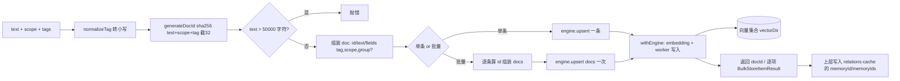
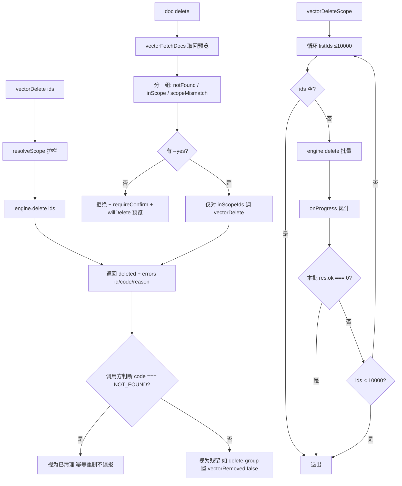
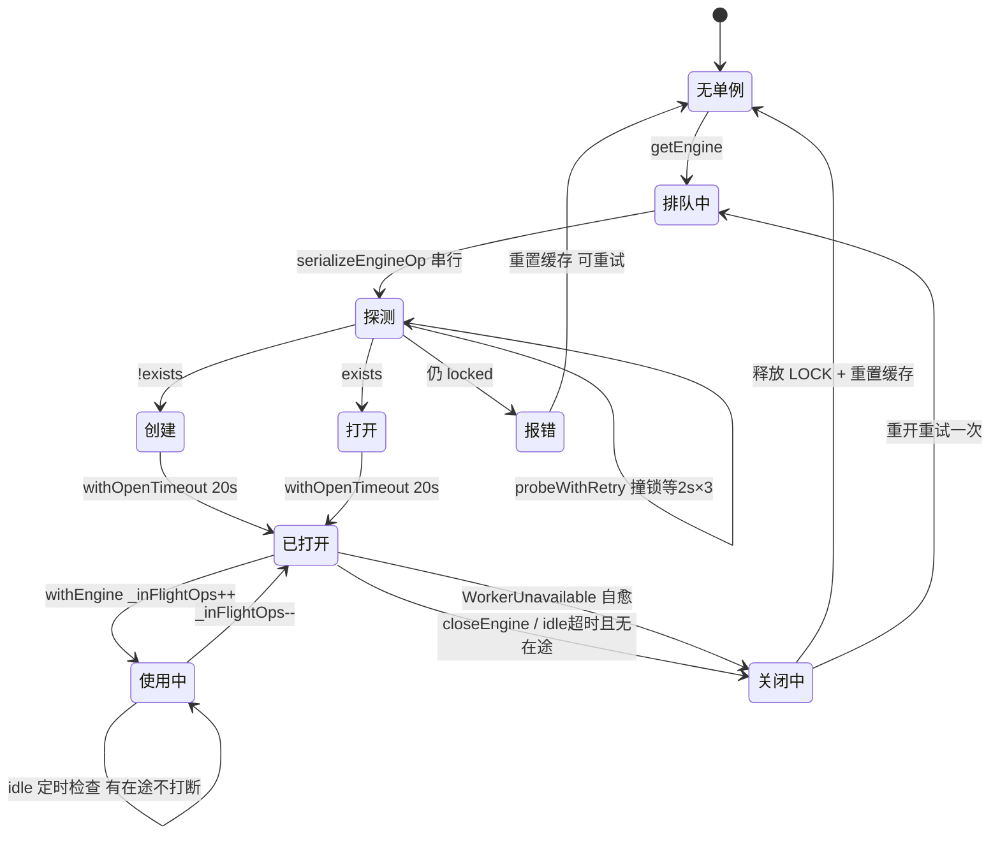
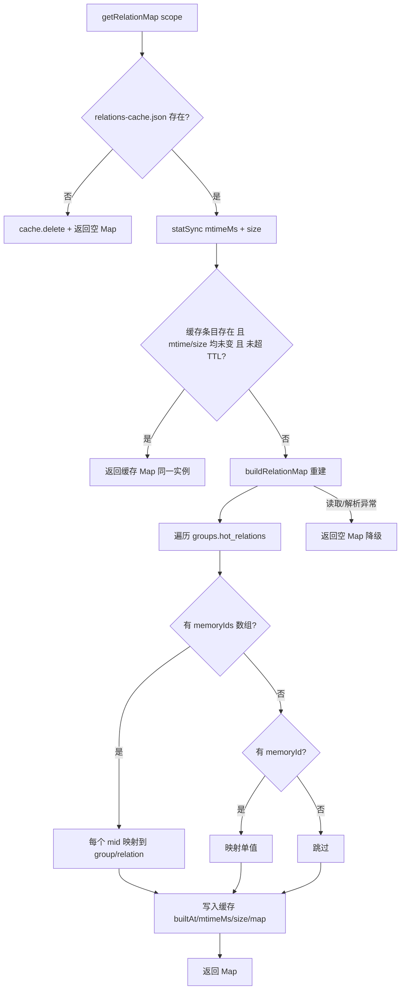

# 03-数据流转：检索与向量客户端专家

**本文引用的文件**
- [src/search.ts](file:///root/knowledge-indexer/src/search.ts)
- [src/lib/vector-client.ts](file:///root/knowledge-indexer/src/lib/vector-client.ts)
- [src/lib/relation-map.ts](file:///root/knowledge-indexer/src/lib/relation-map.ts)
- [src/store.ts](file:///root/knowledge-indexer/src/store.ts)
- [src/bulk-store.ts](file:///root/knowledge-indexer/src/bulk-store.ts)
- [src/doc.ts](file:///root/knowledge-indexer/src/doc.ts)

## 目录
1. [简介](#简介)
2. [检索数据流转](#检索数据流转)
3. [原文召回数据流转](#原文召回数据流转)
4. [写入数据流转](#写入数据流转)
5. [删除与清空数据流转](#删除与清空数据流转)
6. [引擎生命周期数据流转](#引擎生命周期数据流转)
7. [反查缓存数据流转](#反查缓存数据流转)
8. [结论](#结论)

## 简介

本文件追踪本专家的核心数据流转：检索（含原文召回）、写入、删除/清空、引擎生命周期（锁的获取与释放）、反查缓存的构建与失效。黑盒视角（数据去哪、被谁消费）见 `../C4-数据流向与消费.md`。

章节来源：[src/search.ts](file:///root/knowledge-indexer/src/search.ts)（关键符号：`executeSearch`）与 [src/lib/vector-client.ts](file:///root/knowledge-indexer/src/lib/vector-client.ts)（关键符号：`vectorStore` / `vectorDelete`）

## 检索数据流转

```mermaid
flowchart TD
    A[executeSearch 入参] --> B[resolveScope + validateScope]
    B --> C[ensureVectorAvailable scope]
    C -- 不可用 --> C1[ok:false + degraded]
    C -- 可用 --> D{显式 tags?}
    D -- 是 --> E[vectorSearch 单次 多tag OR]
    D -- 否 --> F[vectorListTags 枚举该 scope 全部 tag]
    F --> G{tags 为空?}
    G -- 是 --> G1[raw = 空数组]
    G -- 否 --> H[vectorSearch topk = limit × tag数]
    H --> I[withEngine: 主线程 embedding 1 次]
    I --> J[engine.hybridSearch 语义+FTS+RRF]
    J --> K[(向量集合)]
    K --> L[Hit 映射 memoryId/content/score/tag/group]
    L --> M[threshold 过滤]
    M --> N[按 tag 分组 slice limit]
    N --> O[TAG_PRIORITY 排序]
    E --> M
    O --> P[getRelationMap 反查]
    G1 --> P
    P --> Q[多 tag 去重 同 group|relation 留最高分]
    Q --> R[SearchHit[] 交付]
```

图表来源：[src/search.ts](file:///root/knowledge-indexer/src/search.ts)（关键符号：`executeSearch`）与 [src/lib/vector-client.ts](file:///root/knowledge-indexer/src/lib/vector-client.ts)（关键符号：`vectorSearch`）

**流转要点**：
- **embedding 次数**：显式传 tags 走 1 次；默认搜全部在 2026-08-28 后也降为 1 次（旧实现为 N 次）。`tags` 以数组传入，避免 tag 值含逗号时被 `join/split` 错拆。
- **topk 放大**：`limit × tags.length` 是全局配额，极端场景下单 tag 高分命中可能挤掉其他 tag——与旧"逐 tag 分查"**近似等价**而非严格等价。
- **反查是内存操作**：`getRelationMap` 不触发 I/O（除非缓存失效），命中即附加 `group`/`relation`。

章节来源：[src/search.ts](file:///root/knowledge-indexer/src/search.ts)（关键符号：`executeSearch` / `tagPriority`）与 [src/lib/vector-client.ts](file:///root/knowledge-indexer/src/lib/vector-client.ts)（关键符号：`vectorSearch` / `withEngine`）

## 原文召回数据流转

```mermaid
flowchart TD
    A[SearchHit: memoryId] --> B[getRelationMap 反查]
    B --> C{命中 group+relation?}
    C -- 否 --> D[originalRetrieved:false]
    D --> E[original = 向量文档 content]
    E --> F[originalHint: 无法定位本地 KB 原文]
    C -- 是 --> G[fetchOriginal scope/group/relation]
    G --> H[readJson kb/scope/group/index.json]
    H --> I{localKb 有该 relation?}
    I -- 是 --> J[originalRetrieved:true + original 全文]
    I -- 否 --> K[originalRetrieved:false]
    K --> L[original = '' + hint: KB 缺失该 relation]
    L --> M[降级: original = 向量文档 content]
    H -- 读取异常 --> N[originalRetrieved:false + hint: KB 读取异常]
    N --> M
    J --> O[多 chunk 去重: 后续命中 deduplicated]
    M --> O
    F --> O
    O --> P[最终 SearchHit[]]
```

图表来源：[src/search.ts](file:///root/knowledge-indexer/src/search.ts)（关键符号：`fetchOriginal` / `executeSearch`）

**流转要点**：
- **`includeOriginal` 默认 false**，整条原文召回链路默认不执行（REQ-09：避免默认返回大段原文）。
- **三处降级出口**都保证 `original` 非空——取不到文件级原文时用向量文档 `content` 兜底，并给 `originalHint`。这是"给出路"而非静默失败。
- **`fetchOriginal` 返回 `null` 与 `original: ''` 语义不同**：`null` = KB 文件不存在；`{original:'', hint}` = 文件存在但缺该 relation 或读取异常。

章节来源：[src/search.ts](file:///root/knowledge-indexer/src/search.ts)（关键符号：`fetchOriginal`）与 [src/lib/store.ts](file:///root/knowledge-indexer/src/lib/store.ts)（关键符号：`readJson`）

## 写入数据流转



图表来源：[src/lib/vector-client.ts](file:///root/knowledge-indexer/src/lib/vector-client.ts)（关键符号：`vectorStore` / `vectorBulkStore` / `generateDocId`）

**流转要点**：
- **本层不写 KB**：`memoryId` 回填 `relations-cache` 是上层（知识索引导入 / 关系与索引管理）的职责。因此 `ki store` / `ki bulk_store` 写入的数据**没有原文定位字段**。
- **幂等靠 docId**：同 `text + scope + tag` → 同 docId → upsert 覆盖。tag 参与 hash 是多标签能力的前提（单值 tag 字段下，多 tag 必须各写一 doc）。
- **批量失败不中断**：`result.errors` 按 doc id 定位，逐条映射为 `BulkStoreItemResult`，`succeeded = result.ok`。

章节来源：[src/store.ts](file:///root/knowledge-indexer/src/store.ts)（关键符号：`executeStore`）与 [src/bulk-store.ts](file:///root/knowledge-indexer/src/bulk-store.ts)（关键符号：`executeBulkStore`）

## 删除与清空数据流转



图表来源：[src/lib/vector-client.ts](file:///root/knowledge-indexer/src/lib/vector-client.ts)（关键符号：`vectorDelete` / `vectorDeleteScope`）与 [src/doc.ts](file:///root/knowledge-indexer/src/doc.ts)（关键符号：`executeDocDelete`）

**流转要点**：
- **`NOT_FOUND` 的处理在调用方**：本层原样透出 `code`，由关系与索引管理等消费方决定是否视为已清理。
- **`doc delete` 的 scope 护栏在删除前强制生效**：先 fetch 比对 `d.scope === params.scope`，跨 scope 的进 `scopeMismatch` 跳过。
- **`vectorDeleteScope` 两处退出条件**：本批零删除（防死循环空转）+ 本批不足 LIMIT（说明已清完）。

章节来源：[src/lib/vector-client.ts](file:///root/knowledge-indexer/src/lib/vector-client.ts)（关键符号：`vectorDelete` / `vectorDeleteScope`）与 [src/doc.ts](file:///root/knowledge-indexer/src/doc.ts)（关键符号：`executeDocDelete`）

## 引擎生命周期数据流转



图表来源：[src/lib/vector-client.ts](file:///root/knowledge-indexer/src/lib/vector-client.ts)（关键符号：`getEngine` / `closeEngine` / `withEngine` / `enableIdleClose` / `probeWithRetry` / `serializeEngineOp`）

**流转要点**：
- **状态转换的串行化边界**：`probe/create/open/close` 是四类原生操作，全部经 `serializeEngineOp` 排队，禁止并发（62% 概率原生竞态永久阻塞）。
- **在途计数是 idle close 的闸门**：`_inFlightOps > 0` 时定时器不触发 close，修复了 embedding 网络期被 idle close 打断的竞态。
- **`closeEngine` 先置空缓存**：保证 close 期间的新调用走 reopen 而非复用正在关闭的 engine。

章节来源：[src/lib/vector-client.ts](file:///root/knowledge-indexer/src/lib/vector-client.ts)（关键符号：`getEngine` / `closeEngine` / `withEngine`）

## 反查缓存数据流转



图表来源：[src/lib/relation-map.ts](file:///root/knowledge-indexer/src/lib/relation-map.ts)（关键符号：`getRelationMap` / `buildRelationMap`）

**流转要点**：
- **双失效条件（mtime + size）**：`size` 兜底毫秒精度下 `mtime` 未变的原地改写场景；任一变化即**立即失效**，避免 sync-relation/import 后 10 分钟内反查到陈旧映射。TTL 是第三重兜底（内容被等长改写且 mtime+size 均未变）。
- **降级不抛错**：文件缺失或 JSON 损坏均返回空 Map，检索结果只是缺少 `group`/`relation` 字段。
- **多值优先**：`memoryIds` 存在时 `continue`，不再处理单值 `memoryId`——保证一个文件级 relation 的全部 chunk doc 都能反查到。

章节来源：[src/lib/relation-map.ts](file:///root/knowledge-indexer/src/lib/relation-map.ts)（关键符号：`getRelationMap` / `buildRelationMap` / `clearRelationMapCache`）

## 结论

本专家的数据流转呈三条主线：**检索流**（向量检索 → 反查 → 可选原文召回 → 两级去重，全程只读）、**写入流**（docId 幂等 upsert → 只写向量层，KB 回填由上层负责）、**生命周期流**（单例状态机，串行化 + 撞锁重试 + 空闲释放 + 在途保护）。三处关键设计：embedding 从 N 次降为 1 次、原文召回三处降级出口保证 `original` 非空、反查缓存 mtime+size+TTL 三重失效。

出处行：更新 2026-08-28  git commit：`9841255`
