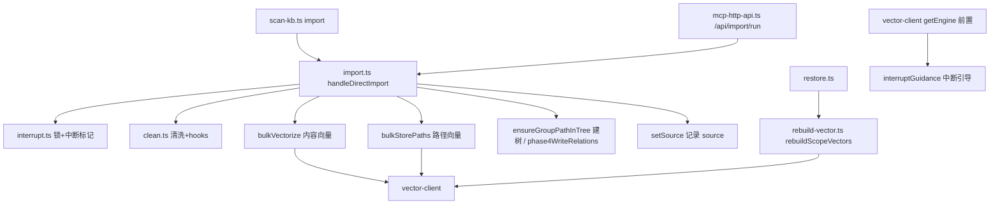

# 01-架构：知识索引导入专家

**本文引用的文件**
- [src/lib/import.ts](file:///root/knowledge-indexer/src/lib/import.ts)
- [src/lib/interrupt.ts](file:///root/knowledge-indexer/src/lib/interrupt.ts)
- [src/lib/batch-vectorize.ts](file:///root/knowledge-indexer/src/lib/batch-vectorize.ts)
- [src/lib/path-vectorize.ts](file:///root/knowledge-indexer/src/lib/path-vectorize.ts)
- [src/lib/rebuild-vector.ts](file:///root/knowledge-indexer/src/lib/rebuild-vector.ts)
- [src/lib/ai-results.ts](file:///root/knowledge-indexer/src/lib/ai-results.ts)
- [src/lib/mcp-http-api.ts](file:///root/knowledge-indexer/src/lib/mcp-http-api.ts)
- [src/scan-kb.ts](file:///root/knowledge-indexer/src/scan-kb.ts)

## 目录
1. [简介](#简介)
2. [模块职责与边界](#模块职责与边界)
3. [架构分层](#架构分层)
4. [依赖关系](#依赖关系)
5. [关键设计决策](#关键设计决策)
6. [对外接口与契约层索引](#对外接口与契约层索引)
7. [术语表](#术语表)
8. [结论](#结论)

## 简介

本专家是 kisearch 的**知识导入链路**：外部 Markdown 目录（或单文件）**原文直导**（无 AI 依赖）——清洗、切分、向量化、建 Group 树、落盘 KB 层。**增量更新由幂等追加语义承载**（2026-08-14 起，commit a373606）：同 sourcePath 覆盖、同名不同源跳过、新文件导入，`full/incremental` 双模式与 `incremental.ts`/`diff.ts` 已物理删除。

章节来源：[src/lib/import.ts](file:///root/knowledge-indexer/src/lib/import.ts)（`handleDirectImport` 主流程）

## 模块职责与边界

**职责**：
- 直导导入（原文 + 自动切分，幂等追加，目录/单文件两种来源）
- 导入并发防护与中断自愈（`interrupt.ts`：导入锁 + 中断标记）
- 批量向量化（content / path / relation / 自定义 tag 四类向量）
- 向量重建（restore 后全量重建 + `--group`/`--tags` 局部重建）
- HTTP 导入入口（upload → run 异步 job → status 轮询）

**边界**（不做什么）：
- 不提供检索 / 原文定位（属检索与向量客户端专家）
- 不提供关系评分 / Group 树 CRUD / 删除（属关系与索引管理专家，本专家只写数据）
- 不提供备份 / 还原（属存储与配置基础专家；restore 复用本专家 `rebuildScopeVectors`）
- 不做 AI 摘要生成（ai-results.json 输入契约已于批次 3 删除，`ai-results.ts` 仅存 `ScanResultEntry` 类型与 `deriveGroupPath` 落点推导）

章节来源：[src/lib/import.ts](file:///root/knowledge-indexer/src/lib/import.ts)（`handleDirectImport`）、[src/lib/interrupt.ts](file:///root/knowledge-indexer/src/lib/interrupt.ts)（`acquireImportLock`）、[src/lib/rebuild-vector.ts](file:///root/knowledge-indexer/src/lib/rebuild-vector.ts)（`rebuildScopeVectors`）

## 架构分层

```
CLI 层           src/scan-kb.ts（仅 import 子命令）
HTTP 层          lib/mcp-http-api.ts（/api/import/upload|run|status，异步 ImportJob）
                      │
编排层           lib/import.ts（handleDirectImport 幂等追加）
防护层           lib/interrupt.ts（导入锁 + 中断标记 + 引导）
                      │
能力层           lib/batch-vectorize.ts（内容向量）  lib/path-vectorize.ts（路径向量）
                lib/chunker.ts（切分）  lib/clean.ts（清洗 + hooks）
                lib/ai-results.ts（类型 + 落点推导）  lib/progress.ts（控制台进度）
                lib/rebuild-vector.ts（重建）
                      │
基础层           检索客户端（vectorBulkStore/vectorCountScope/vectorDeleteScope）
               存储与配置（store/scope/config/constants）
```



图表来源：[src/lib/import.ts](file:///root/knowledge-indexer/src/lib/import.ts)（`handleDirectImport`）与 [src/lib/rebuild-vector.ts](file:///root/knowledge-indexer/src/lib/rebuild-vector.ts)（`rebuildScopeVectors`）

## 依赖关系

| 依赖方 | 被依赖方 | 说明 |
|--------|----------|------|
| `scan-kb.ts` | `import.ts` / `backup.ts`（autoBackup）/ `vector-client.ts`（closeEngine）/ `clean.ts` | CLI 入口 |
| `mcp-http-api.ts` | `import.ts`（handleDirectImport） | HTTP 导入异步 job |
| `import.ts` | `interrupt.ts`（锁/标记）/ `clean.ts` / `chunker.ts` / `batch-vectorize.ts` / `path-vectorize.ts` / `ai-results.ts`（deriveGroupPath）/ `scope.ts` / `store.ts` / `config.ts` / `progress.ts` | 直导编排 |
| `batch-vectorize.ts` | `vector-client.ts`（vectorStore/vectorBulkStore/vectorDelete） | 内容向量化 |
| `path-vectorize.ts` | `vector-client.ts` | 路径向量 |
| `rebuild-vector.ts` | `vector-client.ts` / `path-vectorize.ts` | 重建（被 restore.ts 消费） |
| `vector-client.ts` | `interrupt.ts`（interruptGuidance，getEngine 前置检测） | 打开向量库的命令统一引导中断恢复 |

**外部依赖**：`dist/zvec-engine`（经 vector-client）；**不再依赖 git**（source 块不写 commit）。

章节来源：[src/scan-kb.ts](file:///root/knowledge-indexer/src/scan-kb.ts)（commander `import` 子命令 action）、[src/lib/mcp-http-api.ts](file:///root/knowledge-indexer/src/lib/mcp-http-api.ts)（`handleImportRun`）、[src/lib/vector-client.ts](file:///root/knowledge-indexer/src/lib/vector-client.ts)（`getEngine`）

## 关键设计决策

1. **幂等追加承载增量**（commit a373606）：同 sourcePath 重导覆盖更新；同 group 同 relation 名不同 sourcePath 真冲突跳过；新文件导入。废弃依赖 git diff 的 incremental/diff（`src/lib/incremental.ts` 532 行、`src/lib/diff.ts` 295 行已物理删除）。
2. **rootName 概念移除**（commit fce0b57）：`--group` 指定落点（自动新建含父路径）；缺省时目录导入按顶层子目录名各建根节点、根目录散文件落 scope name、单文件导入落 scope name（`resolveGroupForSource`）。
3. **方案 D 双层数据**：local KB 先写文件级原文（未清洗），清洗只作用于向量化输入；文件级 relation 挂 `memoryIds` 多值（全部 chunk docId + tag 向量 docId），`memoryId` 单值为兼容保留（取首个）。
4. **覆盖导入前置清理**：向量化模式下 scope 已有向量（`vectorCountScope > 0`）→ 先 `vectorDeleteScope` 清空再重建，消除文件变更后的孤儿向量；`--no-vector` 不动向量层。
5. **导入并发锁 + 中断自愈**（`interrupt.ts`，REQ-20260807-001）：同 scope 并发导入拒绝（`.import.lock`，pid 存活检测自动清理 SIGKILL 残留）；SIGINT/SIGTERM 写中断标记（`import-interrupt.json`）并同步清锁；标记由 vector-client `getEngine` 前置检测（`interruptGuidance`）引导 `ki restore --rebuild-vector` 恢复，成功导入/rebuild 后自动清除。
6. **P-7 清洗 hook 失败回滚**：全部 hooks 失败 → 删除已写 local KB 原文 + 计入 skipped，不写向量。
7. **单文件导入**：`sourceDir` 可为单个 Markdown 文件（absPath 直接用 sourceDir，避免 `xxx.md/xxx.md` 的 ENOTDIR）；后缀必须命中白名单，未命中 fail-loud。
8. **重建自包含 + 局部重建**（commit 54b035b）：数据源完全来自已还原 KB；带 `--group` 过滤子树 / `--tags` 合并打标（只增不减）时为局部重建（不清空 scope）。
9. **进度文件断点续跑已废弃**：`progress.ts` 现仅承担控制台进度展示（logPhaseStart/logProgress 等）；进度文件函数（createProgressFile 等）为无调用方的死代码残留。

章节来源：[src/lib/import.ts](file:///root/knowledge-indexer/src/lib/import.ts)（`handleDirectImport` / `resolveGroupForSource`）、[src/lib/interrupt.ts](file:///root/knowledge-indexer/src/lib/interrupt.ts)（`InterruptMark`）、[src/lib/rebuild-vector.ts](file:///root/knowledge-indexer/src/lib/rebuild-vector.ts)（`RebuildVectorOptions`）

## 对外接口与契约层索引

- 契约层：`../C0-使用总览.md`、`../C1-能力契约.md`、`../C2-使用流程.md`、`../C4-数据流向与消费.md`
- 实现层索引：`02-实现.md`、`03-数据流转.md`、`06-测试.md`

## 术语表

| 术语 | 含义 |
|------|------|
| 幂等追加 | 同 sourcePath 重导覆盖、真冲突跳过、新文件导入；重复执行 = 增量更新 |
| 方案 D | 原文直导方案：local KB 存文件级原文 + 文件级 relation 挂 memoryIds 多值 |
| chunk | 文件清洗后按 chunkSize/chunkOverlap 切分的向量化单元，sourcePath = `文件#N` |
| 导入锁 | `kb/{scope}/.import.lock`（pid + startedAt），同 scope 并发导入拒绝 |
| 中断标记 | `kb/{scope}/import-interrupt.json`，SIGINT/SIGTERM 中断时写入供引导恢复 |
| 三类+tag 向量 | content（ki-search）/ relation（ki-relation）/ path（ki-path）/ 自定义 tag 内容向量 |

## 关键发现 / 主要风险

- **覆盖导入是 scope 级全量清空**：向量化模式下只要 scope 已有向量，本次导入会清空全部旧向量重建（即使本次只导一个文件）——跨多次导入不同 group 的文件，前次文件需在本次源目录内（或幂等重导覆盖）才不丢向量。
- **`progress.ts` 死代码**：进度文件函数无调用方，勿基于其理解断点续跑（中断恢复走 interrupt 标记 + rebuild）。
- **HTTP 导入 job 内存态**：`ImportJob` 存进程内存，服务重启后 `/api/import/status` 返回 404（提示重新导入）。
- **index.json 存全文 vs 向量 content 清洗后文本**：两者刻意不同（原文存档 vs 向量化输入），排查"搜到的内容与原文不一致"时属设计行为。

章节来源：[src/lib/import.ts](file:///root/knowledge-indexer/src/lib/import.ts)（`vectorCountScope` 覆盖前置）、[src/lib/mcp-http-api.ts](file:///root/knowledge-indexer/src/lib/mcp-http-api.ts)（`ImportJob`）、[src/lib/progress.ts](file:///root/knowledge-indexer/src/lib/progress.ts)（`logProgress`）

## 结论

本专家通过「幂等追加 + 方案 D 双层数据 + 导入锁/中断自愈 + 覆盖前置清理」实现可靠的外部知识直导链路；CLI 与 HTTP 双入口共享同一编排（handleDirectImport），向量重建与 restore 闭环衔接。

出处行：更新日期 2026-08-28（基于 commit 54b035b）
