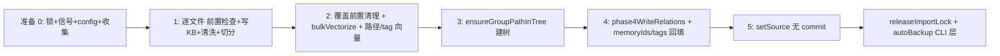

# 02-实现：知识索引导入专家

**本文引用的文件**
- [src/lib/import.ts](file:///root/knowledge-indexer/src/lib/import.ts)
- [src/lib/interrupt.ts](file:///root/knowledge-indexer/src/lib/interrupt.ts)
- [src/lib/batch-vectorize.ts](file:///root/knowledge-indexer/src/lib/batch-vectorize.ts)
- [src/lib/path-vectorize.ts](file:///root/knowledge-indexer/src/lib/path-vectorize.ts)
- [src/lib/rebuild-vector.ts](file:///root/knowledge-indexer/src/lib/rebuild-vector.ts)
- [src/lib/mcp-http-api.ts](file:///root/knowledge-indexer/src/lib/mcp-http-api.ts)

## 目录
1. [简介](#简介)
2. [直导导入实现](#直导导入实现)
3. [导入防护实现（interrupt）](#导入防护实现interrupt)
4. [批量向量化实现](#批量向量化实现)
5. [路径向量化实现](#路径向量化实现)
6. [HTTP 导入实现](#http-导入实现)
7. [向量重建实现](#向量重建实现)
8. [结论](#结论)

## 简介

本文件剖析知识导入的核心实现：直导编排（handleDirectImport）、导入防护（锁/中断标记）、向量化、HTTP 导入与向量重建。

## 直导导入实现

**`handleDirectImport(args)`**（`import.ts`）主流程：

图表来源：[src/lib/import.ts](file:///root/knowledge-indexer/src/lib/import.ts)（`handleDirectImport` 调用链）

**准备阶段（步骤 0）细节**：
- `acquireImportLock(scope)` 失败 → 抛「已有导入进行中」（并发导入拒绝，N4）
- `process.once('SIGINT'/'SIGTERM', onInterrupt)`：写中断标记（含 processedFiles/totalFiles）+ 同步清锁 + `exit(130)`
- config 读取：`getScopeImportConfig`（extensions 白名单默认 `['.md']` / maxFileSize 默认 1MB）、`getScopeCleanConfig`（外部 hooks，REQ-07）
- 来源识别：`sourceIsFile`（statSync.isFile）→ 单文件分支（absPath = sourceDir，白名单 fail-loud 校验）；目录分支 `collectMarkdownFiles`（递归、跳隐藏目录/node_modules、非白名单汇总 skippedNonMd）
- 预读 `relations-cache.json`（缺失 → 抛「scope 初始化异常」）

**步骤 1（逐文件）细节**：
- 前置检查顺序：大小超限 skip → 读文件 → `resolveGroupForSource` 落点推导 → relation 冲突检查（同 group 同名且 sourcePath 不同 = 真冲突 skip；sourcePath 相同 = 幂等重导覆盖）
- `writeLocalKb` 先写原文（未清洗）；清洗 = `cleanMarkdownText`（内置规则）→ `runCleanHooks`（外部 hooks，全失败 → P-7 回滚 removeFromLocalKb + skip）
- `splitIntoChunks`（chunkSize 默认 1000 / overlap 150）；chunk 超限（`MAX_CHUNKS_PER_FILE`）→ 回滚 local KB + skip
- 每文件产出 entries：`path = 文件#N`、`chunkRelation = 文件名-N`、`text = 清洗后 chunk`

**步骤 2（向量化）细节**：
- 覆盖前置：`vectorCountScope > 0` → `vectorDeleteScope`（带动态进度）再重建
- `bulkVectorize(entries, scope, { timeoutMs: 60_000 + entries.length * 10_000 })`；`--no-vector` 跳过（memoryMap 为空）
- `bulkStorePaths`：ki-relation 每 chunk 一条（`buildRelationContent(chunkRelation, groupPath)`）+ ki-path 每 group 一条（`buildGroupPathContent`）
- 自定义 tag 向量：`vectorBulkStore`（text=原文，tags=每个 tag 各一条）→ 按 `item.index / customTags.length` 回推文件 → `tagMemoryMap`；失败仅 warn 不阻断

**步骤 3~5 细节**：
- Phase 3：`phase3EnsureGroups` → `ensureGroupPathInTree` + groupPath 全部父级加入 `ctx.groups`
- Phase 4：`phase4WriteRelations` 按（groupPath + relationText）upsert 文件级 relation（memoryIds 先空数组占位）→ 回填：全部 chunk docId（`mergedMap.get('文件#N')`）+ tag 向量 docId → `rel.memoryIds` 多值（`rel.memoryId` 取首个兼容单值消费方）；`rel.tags` 持久化自定义 tag（供 rebuild/restore 恢复）
- Phase 5：`setSource(scope, { dir, chunkSize, chunkOverlap })`——**不写 commit**（增量由幂等追加承载）
- 成功收尾：`releaseImportLock`（清锁 + 清中断标记）+ 移除信号监听

**关键内部函数**：
- `resolveGroupForSource(group, rel, scope)`：显式 group → `deriveGroupPath(group, rel)`；缺省 → 相对目录为 groupPath（根目录散文件落 scope name）
- `deriveChunkRelation(filePath, chunkIndex)`：`文件名-N`（两位序号）
- `deriveChunkSourcePath(filePath, chunkIndex)`：`文件路径#N`（文件级聚合键）
- `upsertRelation(cache, groupPath, relationText, memoryIds, sourcePath, tags?)`：以 (groupPath + relationText) 为主键；已存在刷新 isImported 不做评分回退
- `writeLocalKb` / `removeFromLocalKb`：`kb/{scope}/{groupPath}/index.json` 的 JSON 键值读写

章节来源：[src/lib/import.ts](file:///root/knowledge-indexer/src/lib/import.ts)（`handleDirectImport` / `resolveGroupForSource` / `upsertRelation` / `phase4WriteRelations`）

## 导入防护实现（interrupt）

**中断标记**（`interrupt.ts`）：
- `writeInterruptMark`：原子写（`.tmp` + rename）`kb/{scope}/import-interrupt.json`，字段 `{scope, interruptedAt, processedFiles, totalFiles, signal}`
- `readInterruptMark`：损坏标记视为 null（可重新导入覆盖）
- `clearInterruptMark`：删标记 + `.tmp`（成功导入 / rebuild 成功 / 手动）
- `interruptGuidance(scope)`：有标记 → 返回完整引导文案（建议 `ki restore <scope> --rebuild-vector`）；无 → null

**导入锁**：
- `acquireImportLock`：锁存在时用 `process.kill(pid, 0)` 探活——存活 → 拒绝（真并发）；不存在/锁损坏 → 清理后继续（SIGKILL 残留自愈，N4）
- `clearImportLock`：仅删锁（中断路径用，保留标记供引导）
- `releaseImportLock`：清中断标记 + 清锁（成功导入收尾）

**触发范围**（N1）：`vector-client.ts` 的 `getEngine` 前置调 `interruptGuidance(scope)`——所有打开向量库的命令统一看到引导；纯 KB 命令不触发。

章节来源：[src/lib/interrupt.ts](file:///root/knowledge-indexer/src/lib/interrupt.ts)（`acquireImportLock` / `interruptGuidance`）、[src/lib/vector-client.ts](file:///root/knowledge-indexer/src/lib/vector-client.ts)（`getEngine` 前置检测）

## 批量向量化实现

**`bulkVectorize(entries, scope, options)`**（`batch-vectorize.ts`）：
- 空数组 → 空结果
- 一次 `vectorBulkStore({scope, entries: entries.map(e => ({text: buildVectorizeContent(e), tags: 'ki-search', keywords: e.keywords}))})`
- 按 `result.results[].index` 回填 `ok: Map<path, docId>` 与 errors（逐条失败不中断）

**`buildVectorizeContent(entry)`**：直接返回 `entry.summary`（content 纯化契约；直导链路中 entry.text 已是清洗后 chunk）。

**`vectorizeOne`**：单条 `vectorStore`；**`deleteMemory(memoryId, scope)`**：`vectorDelete({scope, ids: [memoryId]})`。

章节来源：[src/lib/batch-vectorize.ts](file:///root/knowledge-indexer/src/lib/batch-vectorize.ts)（`bulkVectorize` / `buildVectorizeContent`）

## 路径向量化实现

**`buildGroupPathContent(groupPath)`**（`path-vectorize.ts`）：`groupPath.split('/').filter(Boolean).join(' ')`（层级空格分隔，含根节点，禁止 `/` 保证可还原）。

**`buildRelationContent(relationText, groupPath?)`**：只含名称（Group 归属走 `PathVectorizeEntry.group` 结构化字段，防 BM25 误匹配）。

**`bulkStorePaths(entries)`**：按 scope 分组 → 每组一次 `vectorBulkStore`；失败逐条上报。

**`deletePathVector(text, tag, scope)`**：`vectorSearch` 精确同文本匹配（`r.content === text`）才删，避免误删近似。

章节来源：[src/lib/path-vectorize.ts](file:///root/knowledge-indexer/src/lib/path-vectorize.ts)（`buildGroupPathContent` / `bulkStorePaths` / `deletePathVector`）

## HTTP 导入实现

`mcp-http-api.ts` 三接口（鉴权模式下做 scope 越权校验，越权 `rejectScopeViolation` 脱敏 403）：

- **`handleImportUpload`**（POST `/api/import/upload`）：body `{scope, files:[{name, content(base64)}]}` → `~/.ki/import-uploads/<uploadId>/` 落盘；扩展名白名单 `.md/.markdown/.mdx`、大小上限、`sanitizeFileName` 防穿越；全败清理目录返回 400
- **`handleImportRun`**（POST `/api/import/run`）：body `{scope, uploadId, group?, chunkSize?, chunkOverlap?, vector?, tags?}` → 校验 uploadId 在受控目录内 → `createJob` + 异步 `runImportJob`（调 `handleDirectImport`，group 缺省传 undefined 走推断，与 CLI 语义一致）→ 202 `{jobId}`；**group 缺省语义曾与 CLI 不一致（P1-1 修复，commit 见 AGENTS.md 2026-08-14）**
- **`handleImportStatus`**（GET `/api/import/status?jobId=`）：返回 `{ok, job: {state, phase, progress, result, error, ...}}`；job 内存态，服务重启 404

章节来源：[src/lib/mcp-http-api.ts](file:///root/knowledge-indexer/src/lib/mcp-http-api.ts)（`handleImportUpload` / `handleImportRun` / `runImportJob` / `handleImportStatus`）

## 向量重建实现

**`rebuildScopeVectors(scope, deps?, opts?)`**（`rebuild-vector.ts`）：
1. 校验 scope 数据目录 + relations-cache 存在（缺则 `ok:false`）
2. `collectContentEntries(scopeDir, groupFilter?)`：遍历 index.json 收集内容向量条目（可按 `--group` 子树过滤，`isInGroupScope` 判定自身或子孙）
3. `collectPathRelationEntries(groups)`：relation 每条一个（ki-relation）+ 每 group 一个 path（ki-path）
4. `collectTagEntries` / `mergeRebuildTags`：`--tags` 与范围内 relation 已有 `rel.tags` 合并去重（只增不减）；全量重建（无 groupFilter/tags）先 `deleteScope` 清空旧向量，局部重建不清空
5. `bulkStore` 三类+tag 批量写入
6. `updateMemoryIds`：content docId 回写 relations-cache（匹配键 = groupPath + relationName）
7. 写回 relations-cache.json

`deps` 依赖注入（`RebuildDeps`：bulkStore/deleteScope）供测试 mock；被 `src/restore.ts` 消费（restore 内部自动触发重建）。

章节来源：[src/lib/rebuild-vector.ts](file:///root/knowledge-indexer/src/lib/rebuild-vector.ts)（`rebuildScopeVectors` / `isInGroupScope` / `mergeRebuildTags`）、[src/restore.ts](file:///root/knowledge-indexer/src/restore.ts)（调用点）

## 结论

本实现以「幂等追加编排 + 方案 D 双层数据 + 锁/中断自愈 + 双入口（CLI/HTTP）共享 handleDirectImport + 自包含可局部化的重建」为核心；旧 full/incremental 双模式与 git 依赖已彻底移除，排查时以本文件描述的现行链路为准。

出处行：更新日期 2026-08-28（基于 commit 54b035b）
