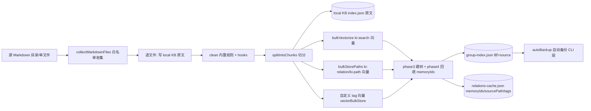
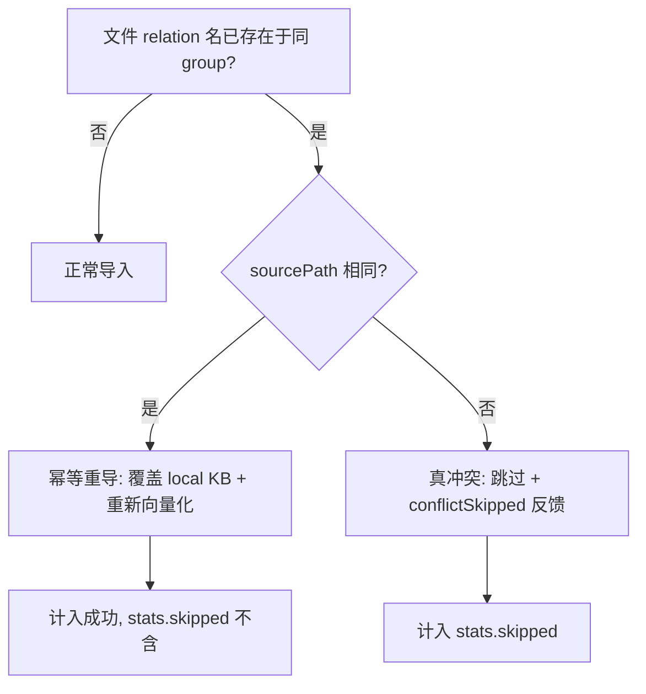
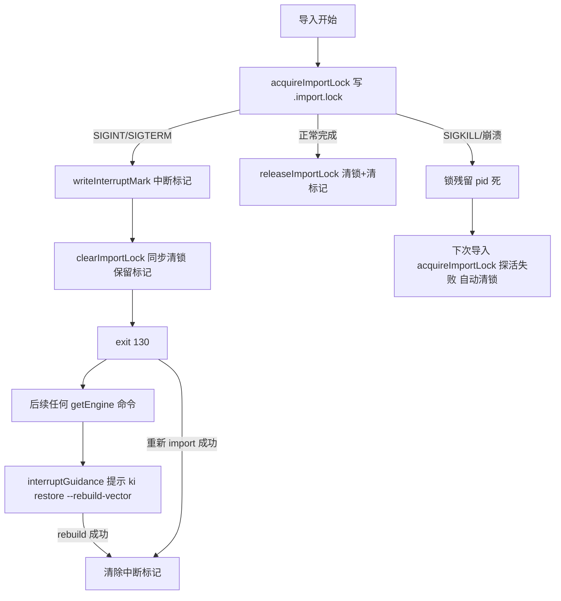
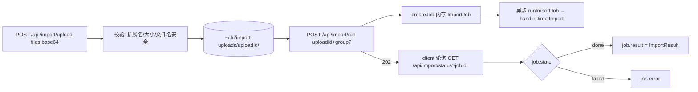
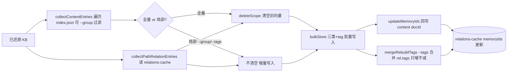

# 03-数据流转：知识索引导入专家

**本文引用的文件**
- [src/lib/import.ts](file:///root/knowledge-indexer/src/lib/import.ts)
- [src/lib/interrupt.ts](file:///root/knowledge-indexer/src/lib/interrupt.ts)
- [src/lib/rebuild-vector.ts](file:///root/knowledge-indexer/src/lib/rebuild-vector.ts)
- [src/lib/mcp-http-api.ts](file:///root/knowledge-indexer/src/lib/mcp-http-api.ts)

## 目录
1. [简介](#简介)
2. [直导导入数据流转](#直导导入数据流转)
3. [幂等重导与冲突流转](#幂等重导与冲突流转)
4. [中断与锁状态流转](#中断与锁状态流转)
5. [HTTP 导入数据流转](#http-导入数据流转)
6. [向量重建数据流转](#向量重建数据流转)
7. [结论](#结论)

## 简介

本文件追踪本专家的核心数据流转：直导导入（源文件 → 四类向量 + KB 双层落盘）、幂等重导、中断/锁状态机、HTTP 异步导入与向量重建。

## 直导导入数据流转

图表来源：[src/lib/import.ts](file:///root/knowledge-indexer/src/lib/import.ts)（`handleDirectImport` 数据写流向）

**流转要点**：
- **双层内容**：local KB 存**未清洗原文**；向量 content 存**清洗后 chunk**——两者刻意不同（原文存档 vs 向量化输入）
- 跨层桥接键：文件级 relation 的 `memoryIds[]` = 全部 chunk docId + tag 向量 docId（`memoryId` 单值取首个，兼容旧消费方）
- `sourcePath` = 相对源目录的 posix 路径（幂等判定键）；chunk 级 `path` = `文件#N`
- Phase 5 `setSource` 只记 `{dir, chunkSize, chunkOverlap}`，**无 commit**（git 依赖已移除）
- 覆盖前置：向量化模式下 scope 已有向量 → 先 `vectorDeleteScope` 全量清空再写入（`vectorCountScope` 判定）

章节来源：[src/lib/import.ts](file:///root/knowledge-indexer/src/lib/import.ts)（`handleDirectImport` / `writeLocalKb` / `collectMarkdownFiles`）

## 幂等重导与冲突流转

图表来源：[src/lib/import.ts](file:///root/knowledge-indexer/src/lib/import.ts)（`handleDirectImport` relation 冲突检查）

**流转要点**：
- 幂等键 = (group + relation 名 + sourcePath)；同名不同源是真冲突（防止不同文件互相覆盖）
- 覆盖导入时旧向量不逐条删——由 scope 级覆盖前置清理统一处理（决策 4，见 01-架构）

章节来源：[src/lib/import.ts](file:///root/knowledge-indexer/src/lib/import.ts)（`handleDirectImport` relation 冲突检查与 `conflictSkipped`）

## 中断与锁状态流转

图表来源：[src/lib/interrupt.ts](file:///root/knowledge-indexer/src/lib/interrupt.ts)（`acquireImportLock` / `releaseImportLock` / `interruptGuidance`）

**流转要点**：
- 锁与标记生命周期解耦：中断清锁**保留标记**；成功导入/rebuild 清锁**并清标记**
- 锁自愈：pid 探活（`process.kill(pid, 0)`）失败或锁损坏 → 自动清理放行（SIGKILL 残留无需人工）
- 引导触发点在 vector-client `getEngine` 前置（N1）——纯 KB 命令（doc list 等）不受影响

章节来源：[src/lib/interrupt.ts](file:///root/knowledge-indexer/src/lib/interrupt.ts)（`acquireImportLock` / `writeInterruptMark` / `clearImportLock`）、[src/lib/vector-client.ts](file:///root/knowledge-indexer/src/lib/vector-client.ts)（`getEngine` 前置 `interruptGuidance`）

## HTTP 导入数据流转

图表来源：[src/lib/mcp-http-api.ts](file:///root/knowledge-indexer/src/lib/mcp-http-api.ts)（`handleImportUpload` → `handleImportRun` → `runImportJob` → `handleImportStatus`）

**流转要点**：
- group 缺省传 `undefined` → `handleDirectImport` 推断落点，与 CLI 缺省语义一致（P1-1 修复）
- job 内存态：服务重启后 jobId 失效（status 404）；上传目录不受影响可重新 run
- 鉴权模式：upload/run 的 body.scope 越权 → 脱敏 403（`rejectScopeViolation`）

章节来源：[src/lib/mcp-http-api.ts](file:///root/knowledge-indexer/src/lib/mcp-http-api.ts)（`handleImportUpload` / `handleImportRun` / `handleImportStatus`）

## 向量重建数据流转

图表来源：[src/lib/rebuild-vector.ts](file:///root/knowledge-indexer/src/lib/rebuild-vector.ts)（`rebuildScopeVectors` 数据流）

**流转要点**：
- 数据源完全来自已还原 KB（自包含，无 AI/无 git 依赖）
- 全量重建幂等（先清空）；局部重建（`groupFilter`/`tags`）不清空 scope，`isInGroupScope` 判定子树（自身或子孙）
- content docId 回写 relations-cache（防 delete-relation 悬空引用）

章节来源：[src/lib/rebuild-vector.ts](file:///root/knowledge-indexer/src/lib/rebuild-vector.ts)（`rebuildScopeVectors` / `isInGroupScope` / `updateMemoryIds` / `mergeRebuildTags`）

## 结论

数据流转呈「源文件 → 双层落盘（原文/向量）+ memoryIds 桥接 + 锁/标记状态机自愈 + HTTP 异步 job + 可局部化重建」的完整链路；增量语义由幂等重导与覆盖前置清理承载，不再存在独立的增量数据流。

出处行：更新日期 2026-08-28（基于 commit 54b035b）
