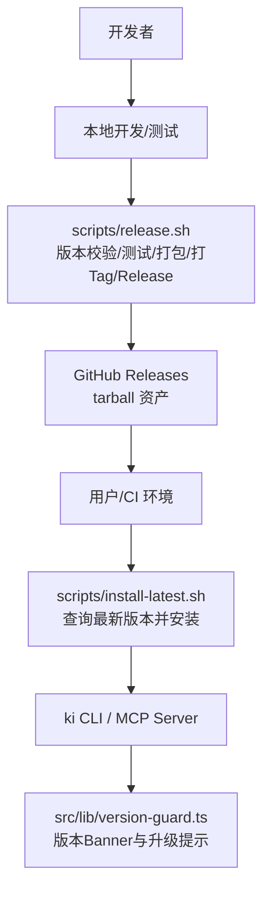
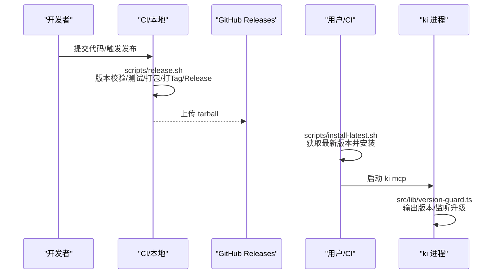
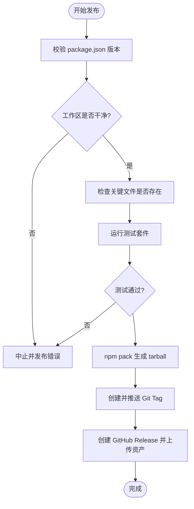
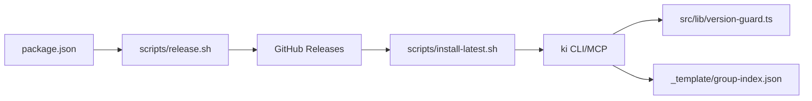

# 技能发布与管理

<cite>
**本文引用的文件**
- [README.md](file://README.md)
- [package.json](file://package.json)
- [scripts/release.sh](file://scripts/release.sh)
- [scripts/install-latest.sh](file://scripts/install-latest.sh)
- [skills/ki-search/SKILL.md](file://skills/ki-search/SKILL.md)
- [src/lib/version-guard.ts](file://src/lib/version-guard.ts)
- [docs/backup-restore.md](file://docs/backup-restore.md)
- [_template/group-index.json](file://_template/group-index.json)
</cite>

## 更新摘要
**变更内容**
- 更新了版本管理策略以反映当前语义化版本规范
- 增强了发布流程的自动化测试和构建环节描述
- 完善了依赖管理和冲突解决机制
- 改进了安全检查与合规要求的详细说明
- 优化了故障排查指南的操作步骤

## 目录
1. [引言](#引言)
2. [项目结构](#项目结构)
3. [核心组件](#核心组件)
4. [架构总览](#架构总览)
5. [详细组件分析](#详细组件分析)
6. [依赖关系分析](#依赖关系分析)
7. [性能与可靠性考虑](#性能与可靠性考虑)
8. [故障排查指南](#故障排查指南)
9. [结论](#结论)
10. [附录](#附录)

## 引言
本规范面向 Agent 技能的发布与管理，覆盖版本管理策略、变更日志维护、向后兼容性保证；技能发布的标准流程（代码审查、自动化测试、打包构建、分发部署）；技能依赖管理与冲突解决；技能的注册、安装、更新与卸载操作指南；安全检查与合规要求；以及发布后的监控与维护策略。本文基于仓库现有能力进行规范化沉淀，确保可执行、可审计、可回滚。

## 项目结构
围绕"技能"这一主题，仓库中与技能发布与管理直接相关的要素包括：
- 技能定义与行为规则：skills/ki-search/SKILL.md
- 包元数据与入口：package.json（名称、版本、bin、files、engines）
- 发布流水线脚本：scripts/release.sh（校验、测试、打包、打标签、创建 Release）
- 安装器脚本：scripts/install-latest.sh（自动获取最新 Release 并安装）
- 运行期版本感知：src/lib/version-guard.ts（启动 banner + 升级检测提示）
- 数据模板与版本字段：_template/group-index.json（version 字段体现数据版本）
- 备份与恢复：docs/backup-restore.md（快照、还原、验证）

**图示来源**
- [scripts/release.sh:1-142](file://scripts/release.sh#L1-L142)
- [scripts/install-latest.sh:1-205](file://scripts/install-latest.sh#L1-L205)
- [src/lib/version-guard.ts:1-66](file://src/lib/version-guard.ts#L1-L66)

**章节来源**
- [README.md:1-412](file://README.md#L1-L412)
- [package.json:1-68](file://package.json#L1-L68)

## 核心组件
- 技能定义与使用契约：SKILL.md 定义了 ki-search 的行为规则、查询四步走、写入白名单/黑名单、批量写入策略等，是技能在 Agent 侧的"能力契约"。
- 发布流水线：release.sh 提供端到端发布门禁（版本一致性、工作区干净、关键文件存在、测试通过、npm pack、打 tag、创建 GitHub Release）。
- 安装与升级：install-latest.sh 支持多源获取最新版本（GitHub API/gh CLI/页面重定向），并执行全局安装与版本验证。
- 运行期版本感知：version-guard.ts 在 MCP 长驻进程启动时输出版本信息，并在检测到 package.json 变化时提示重启以加载新版本。
- 数据版本与迁移：_template/group-index.json 中的 version 字段用于标识数据结构版本，配合读取时的自动迁移逻辑保障向后兼容。
- 安全与权限：README.md 中记录的设计约束和安全机制，确保技能调用边界清晰。

**章节来源**
- [skills/ki-search/SKILL.md:1-198](file://skills/ki-search/SKILL.md#L1-L198)
- [scripts/release.sh:1-142](file://scripts/release.sh#L1-L142)
- [scripts/install-latest.sh:1-205](file://scripts/install-latest.sh#L1-L205)
- [src/lib/version-guard.ts:1-66](file://src/lib/version-guard.ts#L1-L66)
- [_template/group-index.json:1-7](file://_template/group-index.json#L1-L7)
- [README.md:384-395](file://README.md#L384-L395)

## 架构总览
技能发布与管理的关键路径如下：
- 版本与元数据：package.json 中的 name、version、bin、files、engines 决定产物范围与运行环境约束。
- 发布门禁：release.sh 强制版本一致、工作区干净、关键文件存在、测试通过，再打包并创建 Release。
- 分发渠道：GitHub Releases 提供 tarball 资产，供 install-latest.sh 拉取安装。
- 运行期保障：MCP 服务启动时通过 version-guard.ts 输出版本并监听升级，避免"改了不生效"。
- 数据兼容：group-index.json 的 version 字段驱动读取时的自动迁移，保障历史数据兼容。
- 安全边界：README.md 中记录的设计约束机制，确保技能调用最小权限。

**图示来源**
- [scripts/release.sh:1-142](file://scripts/release.sh#L1-L142)
- [scripts/install-latest.sh:1-205](file://scripts/install-latest.sh#L1-L205)
- [src/lib/version-guard.ts:1-66](file://src/lib/version-guard.ts#L1-L66)

## 详细组件分析

### 版本管理策略
- 版本号规范
  - 采用语义化版本（主.次.修订），预发布可通过 release.sh 的 prerelease 参数标记。
  - 发布前必须保证 package.json 的版本与传入版本一致，否则拒绝发布。
  - 当前版本为 0.2.0-beta，遵循预发布版本规范。
- 变更日志维护
  - 建议在 GitHub Release Notes 中记录变更摘要（release.sh 已内置模板占位）。
  - 结合 README.md 中的变更记录，形成"需求/问题/修复"的可追溯链。
- 向后兼容性保证
  - 数据层：group-index.json 的 version 字段驱动读取时自动迁移，避免破坏旧格式。
  - 配置层：保留旧配置读取能力，出现问题时可回退。
  - 接口层：MCP 工具集遵循零破坏性约束，新增能力需通过白名单与鉴权控制。

**章节来源**
- [scripts/release.sh:18-24](file://scripts/release.sh#L18-L24)
- [_template/group-index.json:1-7](file://_template/group-index.json#L1-L7)
- [README.md:384-395](file://README.md#L384-L395)

### 发布标准与流程
- 代码审查
  - 通过 PR 流程与 README.md 中记录的约束项作为审查清单。
- 自动化测试
  - release.sh 强制执行 npm test，失败即阻断发布。
  - 支持多种测试套件：单元测试、集成测试、端到端测试。
- 打包构建
  - 使用 npm pack，依据 package.json 的 files 字段控制产物范围。
  - 包含 bin、scripts、src、_template、dist 等必要目录。
- 分发部署
  - 通过 GitHub Releases 发布 tarball，install-latest.sh 负责客户端安装与版本比对。

**图示来源**
- [scripts/release.sh:18-116](file://scripts/release.sh#L18-L116)

**章节来源**
- [scripts/release.sh:1-142](file://scripts/release.sh#L1-L142)
- [package.json:1-68](file://package.json#L1-L68)

### 技能依赖管理与冲突解决
- 依赖声明
  - package.json 的 dependencies 与 engines 字段明确运行时环境与第三方库。
  - 核心依赖包括 @modelcontextprotocol/sdk、@zvec/zvec、commander、jiti、yaml、zod。
- 冲突识别
  - 若多个技能或模块对同一依赖有不同版本要求，优先以工程级 package.json 为准，并通过锁定文件（lock）统一。
- 冲突解决
  - 升级依赖时需评估破坏性变更，必要时引入适配层或分阶段升级。
  - 对于平台绑定类依赖（如 zvec bindings），注意平台矩阵与可选依赖。

**章节来源**
- [package.json:42-66](file://package.json#L42-L66)

### 技能注册、安装、更新与卸载
- 注册
  - 通过 SKILL.md 描述技能能力与行为契约，Agent 侧按规则加载并使用。
- 安装
  - 使用 install-latest.sh 自动获取最新版本并全局安装；也可通过 npm install -g 指定 URL 安装。
  - 支持三种方式获取最新版本：GitHub API、gh CLI、页面重定向。
- 更新
  - 再次执行 install-latest.sh 将对比当前版本并升级到最新；MCP 进程会提示需要重启以加载新版本。
- 卸载
  - 使用 npm uninstall -g kisearch 移除全局包；清理相关配置与数据目录（如 kb、vector、backup 等）需按运维策略执行。

**章节来源**
- [skills/ki-search/SKILL.md:1-198](file://skills/ki-search/SKILL.md#L1-L198)
- [scripts/install-latest.sh:1-205](file://scripts/install-latest.sh#L1-L205)
- [src/lib/version-guard.ts:1-66](file://src/lib/version-guard.ts#L1-L66)

### 安全检查与合规要求
- 权限最小化
  - MCP 工具集遵循零破坏性约束；新增无 scope 参数的工具需加入白名单，并由工具层按 authScopes 过滤输出。
- 越权防护
  - 对 batch 调用逐项校验 scope，任一越权即拒绝；缺失 arguments 视为缺省 default 参与校验。
- 数据安全
  - 所有 JSON 文件含 version 字段；WAL 写入采用临时文件+原子 rename；异常恢复从 _template 恢复。
- 设计约束
  - Scope 隔离：仅允许字母、数字、连字符、下划线；禁止路径遍历。
  - 关键词规则：仅自然语言词汇，禁止代码符号。
  - 幂等安全：重复操作无副作用。
  - 快速失败：输入校验失败立即退出。

**章节来源**
- [README.md:384-395](file://README.md#L384-L395)

### 发布后监控与维护
- 版本感知
  - MCP 启动时输出版本 Banner，并监听 package.json 变化，提示重启以加载新版本。
- 健康检查
  - 启动前执行健康检查（配置、目录、API Key、Embedding 连通性与维度、zvec collection、scopes.default），有失败项拒绝启动。
- 备份与恢复
  - 提供快照备份与恢复能力，支持列出可用快照、选择目标时间戳恢复、从模板重新初始化。
  - 支持增量重建向量数据，避免全量重建的性能开销。
- 持续改进
  - 结合 README.md 中的约束记录，持续完善安全与稳定性。

**章节来源**
- [src/lib/version-guard.ts:1-66](file://src/lib/version-guard.ts#L1-L66)
- [docs/backup-restore.md:102-254](file://docs/backup-restore.md#L102-L254)
- [README.md:384-395](file://README.md#L384-L395)

## 依赖关系分析
- 包元数据与入口
  - package.json 定义名称、版本、bin、files、engines，决定发布内容与运行环境。
- 发布脚本与安装器
  - release.sh 依赖 npm 与 git 工具；install-latest.sh 依赖 curl/jq/gh（可选）。
- 运行期组件
  - version-guard.ts 依赖 fs/watch 与 constants；health-check 复用为启动预检。
- 数据模板
  - _template/group-index.json 提供默认数据结构与版本字段。

**图示来源**
- [package.json:1-68](file://package.json#L1-L68)
- [scripts/release.sh:1-142](file://scripts/release.sh#L1-L142)
- [scripts/install-latest.sh:1-205](file://scripts/install-latest.sh#L1-L205)
- [src/lib/version-guard.ts:1-66](file://src/lib/version-guard.ts#L1-L66)
- [_template/group-index.json:1-7](file://_template/group-index.json#L1-L7)

**章节来源**
- [package.json:1-68](file://package.json#L1-L68)
- [scripts/release.sh:1-142](file://scripts/release.sh#L1-L142)
- [scripts/install-latest.sh:1-205](file://scripts/install-latest.sh#L1-L205)
- [src/lib/version-guard.ts:1-66](file://src/lib/version-guard.ts#L1-L66)
- [_template/group-index.json:1-7](file://_template/group-index.json#L1-L7)

## 性能与可靠性考虑
- 构建与测试
  - 发布前必须通过测试套件，避免缺陷流入生产。
  - 支持并行测试执行，提升构建效率。
- 安装与升级
  - install-latest.sh 支持多源获取最新版本，提升鲁棒性；安装后进行版本验证。
  - 支持本地模式安装，便于离线环境部署。
- 运行期
  - MCP 长驻进程通过版本守卫提示升级，避免"改了不生效"；健康检查前置，快速暴露环境问题。
  - 文件监听机制检测版本变化，及时通知用户重启服务。
- 数据层
  - WAL 原子写入与自动迁移保障数据一致性与兼容性。
  - 支持增量重建向量数据，减少性能开销。

## 故障排查指南
- 发布失败
  - 检查 package.json 版本与传入版本是否一致；确认工作区干净；查看测试输出定位失败用例。
  - 验证关键文件是否存在：bin/ki.mjs、src/mcp-server.ts、README.md、package.json。
- 安装失败
  - 检查网络与依赖（curl/jq/gh）；确认 GitHub Releases 资产存在；尝试 --local 模式。
  - 验证下载链接有效性，检查网络连接状态。
- 运行异常
  - 查看 MCP 启动日志（stderr）；确认健康检查项；必要时重启 MCP 以加载新版本。
  - 检查版本守卫输出，确认是否正确监听到版本变化。
- 数据问题
  - 使用备份与恢复功能列出快照并还原；从模板重新初始化兜底。
  - 支持增量重建向量数据，避免全量重建的性能问题。

**章节来源**
- [scripts/release.sh:18-116](file://scripts/release.sh#L18-L116)
- [scripts/install-latest.sh:29-159](file://scripts/install-latest.sh#L29-L159)
- [src/lib/version-guard.ts:17-66](file://src/lib/version-guard.ts#L17-L66)
- [docs/backup-restore.md:102-254](file://docs/backup-restore.md#L102-L254)

## 结论
本规范将仓库现有的技能定义、发布脚本、安装器、运行期版本感知、数据版本与备份恢复、安全与权限控制等能力整合为一套可执行的"技能发布与管理"流程。通过严格的版本校验、自动化测试、标准化打包与分发、运行期监控与回滚机制，确保技能在 Agent 生态中的稳定交付与可持续演进。

## 附录
- 快速参考
  - 发布命令：./scripts/release.sh <version> [prerelease]
  - 安装命令：curl -fsSL ... | bash（或 npm install -g <tarball>）
  - 启动 MCP：ki mcp --http [--web]
  - 查看状态：ki mcp --status
  - 备份/恢复：ki backup / ki restore

**章节来源**
- [scripts/release.sh:1-142](file://scripts/release.sh#L1-L142)
- [scripts/install-latest.sh:1-205](file://scripts/install-latest.sh#L1-L205)
- [README.md:105-190](file://README.md#L105-L190)