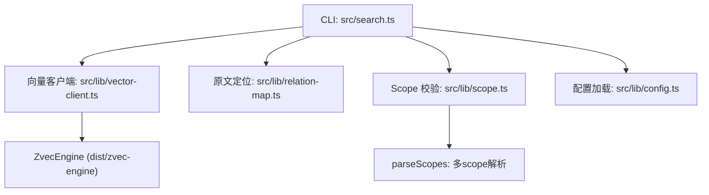
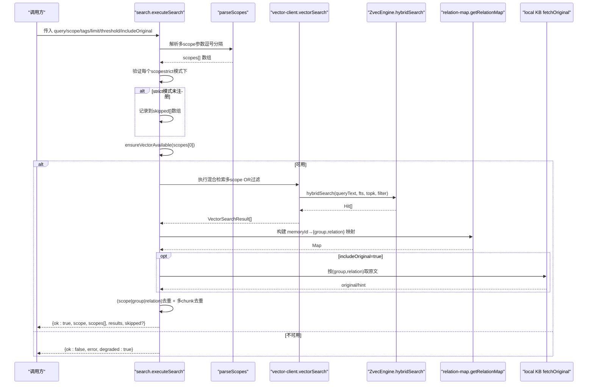
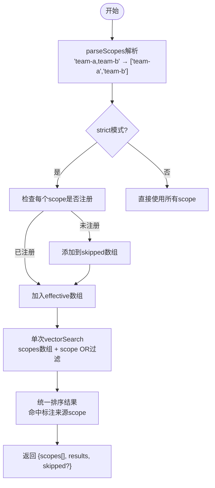
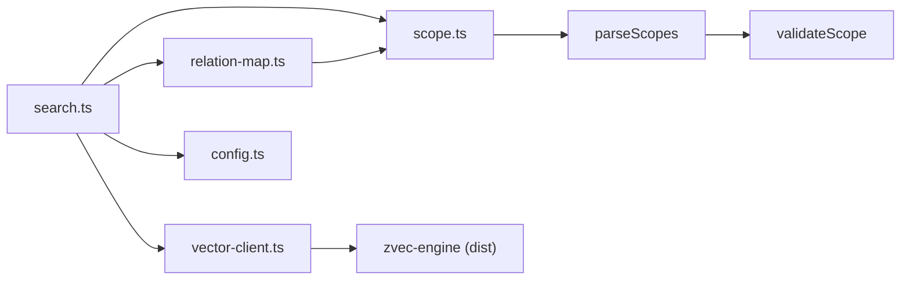

# ki_search工具

<cite>
**本文引用的文件**
- [src/search.ts](file://src/search.ts)
- [src/lib/vector-client.ts](file://src/lib/vector-client.ts)
- [src/lib/relation-map.ts](file://src/lib/relation-map.ts)
- [src/lib/scope.ts](file://src/lib/scope.ts)
- [src/lib/config.ts](file://src/lib/config.ts)
- [skills/ki-search/SKILL.md](file://skills/ki-search/SKILL.md)
</cite>

## 更新摘要
**所做更改**
- 更新了executeSearch函数的多scope支持功能说明
- 新增了跨范围聚合查询的详细描述
- 更新了响应结构以包含scopes[]和skipped[]字段
- 增强了去重逻辑的说明，支持(scope|group|relation)键
- 添加了多scope搜索的语法示例和使用场景

## 目录
1. [简介](#简介)
2. [项目结构](#项目结构)
3. [核心组件](#核心组件)
4. [架构总览](#架构总览)
5. [详细组件分析](#详细组件分析)
6. [依赖关系分析](#依赖关系分析)
7. [性能与调优](#性能与调优)
8. [故障排查](#故障排查)
9. [结论](#结论)
10. [附录：API 参考](#附录api-参考)

## 简介
ki_search 是知识索引工具的混合检索能力入口，结合语义向量搜索与 BM25 全文检索（RRF 融合），并提供作用域隔离、标签过滤、结果去重、原文召回与降级等能力。**新增多scope支持**：现在支持通过逗号分隔的多个scope参数进行跨范围聚合查询，实现统一排序和智能去重的跨知识库检索。其核心流程为"索引直查优先，语义检索兜底"：当已知路径或精确标识时优先走索引定位；否则通过向量+全文的混合检索召回相关内容，并支持按 scope/tags 精细控制。

## 项目结构
- CLI 入口与编排：src/search.ts
- 向量客户端与引擎封装：src/lib/vector-client.ts
- 原文定位映射（memoryId → group/relation）：src/lib/relation-map.ts
- Scope 校验与路径构造：src/lib/scope.ts
- 配置加载与解析（含 embedding、vectorDir、scopeMode）：src/lib/config.ts
- 行为规则与最佳实践：skills/ki-search/SKILL.md

**图表来源**
- [src/search.ts:70-199](file://src/search.ts#L70-L199)
- [src/lib/vector-client.ts:477-506](file://src/lib/vector-client.ts#L477-L506)
- [src/lib/relation-map.ts:48-78](file://src/lib/relation-map.ts#L48-L78)
- [src/lib/scope.ts:45-69](file://src/lib/scope.ts#L45-L69)
- [src/lib/config.ts:444-459](file://src/lib/config.ts#L444-L459)

章节来源
- [src/search.ts:1-333](file://src/search.ts#L1-L333)
- [src/lib/vector-client.ts:1-793](file://src/lib/vector-client.ts#L1-L793)
- [src/lib/relation-map.ts:1-120](file://src/lib/relation-map.ts#L1-L120)
- [src/lib/scope.ts:1-256](file://src/lib/scope.ts#L1-L256)
- [src/lib/config.ts:1-509](file://src/lib/config.ts#L1-L509)
- [skills/ki-search/SKILL.md:1-198](file://skills/ki-search/SKILL.md#L1-L198)

## 核心组件
- executeSearch：统一编排搜索流程（参数校验→可用性检测→检索→原文召回→去重→返回）**现已支持多scope聚合查询**
- vectorSearch：调用底层 hybridSearch（语义 + FTS + RRF），并按 scope/tag 过滤**支持多scope数组参数**
- getRelationMap：构建 memoryId → {group, relation} 的反查映射（带 TTL 缓存）
- ensureVectorAvailable：向量服务可用性检测与降级提示
- resolveScope / validateScope：scope 模式与字符合法性校验
- parseScopes：**新增** 解析逗号分隔的多scope参数，支持去空格、去重、保序

章节来源
- [src/search.ts:83-285](file://src/search.ts#L83-L285)
- [src/lib/vector-client.ts:507-543](file://src/lib/vector-client.ts#L507-L543)
- [src/lib/relation-map.ts:48-78](file://src/lib/relation-map.ts#L48-L78)
- [src/lib/vector-client.ts:420-467](file://src/lib/vector-client.ts#L420-L467)
- [src/lib/config.ts:444-459](file://src/lib/config.ts#L444-L459)
- [src/lib/scope.ts:45-69](file://src/lib/scope.ts#L45-L69)

## 架构总览
ki_search 采用"双路径查询机制"：**增强版支持多scope聚合查询**
- 索引直查优先：当存在 Group/Relation 等明确标识时，直接读取本地 KB 与 relations-cache 进行精准命中。
- 语义检索兜底：当无法确定具体位置时，使用 zvec 的 hybridSearch（语义向量 + BM25 全文 + RRF 融合）召回相关片段，再结合 tag 过滤与原文定位。**多scope模式下，单次查询即可跨多个scope检索，embedding仅执行一次**。

**图表来源**
- [src/search.ts:83-285](file://src/search.ts#L83-L285)
- [src/lib/vector-client.ts:507-543](file://src/lib/vector-client.ts#L507-L543)
- [src/lib/vector-client.ts:420-467](file://src/lib/vector-client.ts#L420-L467)
- [src/lib/relation-map.ts:48-78](file://src/lib/relation-map.ts#L48-L78)

## 详细组件分析

### 搜索参数与行为
- query：自然语言查询文本，同时作为语义向量查询与 FTS 关键词输入。
- **scope：作用域隔离标识。现在支持逗号分隔的多个scope（如 "team-a,team-b"），实现跨范围聚合查询。默认模式下可省略（回退 default），strict 模式下必须显式且已注册。**
- tags：标签过滤。不传则搜索全部；传单个或多逗号分隔，内部以 OR 组合；大小写忽略（写入/查询均小写化）。
- limit：返回条数上限。默认 10。
- threshold：最低相似度阈值（融合得分），低于该值的结果将被过滤。
- includeOriginal：是否返回 local KB 文件级原文。默认 false；开启后若原文不可用将降级为向量文档内容并附带提示。
- fallback_mode：当前实现中未暴露同名参数；但整体具备"向量不可用即降级返回"的行为（degraded:true）。如需更细粒度回退策略，可在上层封装。

**新增特性**：
- **多scope聚合查询**：支持 `scope: "team-a,team-b"` 格式，自动解析为数组并执行单次跨scope检索
- **智能跳过机制**：在strict模式下，未注册的scope会被跳过并记录到skipped数组，不影响其他有效scope的检索
- **增强的响应结构**：返回scopes[]数组表示实际检索的scope列表，skipped[]数组记录被跳过的scope及原因

章节来源
- [src/search.ts:83-285](file://src/search.ts#L83-L285)
- [src/lib/vector-client.ts:507-543](file://src/lib/vector-client.ts#L507-L543)
- [src/lib/config.ts:444-459](file://src/lib/config.ts#L444-L459)
- [src/lib/vector-client.ts:420-467](file://src/lib/vector-client.ts#L420-L467)

### 多scope聚合查询机制
**新增功能**：executeSearch现在支持逗号分隔的多scope参数进行跨范围聚合查询

- **解析阶段**：parseScopes函数将逗号分隔的scope字符串解析为数组，自动去除空格、去重并保持顺序
- **验证阶段**：在strict模式下，逐个检查scope是否在配置白名单中，未注册的scope被记录到skipped数组
- **检索阶段**：vectorSearch接收scopes数组，执行单次hybridSearch，通过scope OR过滤条件跨多个scope检索
- **结果处理**：每个命中标注其来源scope，最终结果按score降序统一排序

**图表来源**
- [src/search.ts:93-127](file://src/search.ts#L93-L127)
- [src/lib/scope.ts:53-69](file://src/lib/scope.ts#L53-L69)
- [src/lib/vector-client.ts:517-543](file://src/lib/vector-client.ts#L517-L543)

### 搜索结果排序与去重
- 排序：按 score 降序（zvec 已归一化分数）。
- **Multi-tag 去重：同一 (scope, group, relation) 因多 tag 写入产生多条命中时，保留 score 最高的一条。**
- **多 chunk 去重（仅 includeOriginal=true）：同一文件的多个 chunk 命中，仅首条携带 original，后续标记 deduplicated。**

**增强去重逻辑**：
- **跨scope去重保护**：去重键从原来的 `(group|relation)` 升级为 `(scope|group|relation)`，防止不同scope中的同名文档被错误去重
- **多scope结果合并**：来自不同scope的相同文档被视为不同知识条目，各自保留

章节来源
- [src/search.ts:240-276](file://src/search.ts#L240-L276)

### 原文召回与降级
- 当 includeOriginal=true 且能定位到 (group, relation) 时，从 local KB 读取文件级原文。
- 若原文不可用（缺失或读取异常），降级为向量文档 content，并设置 originalRetrieved=false 与 originalHint 提示。
- 若无法定位（无反查信息），同样降级为向量文档 content。

**多scope优化**：
- 按命中标注的scope字段选择对应的relation-map进行原文定位
- 避免跨scope的原文错配问题

章节来源
- [src/search.ts:197-238](file://src/search.ts#L197-L238)

### 错误处理与超时控制
- 向量服务不可用：ensureVectorAvailable 返回 { ok:false, error, degraded:true }，不抛异常，便于上层降级。
- 撞锁重试：向量库被占用时自动等待并重试（最多 3 次，间隔 2s），避免立即失败。
- 打开/创建超时：engine open/create 带 20s 超时保护，防止原生阻塞导致进程挂起。
- Worker 不可用自愈：在途操作检测到 worker closed 时，自动 closeEngine 并重新获取 engine 重试一次。
- CLI 结束释放：每次 CLI 调用结束后关闭 engine，避免进程无法退出。

**多scope错误处理**：
- strict模式下部分scope未注册不会导致整体失败，而是记录到skipped数组
- 所有scope都被跳过时才返回错误

章节来源
- [src/lib/vector-client.ts:93-104](file://src/lib/vector-client.ts#L93-L104)
- [src/lib/vector-client.ts:203-216](file://src/lib/vector-client.ts#L203-L216)
- [src/lib/vector-client.ts:389-407](file://src/lib/vector-client.ts#L389-L407)
- [src/search.ts:282-285](file://src/search.ts#L282-L285)

### 搜索语法示例
- CLI
  - ki search <query> [--scope <scope>] [--limit <n>] [--threshold <f>] [--tags <t1,t2>] [--original]
  - **多scope示例**：ki search "用户认证流程" --scope "team-a,team-b" --limit 5 --threshold 0.3 --tags "ki-search,auth"
- MCP/函数调用
  - executeSearch({ scope: "team-a,team-b", query, limit, threshold, tags, includeOriginal })

**多scope使用场景**：
- 跨团队知识库联合检索
- 多项目知识聚合查询
- 统一视图下的分布式知识搜索

章节来源
- [src/search.ts:291-322](file://src/search.ts#L291-L322)
- [skills/ki-search/SKILL.md:74-104](file://skills/ki-search/SKILL.md#L74-L104)

## 依赖关系分析
- search.ts 依赖 vector-client.ts（检索）、relation-map.ts（原文定位）、scope.ts（校验）、config.ts（scope 解析）。
- vector-client.ts 依赖 dist/zvec-engine（hybridSearch/upsert/delete/listIds/fetch）。
- relation-map.ts 依赖 scope.ts（relations-cache.json 路径）。
- config.ts 提供 embedding/vectorDir/scopeMode 等全局配置。

**新增依赖关系**：
- parseScopes函数依赖validateScope进行字符集校验
- 多scope支持需要vectorSearch接收scopes数组参数

**图表来源**
- [src/search.ts:11-18](file://src/search.ts#L11-L18)
- [src/lib/vector-client.ts:21-33](file://src/lib/vector-client.ts#L21-L33)
- [src/lib/relation-map.ts:19-21](file://src/lib/relation-map.ts#L19-L21)
- [src/lib/config.ts:148-175](file://src/lib/config.ts#L148-L175)
- [src/lib/scope.ts:53-69](file://src/lib/scope.ts#L53-L69)

章节来源
- [src/search.ts:11-18](file://src/search.ts#L11-L18)
- [src/lib/vector-client.ts:21-33](file://src/lib/vector-client.ts#L21-L33)
- [src/lib/relation-map.ts:19-21](file://src/lib/relation-map.ts#L19-L21)
- [src/lib/config.ts:148-175](file://src/lib/config.ts#L148-L175)

## 性能与调优
- 合理使用 limit：限制返回条数，减少网络与序列化开销。
- 合理设置 threshold：提高阈值可减少低质结果，但可能漏召回；建议根据业务场景调优。
- 利用 tags：通过标签缩小搜索空间，提升命中率与速度。
- 原文按需开启：includeOriginal 仅在需要时开启，避免额外 IO。
- 共享向量库：多实例共享同一向量库时，启用空闲释放锁（常驻 MCP 层）避免争用；CLI 短命令无需启用。
- 批量导入优化：导入链路使用批量 upsert，减少往返次数。

**多scope性能优化**：
- **单次embedding**：多scope检索只执行一次embedding计算，相比多次单scope检索显著降低延迟
- **OR过滤优化**：通过scope OR过滤条件在向量层进行高效筛选
- **智能跳过**：strict模式下未注册scope快速跳过，不浪费检索资源

章节来源
- [src/lib/vector-client.ts:164-181](file://src/lib/vector-client.ts#L164-L181)
- [src/lib/vector-client.ts:547-590](file://src/lib/vector-client.ts#L547-L590)
- [src/search.ts:93-127](file://src/search.ts#L93-L127)

## 故障排查
- 向量服务不可用
  - 现象：返回 { ok:false, error, degraded:true }
  - 处理：检查向量库是否被占用或损坏；必要时重建向量库
- 向量库被占用
  - 现象：提示"被其他进程占用或存在崩溃残留"
  - 处理：停止冲突进程或等待锁释放；必要时执行重建
- 原文不可用
  - 现象：originalRetrieved=false 且 originalHint 提示
  - 处理：执行 sync-relation 或 rebuild-vector 恢复原文映射
- 打开/创建超时
  - 现象：超过 20s 未完成
  - 处理：检查磁盘状态与向量库目录健康性

**多scope相关故障**：
- **strict模式未注册**：检查config.yaml中的scopes白名单配置
- **parseScopes解析失败**：确认scope格式正确，仅包含字母、数字、连字符、下划线
- **全部scope被跳过**：检查是否有至少一个有效的scope未被跳过

章节来源
- [src/lib/vector-client.ts:420-467](file://src/lib/vector-client.ts#L420-L467)
- [src/lib/vector-client.ts:93-104](file://src/lib/vector-client.ts#L93-L104)
- [src/lib/vector-client.ts:203-216](file://src/lib/vector-client.ts#L203-L216)
- [src/search.ts:197-238](file://src/search.ts#L197-L238)

## 结论
ki_search 提供了稳定、可控的混合检索能力：在已知路径时优先索引直查，未知路径时通过语义+全文召回，并结合标签与作用域隔离、原文召回与多级降级，满足多种检索场景。**新增的多scope聚合查询功能**进一步增强了跨知识库检索能力，通过单次embedding和智能去重机制，在保证召回质量的同时获得良好的性能表现。通过合理的参数调优与错误处理策略，可在保证召回质量的同时获得良好的性能表现。

## 附录：API 参考

### 函数：executeSearch
- 入参
  - scope?: string **（支持逗号分隔的多scope，如 "team-a,team-b"）**
  - query: string
  - limit?: number
  - threshold?: number
  - tags?: string
  - includeOriginal?: boolean
- 返回
  - **多scope模式**：{ ok: true; scope: string; scopes: string[]; results: SearchHit[]; skipped?: { scope: string; reason: string }[] }
  - **单scope模式**：{ ok: true; scope: string; results: SearchHit[] }
  - { ok: false; error: string; degraded?: boolean }

**新增响应字段**：
- **scopes**: 多scope检索时实际检索的scope列表（单scope不返回，向后兼容）
- **skipped**: 多scope下被跳过的scope及原因（合法但未注册等；无跳过时不返回）

章节来源
- [src/search.ts:83-285](file://src/search.ts#L83-L285)

### 类型：SearchHit
- memoryId: string
- content: string
- score: number
- tag?: string
- **scope?: string** **（多scope检索时标注来源；单scope不额外标注）**
- group?: string
- relation?: string
- originalRetrieved?: boolean
- original?: string
- originalHint?: string
- deduplicated?: boolean
- tags?: string[]

**新增字段**：
- **scope**: 在多scope检索中标注命中的来源scope

章节来源
- [src/search.ts:34-52](file://src/search.ts#L34-L52)

### 函数：vectorSearch
- 入参
  - scope?: string
  - **scopes?: string[]** **（多scope：优先于scope；数组成员逐个resolve）**
  - query: string
  - limit?: number
  - tags?: string | string[]
  - threshold?: number
- 返回
  - VectorSearchResult[]

**新增参数**：
- **scopes**: 支持数组形式的多scope参数，实现单次跨scope检索

章节来源
- [src/lib/vector-client.ts:507-543](file://src/lib/vector-client.ts#L507-L543)

### 函数：parseScopes
- 入参
  - raw?: string **（逗号分隔的scope字符串）**
- 返回
  - string[] **（去空格、去重、保序后的scope数组）**
- 异常
  - ScopeError：当解析为空或包含非法字符时抛出

**新增功能**：
- 解析逗号分隔的多scope参数
- 自动去除空格、去重、保持原始顺序
- 严格的字符集校验（仅允许字母、数字、连字符、下划线）

章节来源
- [src/lib/scope.ts:53-69](file://src/lib/scope.ts#L53-L69)

### 函数：ensureVectorAvailable
- 入参
  - scope?: string
- 返回
  - { available: boolean; reason?: string; code?: 'LOCKED'|'CORRUPTED'|'PROBE_ERROR' }

章节来源
- [src/lib/vector-client.ts:420-467](file://src/lib/vector-client.ts#L420-L467)

### 函数：getRelationMap
- 入参
  - scope: string
  - ttlMs?: number
- 返回
  - Map<string, { group: string; relation: string }>

章节来源
- [src/lib/relation-map.ts:48-78](file://src/lib/relation-map.ts#L48-L78)

### CLI 用法
- ki search <query> [--scope <scope>] [--limit <n>] [--threshold <f>] [--tags <t1,t2>] [--original]
- **多scope示例**：ki search "用户认证流程" --scope "team-a,team-b" --limit 5 --threshold 0.3 --tags "ki-search,auth"

**新增CLI选项**：
- **多scope支持**：`--scope "team-a,team-b"` 格式，自动解析为数组进行跨scope检索

章节来源
- [src/search.ts:291-322](file://src/search.ts#L291-L322)