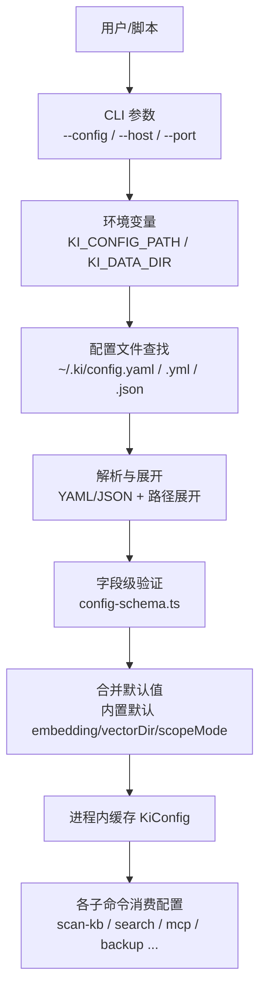
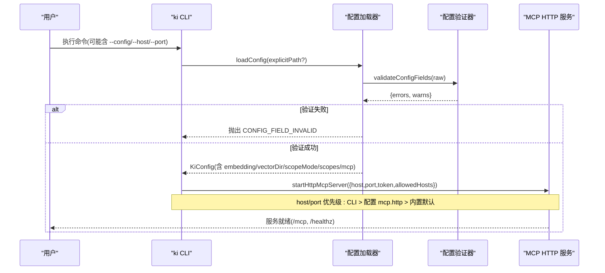
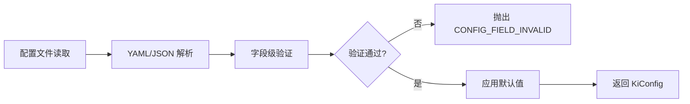
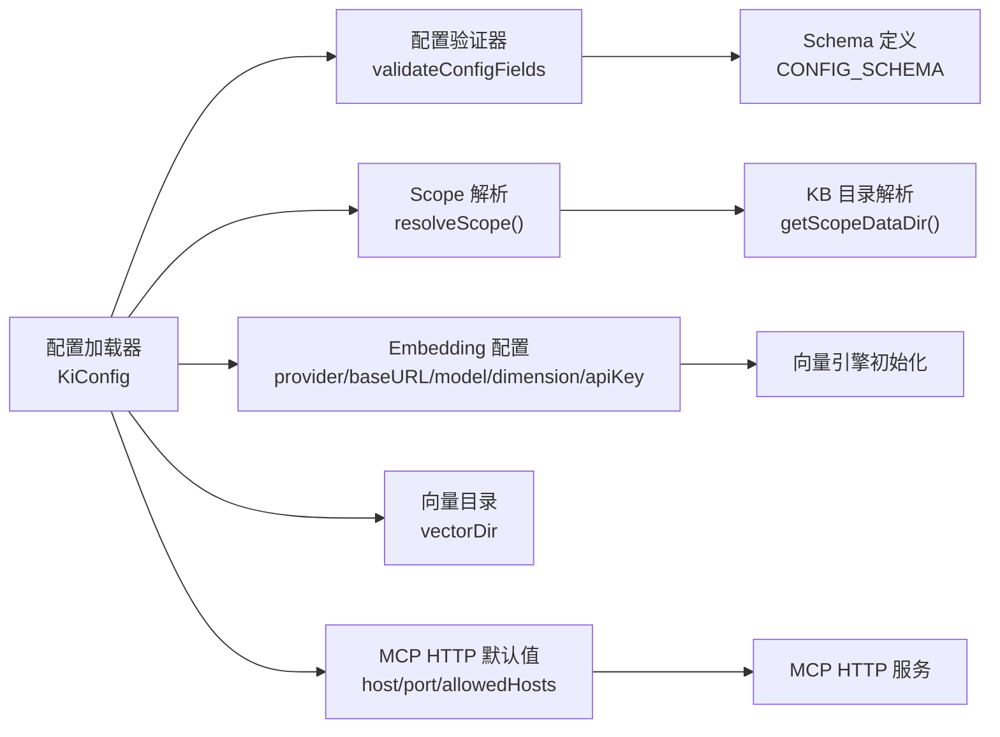

# 配置文件详解

<cite>
**本文引用的文件**
- [src/config.ts](file://src/config.ts)
- [src/lib/config.ts](file://src/lib/config.ts)
- [src/lib/config-schema.ts](file://src/lib/config-schema.ts)
- [docs/configuration.md](file://docs/configuration.md)
- [docs/cli.md](file://docs/cli.md)
- [docs/mcp-http.md](file://docs/mcp-http.md)
- [src/lib/mcp-http.ts](file://src/lib/mcp-http.ts)
- [test/zvec-engine-embedding.test.mjs](file://test/zvec-engine-embedding.test.mjs)
- [test/e2e/zvec-engine-e2e.network.mjs](file://test/e2e/zvec-engine-e2e.network.mjs)
- [test/config-doctor.test.ts](file://test/config-doctor.test.ts)
</cite>

## 更新摘要
**变更内容**
- 新增配置验证系统章节，详细说明字段级验证机制
- 更新配置加载流程，包含验证步骤
- 增强故障排查指南，涵盖验证错误处理
- 添加配置最佳实践，强调验证的重要性

## 目录
1. [简介](#简介)
2. [项目结构](#项目结构)
3. [核心组件](#核心组件)
4. [架构总览](#架构总览)
5. [详细组件分析](#详细组件分析)
6. [配置验证系统](#配置验证系统)
7. [依赖关系分析](#依赖关系分析)
8. [性能考虑](#性能考虑)
9. [故障排查指南](#故障排查指南)
10. [结论](#结论)
11. [附录：完整配置示例与最佳实践](#附录完整配置示例与最佳实践)

## 简介
本指南面向使用 kisearch（knowledge-indexer）的用户，系统性说明配置文件的查找优先级、全部配置项含义与用法，重点覆盖：
- 基础存储：dataDir、backupDir、vectorDir
- Embedding 提供商：SiliconFlow 与 OpenAI 兼容接口，API Key 安全引用
- Scope 护栏：scopeMode 的 default 与 strict 差异
- Scope 级配置：kbDir、wikiSync 写回、clean 清洗规则、import 导入选项
- MCP HTTP 传输默认值与安全建议
- **新增**：配置验证系统，提供字段级校验、拼写错误建议和 fail-loud 行为
并提供可落地的配置示例与最佳实践。

## 项目结构
kisearch 的配置体系由"命令行参数 > 环境变量 > 配置文件路径 > 内置默认"的优先级驱动，核心加载逻辑集中在配置模块中，并通过 CLI 命令生成模板与提示。**新增配置验证系统**在语法解析后立即执行，确保配置内容的合法性。



**图表来源**
- [src/lib/config.ts:148-175](file://src/lib/config.ts#L148-L175)
- [src/lib/config.ts:185-205](file://src/lib/config.ts#L185-L205)
- [src/lib/config.ts:266-278](file://src/lib/config.ts#L266-L278)
- [docs/cli.md:10-19](file://docs/cli.md#L10-L19)

**章节来源**
- [src/lib/config.ts:148-175](file://src/lib/config.ts#L148-L175)
- [src/lib/config.ts:185-205](file://src/lib/config.ts#L185-L205)
- [src/lib/config.ts:266-278](file://src/lib/config.ts#L266-L278)
- [docs/cli.md:10-19](file://docs/cli.md#L10-L19)

## 核心组件
- 配置加载器：负责按优先级查找并解析配置文件，展开路径，合并默认值，提供统一 KiConfig 对象。
- **新增**配置验证器：通过 config-schema.ts 实现字段级验证，包括名称、类型和取值校验，提供 Levenshtein 距离建议。
- 配置模板生成器：通过 `ki config init` 生成带注释的 YAML 模板，便于首次上手。
- Scope 解析器：根据 scopeMode 决定未注册 scope 是否允许。
- Embedding 配置解析：支持明文或环境变量引用 apiKey，严格校验 baseURL/dimension/provider。
- MCP HTTP 默认值：仅承载 host/port/allowedHosts 默认值，Token 不写入配置。

**章节来源**
- [src/lib/config.ts:119-137](file://src/lib/config.ts#L119-L137)
- [src/lib/config.ts:220-240](file://src/lib/config.ts#L220-L240)
- [src/lib/config.ts:288-307](file://src/lib/config.ts#L288-L307)
- [src/config.ts:38-118](file://src/config.ts#L38-L118)
- [src/lib/config-schema.ts:1-340](file://src/lib/config-schema.ts#L1-L340)

## 架构总览
配置在启动时一次性加载并缓存，后续所有子命令共享同一份 KiConfig。**新增配置验证步骤**在语法解析后立即执行，确保配置内容的合法性。MCP HTTP 服务启动时，优先读取 CLI 参数，其次读取配置中的 mcp.http 默认值，最后使用内置默认。



**图表来源**
- [src/lib/config.ts:148-175](file://src/lib/config.ts#L148-L175)
- [src/lib/config.ts:266-278](file://src/lib/config.ts#L266-L278)
- [src/lib/config-schema.ts:328-339](file://src/lib/config-schema.ts#L328-L339)
- [src/lib/mcp-http.ts:676-717](file://src/lib/mcp-http.ts#L676-L717)
- [docs/mcp-http.md:249-260](file://docs/mcp-http.md#L249-L260)

## 详细组件分析

### 配置文件查找优先级与路径展开
- 优先级顺序：
  1) --config 指定路径
  2) 环境变量 KI_CONFIG_PATH
  3) ~/.ki/config.yaml → config.yml → config.json
  4) 内置默认值
- 路径展开：
  - $HOME 与 ~ 会被展开为用户主目录
  - 相对路径以配置文件所在目录为基准展开
- 旧版 JSON 配置会输出迁移提示，建议改用 YAML。

**章节来源**
- [docs/configuration.md:7-18](file://docs/configuration.md#L7-L18)
- [src/lib/config.ts:148-175](file://src/lib/config.ts#L148-L175)
- [src/lib/config.ts:209-218](file://src/lib/config.ts#L209-L218)

### 基础存储配置：dataDir / backupDir / vectorDir
- dataDir：KB 源数据目录，存放各 scope 的原始文档。默认 ~/.ki/kb；未配置 kbDir 时，某 scope 的实际数据目录为 dataDir/{scope}。
- backupDir：备份目录，默认 ~/.ki/backup。
- vectorDir：zvec 向量库 collection 目录，默认 ~/.ki/vector。注意：schema 创建后不可 alter/drop，增加字段需删除 vectorDir 重建，将丢失该 scope 全部向量数据并需重新导入。

**章节来源**
- [docs/configuration.md:43-66](file://docs/configuration.md#L43-L66)
- [src/lib/config.ts:260-275](file://src/lib/config.ts#L260-L275)
- [src/lib/config.ts:382-386](file://src/lib/config.ts#L382-L386)

### Embedding 提供商配置（SiliconFlow 与 OpenAI 兼容）
- provider：siliconflow | openai-compatible（OpenAI 兼容客户端，实际提供商由 baseURL 决定）。
- baseURL：API 端点，决定实际对接的提供商。
- model：模型名称。
- dimension：向量维度，必须等于 collection.dimension（kisearch 固定 4096）。
- apiKey：必填。支持两种写法：
  - 明文密钥：apiKey: sk-xxx
  - 环境变量引用：apiKey: ${VAR_NAME}，运行时从同名环境变量读取
- 安全策略：缺省则不解析（KI 层 fail-loud），不做任何隐式 env 回退。

**章节来源**
- [docs/configuration.md:67-89](file://docs/configuration.md#L67-L89)
- [src/lib/config.ts:110-137](file://src/lib/config.ts#L110-L137)
- [src/lib/config.ts:220-240](file://src/lib/config.ts#L220-L240)
- [test/zvec-engine-embedding.test.mjs:54-67](file://test/zvec-engine-embedding.test.mjs#L54-L67)
- [test/e2e/zvec-engine-e2e.network.mjs:41-64](file://test/e2e/zvec-engine-e2e.network.mjs#L41-L64)

### Scope 护栏：scopeMode（default vs strict）
- default：允许使用未在 scopes 显式注册的 scope（按需传入 scope 名即可）。
- strict：scopes 的 key 兼作 scope 白名单，必须显式传入已注册的 scope，否则报错（fail-loud）。
- 行为实现：当 mode=strict 且未传或未注册 scope 时抛出错误；default 模式下空 scope 归为 'default'。

**章节来源**
- [docs/configuration.md:90-99](file://docs/configuration.md#L90-L99)
- [src/lib/config.ts:288-289](file://src/lib/config.ts#L288-L289)
- [src/lib/config.ts:431-459](file://src/lib/config.ts#L431-L459)

### Scope 级配置：kbDir / wikiSync / clean / import
- kbDir：KB 基础目录。程序自动拼接 kb/{scope} 子目录（如 kbDir=/data/kb、scope=monitor → 实际数据目录 /data/kb/kb/monitor）。未配置时回退到 dataDir/{scope}。
- wikiSync：Wiki 写回/回收站的源目录定位与开关。
  - enabled：是否启用 Wiki 写回（显式 false 禁用一切写回）
  - autoBackfill：写回时检测目标不存在/为空则自动全量补齐历史关系
  - sourceDir：源文档目录
- clean：数据清洗配置（默认开启全部规则）。
  - rules：bom/frontmatter/htmlComment/mermaid/codePath/codeBlock/emptyChunk/keepShortSamples
  - hooks：外部清洗钩子命令（stdin→stdout 管道，按序执行）
- import：导入配置。
  - extensions：格式白名单（默认 [.md]）
  - maxFileSize：单文件大小上限（字节，默认 1MB）

**章节来源**
- [docs/configuration.md:100-163](file://docs/configuration.md#L100-L163)
- [src/lib/config.ts:63-97](file://src/lib/config.ts#L63-L97)
- [src/lib/config.ts:309-358](file://src/lib/config.ts#L309-L358)

### MCP HTTP 传输默认值与安全建议
- mcp.http.host：监听地址，默认 127.0.0.1（回环免鉴权；对外监听改 0.0.0.0）
- mcp.http.port：监听端口，默认 7423
- mcp.http.allowedHosts：DNS rebinding 保护允许的 Host 头（可选）
- 优先级：--host/--port CLI 参数 > mcp.http.host/port 配置 > 内置默认
- 安全要点：
  - Token 只走 CLI 参数或环境变量，绝不写入配置文件
  - 非回环绑定强制 Bearer Token；回环绑定免鉴权
  - 生产远程暴露建议前置 TLS 反向代理，配合防火墙与 allowedHosts

**章节来源**
- [docs/configuration.md:164-177](file://docs/configuration.md#L164-L177)
- [docs/mcp-http.md:41-70](file://docs/mcp-http.md#L41-L70)
- [docs/mcp-http.md:132-146](file://docs/mcp-http.md#L132-L146)
- [docs/mcp-http.md:249-260](file://docs/mcp-http.md#L249-L260)
- [src/lib/mcp-http.ts:36-50](file://src/lib/mcp-http.ts#L36-L50)
- [src/lib/mcp-http.ts:676-717](file://src/lib/mcp-http.ts#L676-L717)

## 配置验证系统

### 验证机制概述
kisearch 引入了全面的配置验证系统，通过 `config-schema.ts` 实现字段级验证。该系统在 YAML/JSON 语法解析成功后立即执行，确保配置内容的合法性，避免过去"静默落默认值/NaN"导致的隐性错配问题。

### 验证策略
验证系统采用"fail-loud + 给出路"的设计哲学：

| 情况 | 行为 | 说明 |
|------|------|------|
| 未知字段名 | ❌ 报错 | 附 Levenshtein 相近字段建议 |
| 类型不符 | ❌ 报错 | 指出期望类型与实际值 |
| 非法枚举值 | ❌ 报错 | 列出合法取值范围 |
| 非法取值 | ❌ 报错 | 如端口越界、URL 格式错误等 |
| 废弃字段 | ⚠️ 告警 | 仍按"被忽略"加载，不阻断 |
| null scope 条目 | ⚠️ 告警 | YAML 裸写 `default:` 解析为 null |
| 空字符串字段 | ⚠️ 告警 | 按"未配置"处理，落默认值 |

### 字段级验证规则
验证系统定义了完整的配置 schema，支持以下验证类型：

- **基础类型验证**：string、number、boolean、object、stringArray
- **字面量验证**：literal 模式用于枚举值校验（如 scopeMode）
- **自定义验证器**：positiveInt、portRange、httpUrl 等专用验证函数
- **嵌套对象验证**：支持多层对象结构的递归验证
- **自由键映射**：scopes.<name> 等动态键名的特殊处理

### Levenshtein 距离建议
验证系统实现了 Levenshtein 编辑距离算法，为拼写错误的字段名提供智能建议：

```typescript
// 编辑距离计算示例
function editDistance(a: string, b: string): number {
  const m = a.length;
  const n = b.length;
  const dp: number[] = Array.from({ length: n + 1 }, (_, j) => j);
  for (let i = 1; i <= m; i++) {
    let prev = dp[0];
    dp[0] = i;
    for (let j = 1; j <= n; j++) {
      const tmp = dp[j];
      dp[j] = Math.min(dp[j] + 1, dp[j - 1] + 1, prev + (a[i - 1] === b[j - 1] ? 0 : 1));
      prev = tmp;
    }
  }
  return dp[n];
}
```

### 验证错误处理
验证系统收集所有错误后一次性报告，避免"挤牙膏"式的逐个错误提示：

```text
❌ 配置加载失败：CONFIG_FIELD_INVALID: 配置文件字段校验失败：/root/.ki/config.yaml（共 2 处）
  - datadir：非预期字段，您是否想输入 "dataDir"？（可用：dataDir | backupDir | ...）
  - embedding.dimension：应为数字，实际为 string（4096）
提示：字段含义与合法取值见 docs/configuration.md
```

### 验证集成流程
配置验证集成到配置加载流程的关键位置：



**图表来源**
- [src/lib/config.ts:252-285](file://src/lib/config.ts#L252-L285)
- [src/lib/config-schema.ts:328-339](file://src/lib/config-schema.ts#L328-L339)

**章节来源**
- [src/lib/config-schema.ts:1-340](file://src/lib/config-schema.ts#L1-L340)
- [src/lib/config.ts:266-278](file://src/lib/config.ts#L266-L278)
- [test/config-doctor.test.ts:221-409](file://test/config-doctor.test.ts#L221-L409)

## 依赖关系分析
- 配置加载模块被 CLI 和各子命令广泛依赖，提供统一的 KiConfig 视图。
- **新增**配置验证模块被配置加载器调用，确保配置内容的合法性。
- MCP HTTP 服务依赖配置中的 mcp.http 默认值，但始终以 CLI 参数为准。
- Embedding 配置影响向量引擎初始化与向量化流程，dimension 必须与集合 schema 一致。
- Scope 配置影响 KB 物理路径、Wiki 写回、清洗与导入行为。



**图表来源**
- [src/lib/config.ts:382-386](file://src/lib/config.ts#L382-L386)
- [src/lib/config.ts:419-428](file://src/lib/config.ts#L419-L428)
- [src/lib/config.ts:431-459](file://src/lib/config.ts#L431-L459)
- [src/lib/config-schema.ts:125-166](file://src/lib/config-schema.ts#L125-L166)
- [src/lib/mcp-http.ts:676-717](file://src/lib/mcp-http.ts#L676-L717)

**章节来源**
- [src/lib/config.ts:382-386](file://src/lib/config.ts#L382-L386)
- [src/lib/config.ts:419-428](file://src/lib/config.ts#L419-L428)
- [src/lib/config.ts:431-459](file://src/lib/config.ts#L431-L459)
- [src/lib/config-schema.ts:125-166](file://src/lib/config-schema.ts#L125-L166)
- [src/lib/mcp-http.ts:676-717](file://src/lib/mcp-http.ts#L676-L717)

## 性能考虑
- 向量库 schema 变更需重建 vectorDir，避免频繁重建带来的数据丢失与重导入成本。
- 合理设置 import.maxFileSize 与 extensions，减少无效导入开销。
- 使用 clean 规则过滤冗余内容，降低向量入库体积与噪声。
- MCP 会话上限与空闲回收避免资源耗尽（默认 256 会话，30 分钟空闲回收）。
- **新增**配置验证在启动时执行，虽然增加少量启动时间，但避免了运行时的隐性错误。

## 故障排查指南
- 未找到配置文件：会提示使用默认路径，建议执行 ki config init 创建配置文件。
- 旧版 JSON 配置：检测到时会提示迁移至 YAML。
- **新增**配置验证失败：遇到 `CONFIG_FIELD_INVALID` 错误时，检查字段名拼写、数据类型和取值范围。
- Embedding 缺失 apiKey：构造函数抛错（EmbeddingConfigError），需通过环境变量或配置注入。
- baseURL 非 https：构造失败，需改为 HTTPS。
- dimension 非法：抛错，需确保为正整数且与集合维度一致。
- MCP 鉴权失败：检查 Authorization: Bearer 是否与托管 Token 完全一致；服务端 stderr 记录失败原因。
- 越权拒绝：确认请求 scope 是否在 Token 授权范围内；枚举工具不受此校验限制。

**章节来源**
- [src/lib/config.ts:158-171](file://src/lib/config.ts#L158-L171)
- [src/lib/config.ts:266-278](file://src/lib/config.ts#L266-L278)
- [test/config-doctor.test.ts:413-439](file://test/config-doctor.test.ts#L413-L439)
- [test/zvec-engine-embedding.test.mjs:54-83](file://test/zvec-engine-embedding.test.mjs#L54-L83)
- [docs/mcp-http.md:224-233](file://docs/mcp-http.md#L224-L233)

## 结论
kisearch 的配置体系以"明确优先级、最小默认、强约束安全"为原则：
- 通过 CLI > 环境变量 > 配置文件 > 内置默认的顺序保证灵活性与可移植性
- **新增**配置验证系统确保配置内容的合法性，提供智能错误提示和修复建议
- 对敏感信息（apiKey、Token）采用环境变量引用与 CLI/env 注入，避免明文落盘
- 通过 scopeMode 与 scopes 精细化控制多项目隔离与行为
- MCP HTTP 默认值与严格的安全策略保障多 IDE 共享与远程访问安全

## 附录：完整配置示例与最佳实践

### 完整配置示例
以下示例展示常用配置项的组合方式（请根据实际环境替换路径与变量名）：

```yaml
dataDir: /data/kb
backupDir: /data/ki-backup
vectorDir: /root/.ki/vector

embedding:
  provider: siliconflow
  baseURL: https://api.siliconflow.cn/v1
  model: Qwen/Qwen3-Embedding-8B
  dimension: 4096
  apiKey: ${SILICONFLOW_API_KEY}

scopeMode: default

scopes:
  monitor:
    kbDir: /data/kb
    wikiSync:
      enabled: true
      sourceDir: /repo/bk-monitor-wiki/wiki
    clean:
      enabled: true
      rules:
        bom: true
        frontmatter: true
        htmlComment: true
        mermaid: true
        codePath: true
        codeBlock: true
        emptyChunk: true
        keepShortSamples: true
      hooks: []
    import:
      extensions: [.md]
      maxFileSize: 1048576
  docs:
    kbDir: /data/kb

mcp:
  host: 127.0.0.1
  port: 7423
  allowedHosts: [localhost]
```

**章节来源**
- [docs/configuration.md:180-227](file://docs/configuration.md#L180-L227)

### 最佳实践
- 首次使用：运行 ki config init 生成模板，再手动编辑。
- API Key 管理：优先使用环境变量引用 ${VAR_NAME}，不要明文写入配置。
- 向量库维护：如需新增字段，先评估重建 vectorDir 的成本与数据迁移方案。
- Scope 治理：团队环境建议使用 scopeMode=strict，并在 scopes 中显式注册可用 scope。
- MCP 安全：远程暴露务必启用 Bearer Token，结合防火墙与 allowedHosts；生产建议前置 TLS 反代。
- 导入优化：限制 extensions 与 maxFileSize，启用 clean 规则以减少噪声与体积。
- **新增**配置验证：利用配置验证系统的错误提示快速定位和修复配置问题。

**章节来源**
- [docs/configuration.md:231-243](file://docs/configuration.md#L231-L243)
- [docs/mcp-http.md:243-248](file://docs/mcp-http.md#L243-L248)