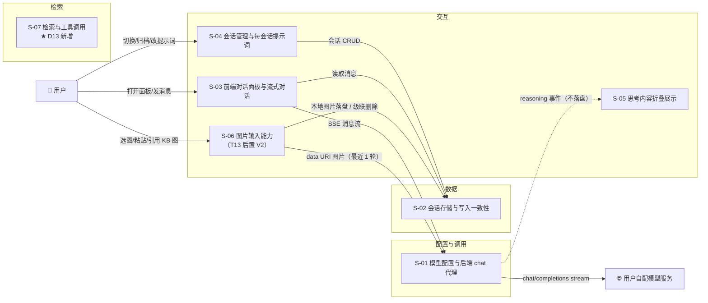

# Web 侧边栏 AI 对话模块 — 设计总览（父文档）

> 关联需求：`requirement.md`（v4）｜验证与质疑：`demo/verify-report.md`、`review/challenge-report.md`

## 1. 需求背景 & 目标

**背景**：kisearch 现有两个入口——Web 端「人管知识库」与 MCP「AI 用知识库」，二者之间没有对话通道，用户想就知识库问一句必须离开页面。

**目标**：在 Web 任意页面右侧提供常驻可收起的 AI 对话面板，实现「多轮对话 + 历史会话 + 归档/删除 + 每会话提示词」，模型由用户自行配置（D8），思考内容可展示但不落盘（D7）。

**非功能性假设（默认值，超出需重新评估）**：单机单用户、并发 ≤3 个标签页；单会话 ≤500 条消息、总会话 ≤2000；首字 1s 量级可接受、首答最长可达 12s（须有状态反馈）；一致性为单机强一致（daemon 内串行化）。

**⛔ 不在范围内**：~~知识库检索增强（仅预留 `context` 字段）~~ **【v2 反转】D13 决定「要检索」→ 见 `S07_检索与工具调用_DESIGN.md`**；L2 上下文裁剪/摘要、L3 跨会话长期记忆、多用户与权限体系、MCP 侧会话暴露、CLI 会话管理命令、**图片输入（T13 后置 V2，S-06 契约保留不实现）**。

## 2. 关键环节一览图

## 3. 总体方案设计

**核心链路**：`ChatPanel`（fetch + `ReadableStream`）→ `/api/chat/conversations/:id/messages`（SSE）→ `llm-client`（上游流解析与归一化）→ 上游模型；会话读写经 `chat-store`（独立目录 + daemon 内 mutex 串行化）。

共享术语速查与接口索引见第 4 章。

**设计决策点（全局级）**：

| 决策 | 采用方案 | 被否决方案与理由 |
|---|---|---|
| 会话存储形态 | 每会话独立 JSON（复用 `writeJson`/WAL） | ① 单一大 JSON：并发写放大、单文件损坏全丢；② SQLite：项目无该依赖，为元数据引入新依赖不划算；③ zvec collection：面向文档/向量，不适合频繁小改的元数据 |
| 会话归属 | **跟随 scope**（路径含 scope，列表随 scope 切换刷新） | 全局共享会话：跨知识库内容混淆，且与 `ki-web:scope` 心智不一致；若后续要全局共享，仅需去掉路径中的 scope 段 |
| 流式协议 | SSE + `data: {"type":...}`（demo 已验证） | ① 轮询：延迟与实现都更差；② WebSocket：单向流用不上，且 daemon 无 WS 先例；③ chunked 裸文本：需自定义分帧 |
| 前端 HTTP 通道 | `fetch` + `ReadableStream`（可 POST、可 abort） | `EventSource`：只支持 GET，无法带请求体，也无法中途 abort 语义化 |

## 4. 全局风险 & 跨子需求依赖

**共享术语速查**（定义见对应子文档，此处只索引）：

| 术语 | 定义位置 | 一句话 |
|---|---|---|
| `config.llm` | S-01 | 模型配置段，无默认值，缺失即 fail-loud |
| 归一化事件流 | S-01 | 上游 chunk → `{type:meta\|reasoning\|content\|usage\|done\|aborted\|error}` |
| reasoning 隔离 | S-01 | 思考内容只转发不落盘、永不回传上游 |
| 会话文件 | S-02 | `chatDir/{scope}/{convId}.json`，含 `seq` 与 `messages` |
| 会话级串行化 | S-02 | daemon 内按 `conversationId` 的 RMW 互斥 |
| 面板降级 | S-03 | 窄屏时面板由常驻列降为浮层抽屉 |
| 生成中状态 | S-03 | 从发送到首答之间的持续可见反馈（R11a） |
| 提示词作用域 | S-04 | systemPrompt 仅作用于本会话后续轮次 |
| 内存态思考 | S-05 | 思考仅存于页面内存，切会话/刷新即失 |
| 图片窗口 | S-06 | 上游请求中仅最近 1 轮携带真实图片，更早的替换为占位文字 |
| KB 图片引用 | S-06 | 消息只存 `{scope,group,path}` 引用，不复制文件；发送时读文件转 data URI |
| **检索工具 `kb_search`** | **S-07** | 暴露给模型的工具（**3 参数：query / mode / limit；无 scope**） |
| **检索 skill** | **S-07** | 注入 system 的"路由规则 + 反幻觉规则"，与工具 schema **同源维护** |
| **瘦身投影** | **S-07** | 进上游上下文的检索结果形态（≤5 条 / 单片段 ≤300 字） |
| **来源引用 `sources`** | **S-07** | **唯一允许落盘**的检索产物（group / doc / 行号 / ≤200 字摘要） |
| **预检索降级** | **S-07** | 模型不支持工具调用时，daemon 代跑一次检索并**明示**（T10） |

**接口索引**（完整签名与 Demo 返回见对应子文档）：

| 方法 | 路径 | 定义位置 |
|---|---|---|
| GET | `/api/chat/config` | S-01 §3.3 |
| GET | `/api/chat/conversations` | S-02 §3.4 |
| POST | `/api/chat/conversations` | S-02 §3.4 |
| GET | `/api/chat/conversations/:id` | S-02 §3.4 |
| PATCH | `/api/chat/conversations/:id` | S-02 §3.4 |
| POST | `/api/chat/conversations/:id/archive` | S-02 §3.4 |
| DELETE | `/api/chat/conversations/:id` | S-02 §3.4 |
| POST | `/api/chat/conversations/:id/messages`（SSE） | S-02 §3.4 + S-01 §3.2 |
| POST | `/api/chat/conversations/:id/images` | S-06 §3.4 |
| GET | `/api/chat/images/:id` | S-06 §3.4 |
| GET | `/api/asset`（**复用既有**，KB 图片展示） | `src/lib/mcp-http-api.ts` handleAsset |
| **POST** | `/api/chat/conversations/:id/regenerate` | **S-07 §3.9 / `api/retrieval.md` §2** |
| **PATCH** | `/api/chat/conversations/:id/messages/:msgId` | **S-07 §3.9 / `api/retrieval.md` §3** |
| **POST** | `/api/chat/config/ack` | **S-07 §3.9 / `api/retrieval.md` §4** |
| **DELETE** | `/api/chat/conversations?scope=` | **S-07 §3.9 / `api/retrieval.md` §5** |

**跨子需求依赖**：`S-01 → S-03`（面板依赖事件协议）、`S-02 → S-03/S-04`（依赖会话接口与数据模型）、`S-03 → S-05`（思考展示挂在生成期 UI 上）、**`S-07 → S-01/S-02/S-03/S-05`**（检索引入：`llm-client` 的 tools 参数、`ChatMessage.sources`、4 类新事件与来源 UI、工具步骤展示）。

> **⚠️ D13 后的关键路径**：`S-07` 同时向四个子需求注入契约变更 → 它是本次**最大的契约源**。
> 且 `S-07 §3.6` 的排队口径**推翻了** `api/INDEX.md` 原有的"不使用 `OperationCoordinator`"结论（已在 `api/INDEX.md` §1 修订为**分层口径**）—— 这是本次修订中**唯一一处"旧结论被反转"**的地方，实现时最容易按旧文档写错。

**接口契约变化风险**：归一化事件流的字段（S-01）被 S-03/S-05 直接消费；`/api/chat/*` 新增接口必须同步登记 `src/lib/mcp-http-api.ts` 的越权白名单，否则 token 可越权读写他 scope 会话。

**横切约定与权限模型**（骨架清单第 10/11 项，**骨架期冻结、实现期只读**）：见 **`cross-cutting.md`** ——
时区 / 精度 / ID 格式 / 分页 / 错误码分段 / 日志 / **trace 决策** + 权限矩阵 + **7 条越权负向用例**。
> 这两类问题**不产生文件冲突、编译能过、单测能绿**，只在拼接期（排障地狱）与线上（越权）暴露。

| 全局风险 | 等级 | 应对 |
|---|---|---|
| daemon 框架层未验证（鉴权/快照/长连接） | 中 | **设计前置门**：先在真实 daemon 加最小流式端点验证通过再开发 |
| 上游模型差异（无 reasoning 字段、字段名不同） | 中 | `llm-client` 对缺失字段容错：无 `reasoning_content` 即按普通流处理 |
| 窄屏挤压既有页面（构造场景实测 342px） | 中 | 面板降级策略（S-03）+ 实现后回归 5 个页面 |
| 会话写入竞态（读-改-写） | 中 | S-02 会话级串行化，`seq` 递增审计 |
| 越权白名单漏登记 | 低 | 落地 checklist 必查项 |
| 存储增长 | 低 | 不落盘 reasoning（D7）；单会话上限提示 |

**前置门清单（进入开发前必须清掉）**：

| # | 门 | 状态 |
|---|---|---|
| ① | daemon 最小流式端点验证 —— **须含 >15s 长流 + 至少一次工具调用往返**（D13 后加严） | ⏳ 未清（**本次走链：在骨架后验证**） |
| ② | 真实页面布局基线补测（1280/1440/1600），用于定降级阈值 | ⏳ 未清（不阻塞后端切片） |
| ~~③~~ | ~~上游模型价目表确认~~ | ❌ **已取消**（D16 不展示金额） |
