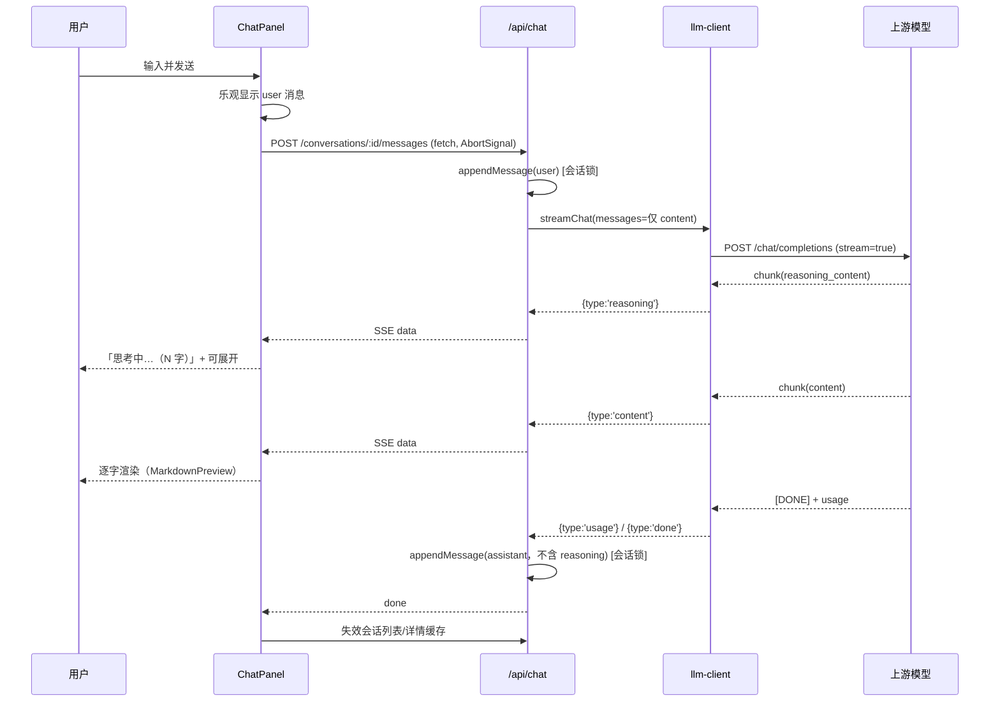

# S-03 前端对话面板与流式对话 — 设计

## 1. 术语

| 术语 | 定义 |
|---|---|
| 面板降级 | 视口窄于阈值时，面板由常驻列（占位布局）切换为浮层抽屉（覆盖内容） |
| 生成中状态 | 从发送到首答之间的持续可见动态反馈（需求 R11a） |
| 归一化事件流 | 消费 `/api/chat/.../messages` 返回的 SSE，按 `data.type` 分派渲染 |

## 2. 现状（AS-IS）

- 唯一布局壳 `AppShell`：`ki-sidebar`（232px，可折叠）+ `ki-main`，`ki-shell` 为 flex 容器 —— `web/src/layouts/AppShell.tsx:92,147`、`web/src/styles/ki.css:54,118,200`
- 页面级第二栏由各页自建（如 Browse 的 `ki-split` 300px）—— `web/src/pages/BrowsePage.tsx:692-694`
- 请求层：`req<T>` fetch 封装（`web/src/api/httpApi.ts:132-148`）、react-query hooks（`web/src/lib/hooks.ts`）
- scope 来自 `ScopeContext`（localStorage `ki-web:scope`）—— `web/src/lib/scopeContext.tsx:12,19`
- **全仓无 SSE / ReadableStream 使用**（`web/src` 零命中），无任何 chat 组件
- 既有浮层范式：`.ki-drawer` + scrim（`web/src/components/ModuleDrawer.tsx:1`）；样式单文件 `web/src/styles/ki.css`（1476 行），BEM 前缀 `ki-`

## 3. 方案（TO-BE）

### 3.1 目录结构

```
web/src/
├── api/
│   └── chatApi.ts               # [新增] 会话 CRUD 封装（复用 req<T>）
├── lib/
│   ├── chatStream.ts            # [新增] fetch + ReadableStream 的 SSE 消费与中止
│   └── hooks.ts                 # [修改] 增 useChatConfig / useConversations / useConversation
├── components/
│   └── chat/
│       ├── ChatPanel.tsx        # [新增] 面板容器（头部/列表/消息/输入区编排）
│       ├── ConversationList.tsx # [新增] 会话列表抽屉（最近 / 已归档）—— 见 S-04
│       ├── MessageList.tsx      # [新增] 消息流渲染 + 自动滚底
│       ├── MessageItem.tsx      # [新增] 单条消息（user / assistant 分支）
│       ├── Composer.tsx         # [新增] 输入区（发送 / 停止 / Enter 提交）
│       └── ReasoningBlock.tsx   # [新增] 思考折叠块 —— 见 S-05
├── layouts/
│   └── AppShell.tsx             # [修改] 挂载 <ChatPanel/> 与降级逻辑
└── styles/
    └── ki.css                   # [修改] 新增 --ki-chat-width 与 .ki-chatpanel* 样式、降级媒体查询
```

### 3.2 布局与降级

```tsx
// AppShell.tsx（结构示意）
<div className="ki-shell">
  <aside className="ki-sidebar">…</aside>
  <div className="ki-main">…</div>
  <ChatPanel />          {/* 常驻列或浮层，由 data-mode 决定 */}
</div>
```

- 常驻态：`--ki-chat-width: 380px`，面板为 `ki-shell` 的第三个 flex 子项；`ki-main` 已是 `flex:1; min-width:0`，无需改动其规则
- **降级判定（阈值待补测确认）**：优先用 `ResizeObserver` 观测 `ki-main` 的**实际宽度**，< 480px 即切浮层 —— 非 Browse 页没有 300px 文档栏，用统一视口阈值会让这些页面过早降级；视口阈值仅作观测不可用时的兜底常量 `CHAT_DOCK_MIN_VIEWPORT = 1400`（算式：232 导航 + 300 文档栏 + 380 面板 + 约 40 间距 + 480 主内容）。真实 `/browse` 基线测定后回填该常量
- 浮层态：`position: fixed; right:0; top:0; bottom:0; width: min(420px, 92vw); z-index` 高于内容、低于 `.ki-drawer`
- 全屏阅读器（`.ki-drawer--fullscreen`）打开时自动切浮层并收起（监听 body 上的抽屉存在性）
- 展开态持久化：localStorage `ki-web:chat-open`（布尔）；当前会话 `ki-web:chat-conv:{scope}`

### 3.3 消费的接口契约与状态缓存

**消费的接口**（定义见 S-01/S-02）：

| 接口 | 用途 | 关键返回 |
|---|---|---|
| `GET /api/chat/config` | 面板可用性与模型名 | `enabled` / `model` / `configPath` |
| `GET /api/chat/conversations` | 会话列表 | `items[]`（含 `corrupted` 标记）、`nextCursor` |
| `GET /api/chat/conversations/:id` | 会话详情 | `messages[]`（**无 reasoning 字段**） |
| `POST /api/chat/conversations/:id/messages` | 发消息（SSE） | `{type: meta｜reasoning｜content｜usage｜done｜aborted｜error}` |

| queryKey | 数据 | 失效时机 |
|---|---|---|
| `['chat','config']` | `GET /api/chat/config` | 配置变更后手动刷新按钮 |
| `['chat','convs',scope,archived]` | 会话列表 | 新建/归档/删除/发送完成后 |
| `['chat','conv',id]` | 会话详情 | 发送完成后（写入需重取以拿服务端 id 与 usage） |

**流式期间的状态归属**：生成中的 `content/reasoning` 累积在 `ChatPanel` 组件 state（不写 react-query 缓存），`done` 后 `invalidateQueries(['chat','conv',id])`。

**流式渲染节流（性能约束）**：`MarkdownPreview`（marked + mermaid）单次渲染实测 15–17ms，而流式每秒可达数十 chunk。渲染必须节流：**≥100ms 间隔或 `requestAnimationFrame` 合并**，仅渲染最新累积文本；`done` 后做一次全量渲染。不节流会导致长答案渲染卡顿。

**中止后的服务端对齐**：用户点击「停止」后，本地内容与服务端落盘内容可能存在尾部差异（最后若干 chunk 是否已到达服务端不确定）。中止后必须 `invalidateQueries(['chat','conv',id])` 重取，**以服务端落盘内容为准**；重取失败则保留本地内容并标记「未同步」。

### 3.4 时序图



中止路径：用户点「停止」→ `AbortController.abort()` → daemon 侧捕获 → 上游 abort → 落盘 `aborted:true` + 已生成 content → 前端把最后一条标记「已中止」。

### 3.5 关键交互

| 场景 | 行为 |
|---|---|
| 未配置模型 | 面板顶部横幅：`未配置模型` + 配置文件路径（来自 `GET /chat/config` 的 `configPath`），输入区禁用；**不静默失败** |
| 生成中 | 「停止」按钮替代「发送」；输入区可继续编辑但不可再次发送 |
| 首字前 | 显示「正在思考…」+ 计时；这是 R11a 的硬要求（最长可达 12s） |
| 长会话 | `done.warning === 'conversation-too-long'` → 输入区上方提示「会话过长，建议新建会话」 |
| 错误 | 消息尾部红色错误块，按 `code` 给文案；`retryable:true` 时提供「重试」按钮（重发上一条 user 文本） |
| 切会话/关面板时生成中 | 先 abort，保留已生成部分（不产生交错消息） |
| 发图（`supportsImages=true` 时） | 输入区显示图片按钮，支持粘贴与拖拽；发送前展示缩略图可单张删除；上限 4 张 / 单图 4MB，超限即时提示（N14） |
| 图片能力关闭（`supportsImages=false`，默认） | **完全隐藏图片入口**，粘贴图片时给出说明性提示（不做静默忽略），避免用户白做功 |
| 历史图片未携带 | 旧消息中的图片缩略图标注「本轮未携带」+ tooltip 说明成本原因（D10 / R15） |
| 引用知识库图片 | 提供 KB 图片选择入口；发送前若引用已失效则定位到具体图片并给「移除并重发」（N13） |
| 图片用量 | 本轮回合结束后展示 `promptTokensDetails.imageTokens`，让图片成本可见（R17） |

## 4. 关键决策点

| 决策 | 采用 | 被否决方案与理由 | 重新评估触发条件 |
|---|---|---|---|
| 面板位置 | 右侧常驻可收起 + 窄屏浮层 | ① 左侧 232px 导航内：宽度不足以对话；② 独立页面 `/chat`：违背"任意页面随时对话"；③ 只做浮层：宽屏下浪费可用空间 | 真实基线测定主内容区 <480px 时 |
| 传输通道 | `fetch` + `ReadableStream` + `AbortController` | `EventSource`：仅 GET、无法带 body、无统一 abort 语义 | 若改为 GET 查询式发送时 |
| 流式状态存放 | 组件 state（不写缓存），完成后失效缓存 | 直接写 react-query 缓存：高频 chunk 触发无谓重渲染与失效 | 需要跨组件共享流式态时 |
| Markdown 渲染 | 复用 `MarkdownPreview`（已含代码复制/Mermaid） | 纯文本渲染：AI 回答常含代码块与表格，可读性差 | 无 |

## 5. 异常处理

| 场景 | 行为 | 是否对外暴露 |
|---|---|---|
| 模型未配置（`enabled:false`） | 面板横幅 + 禁用发送 + 显示配置路径 | 是 |
| 连接建立失败（daemon 未就绪） | 面板显示「服务未就绪」+ 重试按钮，不发请求 | 是 |
| 流中断（网络/daemon 重启） | 保留已渲染内容，标记「连接中断」并给重试入口 | 是 |
| 收到 `error` 事件 | 按 `code` 映射文案；`retryable` 决定是否给重试按钮 | 是 |
| 会话不存在（404） | 清空当前会话并刷新列表，提示「会话已删除」 | 是 |
| 会话文件损坏 | 详情页提示「该会话已损坏，可删除」+ 删除入口 | 是 |
| 用户中止 | 已生成内容保留 + 「已中止」标记；不报错 | 是（非错误态样式） |
| 切 scope | 关闭当前面板会话（保留本地草稿），列表按新 scope 重取 | 是 |

## 6. 影响范围

| 文件 | 改动 | 回归点 |
|---|---|---|
| `web/src/layouts/AppShell.tsx` | 挂载面板 + 降级/全屏逻辑 | 5 个页面布局不破；`Ctrl+F` 聚焦逻辑不受影响（面板输入框不标记 `data-ki-search-input`） |
| `web/src/styles/ki.css` | 新增面板样式与媒体查询 | 不改既有 `.ki-shell/.ki-main/.ki-drawer` 规则，仅追加 |
| `web/src/lib/hooks.ts` | 新增 3 个 hook | 既有 4 个 hook 行为不变 |
| 既有页面（Browse/Search/Import/Write/Dashboard） | **无需改动** | 窄屏下主内容区可用性回归；`.ki-drawer` 层级与面板不冲突 |

## 7. 待定问题

| 问题 | 影响 | 处理时机 |
|---|---|---|
| 降级阈值最终取值（1400px 为初值） | 降级触发过早/过晚 | 前置门②：真实 `/browse` 基线补测后定 |
| 面板默认展开还是收起（T1） | 首屏观感 | 上线前用户确认；当前默认「展开」并记忆用户选择 |

## 8. 不在范围内

移动端专项适配（窄屏仅保证可用的浮层形态）、多面板并排、会话内容全文检索 UI、富文本编辑器（输入区为纯文本）、虚拟滚动（消息 >500 条时仅提示新建会话）。
