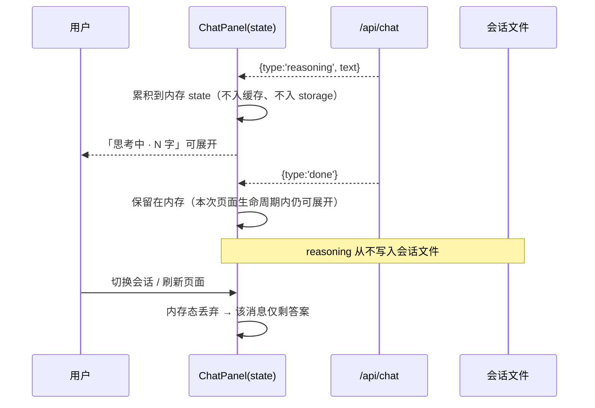

# S-05 思考内容折叠展示 — 设计

## 1. 术语

| 术语 | 定义 |
|---|---|
| 思考块 | 助手消息上方可展开的 `reasoning` 区域，默认收起 |
| 内存态（不落盘） | 思考内容只存在于当前页面会话的内存中；切会话 / 刷新 / 收起面板后即不可回看（D7） |
| 结构性隔离 | `ChatMessage` 数据模型不含 `reasoning` 字段，从源头保证不敢回传上游（见 S-02 §3.2） |

## 2. 现状（AS-IS）

- 面板与消息渲染不存在（S-03 新建）
- 可复用（含路径依据）：`web/src/components/MarkdownPreview.tsx` 已支持安全重建 standalone `<details>/<summary>` 且不放宽其他 HTML/URL scheme 限制；其代码块复制按钮与 `aria-live` 状态反馈可作为本组件的交互范式
- 实测上游行为：思考内容先于答案到达，单次可达 2635 字；思考 token 占 completion 的 24%~99%（`demo/verify-report.md` §R-03）

## 3. 方案（TO-BE）

### 3.1 组件

```
web/src/components/chat/ReasoningBlock.tsx   # [新增]
web/src/styles/ki.css                        # [修改] 追加 .ki-reason* 样式
```

```tsx
interface ReasoningBlockProps {
  text: string;        // 内存态累积的思考内容
  streaming: boolean;  // 是否仍在生成
  chars: number;       // 字符数（避免每次渲染重复计算）
}
```

- 结构：`<details class="ki-reason"><summary>…</summary><div class="ki-reason__body">…</div></details>`
- 标题文案：生成中「思考中 · N 字」，结束后「思考过程 · N 字」；不展示"已完成/耗时"等无法验证的信息
- 默认**收起**；同一消息在生成中若用户已手动展开，则保持展开（记录用户意图，不因新 chunk 强制收起）
- 正文：等宽换行纯文本（不做 Markdown 渲染——思考内容常含半成品格式，渲染易产生破碎排版）
- 长内容：容器最大高度 240px + 内部滚动；>20,000 字时只渲染前 20,000 字并提示「思考内容过长，已截断显示」

### 3.2 生命周期（不落盘的语义边界）



**明确告知**：面板首次打开思考块时，tooltip 文案说明「思考内容仅本次会话可见，留存于页面内存，不写入记录」。

### 3.3 与 S-01/S-03 的契约

| 依赖 | 内容 |
|---|---|
| S-01 事件流 | 消费 `{type:'reasoning', text}` 增量；上游无该字段时全程不渲染思考块（不视为异常） |
| S-03 状态归属 | 思考内容与 `content` 同存于 `ChatPanel` 的流式 state；`done` 后随消息一起留在内存，但不进入 react-query 缓存 |
| 中止路径 | 中止时已收到的思考内容仍可展开查看（内存），会话文件中仅保存已生成的 `content` |

**内存绑定结构（实现约束）**：`ChatPanel` 维护两个内存结构——`Map<messageId, string>`（思考文本）与 `Set<messageId>`（用户是否手动展开过）。消息本体来自 react-query 缓存，思考文本按 `messageId` 关联渲染：

- **不允许把 reasoning 写进消息对象**（既会污染缓存，也可能被后续逻辑误当作可回传数据）
- `done` 事件返回服务端 `messageId` 后，以该 id 为键写入 Map；中止路径用本地临时 id，重拉会话后丢弃
- 切换会话 / 刷新页面 / 收起面板重新展开（重新挂载）时 Map 随组件销毁，即 D7 的"不落盘"语义

## 4. 关键决策点

| 决策 | 采用 | 被否决方案与理由 | 重新评估触发条件 |
|---|---|---|---|
| 存放介质 | **仅内存**（组件 state） | ① 写入会话文件：D7 明确否决，且思考体量数倍于答案；② `sessionStorage`：写入浏览器存储，与"不落盘"口径边界模糊，且需额外清理策略 | 用户后续要求"刷新后可回看"时重新拍板 |
| 渲染方式 | 纯文本 + 等宽换行 | Markdown 渲染：思考内容常含半成品结构，渲染后排版破碎；`MarkdownPreview` 亦会触发 Mermaid/代码块处理开销 | 无 |
| 默认状态 | 收起 | 默认展开：2635 字思考会淹没 12 字的答案 | 连续 20 次采样中思考字符数中位数 <200 时 |
| 截断阈值 | 20,000 字 | 不截断：极端思考内容会造成渲染卡顿；阈值过低：丢失有效信息 | 采样中出现 >50,000 字的思考样本时 |

## 5. 异常处理

| 场景 | 行为 | 是否对外暴露 |
|---|---|---|
| 上游无 `reasoning_content` 字段 | 整条消息不渲染思考块 | 否（静默跳过） |
| reasoning 事件乱序/重复 | 按到达顺序拼接（上游为顺序流，重复内容直接追加，不做去重） | 否 |
| 思考内容超 20,000 字 | 截断渲染 + 提示文案 | 是 |
| 生成中用户展开后切走再切回 | 内容已丢弃（不落盘），思考块消失，仅剩答案 | 是（预期行为，tooltip 已说明） |
| 思考内容含疑似敏感信息（密钥/路径） | 不额外处理（与答案同等对待，均来自上游） | 否（列入 T5 合规评估） |

## 6. 影响范围

| 文件 | 改动 | 回归点 |
|---|---|---|
| `web/src/components/chat/ReasoningBlock.tsx` | 新增 | — |
| `web/src/components/chat/MessageItem.tsx` | 挂载思考块（assistant 分支） | 无思考时布局与 S-03 一致 |
| `web/src/styles/ki.css` | 追加 `.ki-reason*`（虚线边框 + 次要色 + 内滚） | 不改既有 `.ki-drawer`/`details` 样式 |

## 7. 待定问题

| 问题 | 影响 | 处理时机 |
|---|---|---|
| 思考内容是否需要"复制"按钮 | 复用性 | 二期评估（`CodeBlock` 已有复制范式可借） |
| 是否需要"始终展示思考"的用户偏好开关 | 个性化 | 二期评估（本期固定默认收起） |
| 思考内容中的敏感信息是否需要脱敏 | 合规 | 与 N8 隐私口径一并确认 |

## 8. 不在范围内

思考内容落盘与回看、思考内容全文检索、思考内容参与后续对话上下文（**明确禁止，见 S-02 数据模型**）、思考内容的多语言翻译。
