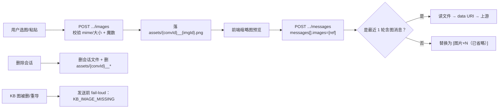

# S-06 图片输入能力 — 设计

> 决策依据：D9（仅输入）/ D10（历史只带最近 1 轮）/ D11（配置手填开关）/ D12（本地 + 引用 KB）
> 实测依据：`demo/verify-report.md` §8（11KB 图 → 86 image tokens；93KB 图 → 1570 image tokens，均 200 成功）

## 1. 术语

| 术语 | 定义 |
|---|---|
| 图片引用 | 消息携带的图片来源描述：`local`（chatDir 内文件）或 `kb`（知识库资产，仅引用不复制） |
| 图片窗口 | 上游请求中允许携带真实图片的消息范围；本期固定为"最近 1 轮含图消息" |
| 结构性隔离 | 与 reasoning 同理：`ChatImageRef` 只描述来源，出网前才由服务端读文件转 data URI |

## 2. 现状（AS-IS）

- 消息模型为纯文本（S-02 的 `ChatMessage.content: string`），无图片字段
- 上游消息构造 `buildUpstreamMessages` 只映射 `{ role, content }`（字符串），不支持 content 数组
- 既有 KB 图片读取通道：`GET /api/asset?scope=&group=&path=`，实现含**双锚点路径校验**（KB 根 + assets 目录）、后缀白名单（`ASSET_MIME`）、SVG 沙箱 CSP、`no-cache`（`src/lib/mcp-http-api.ts` 的 `handleAsset`）
- KB 资产目录：`kb/{scope}/{group}/assets`（`src/lib/scope.ts:130`）
- 既有上传通道 `/api/import/upload` 面向 KB 导入（写入 `kb/`），**不可复用**于会话图片
- 实测：上游接受 `content: [{type:'text'},{type:'image_url',image_url:{url:'data:...'}}]`；返回 `usage.prompt_tokens_details.image_tokens`

## 3. 方案（TO-BE）

### 3.1 文件改动

```
src/
├── lib/
│   ├── chat-images.ts       # [新增] 图片校验、存储、引用解析、data URI 转换
│   ├── chat-store.ts        # [修改] 消息模型扩展 + 级联删除图片
│   ├── llm-client.ts        # [修改] 上游消息构造支持 content 数组（或下沉到 chat-store）
│   └── mcp-http-api.ts      # [修改] 新增 2 条图片路由
web/src/components/chat/
├── ImagePicker.tsx          # [新增] 上传/粘贴/拖拽 + KB 图片选择
├── ImageThumbs.tsx          # [新增] 发送前缩略图预览与删除
└── MessageImages.tsx        # [新增] 消息内图片展示（含"未携带"标记）
```

### 3.2 数据模型

```ts
type ChatImageRef =
  | { kind: 'local'; id: string; name: string; mime: string; bytes: number; addedAt: string }
  | { kind: 'kb'; scope: string; group: string; path: string; name: string; addedAt: string };

interface ChatMessage {
  // …既有字段…
  images?: ChatImageRef[];     // 仅 user 消息可携带（本期只做输入，模型回复为纯文本）
}
```

**存储布局**（本地图片；文件名前缀绑定会话，便于级联删除）：

```
{chatDir}/{scope}/assets/{convId}__{imageId}{ext}     # imageId = img-{base36}-{rand4}
```

**KB 图片不落盘**：消息里只存 `{scope, group, path}` 引用，展示时由前端直接请求既有 `/api/asset`，不复制文件（D12）。

### 3.3 上游消息构造（图片窗口 + reasoning 隔离）

```ts
// src/lib/chat-images.ts
export async function buildUpstreamMessages(conv: ConversationFile, cfg: LlmConfig) {
  const msgs: unknown[] = [];
  if (conv.systemPrompt.trim()) msgs.push({ role: 'system', content: conv.systemPrompt });

  // 只允许最后一条含图消息携带真实图片（D10）
  const lastImageIdx = conv.messages.reduce((acc, m, i) => (m.images?.length ? i : acc), -1);

  for (const [i, m] of conv.messages.entries()) {
    if (i !== lastImageIdx || !m.images?.length) {
      msgs.push({ role: m.role, content: m.images?.length
        ? `${m.content}${m.content ? '\n' : ''}[图片×${m.images.length}（已省略）]`
        : m.content });
      continue;
    }
    const parts: unknown[] = [];
    if (m.content) parts.push({ type: 'text', text: m.content });
    for (const img of m.images) {
      parts.push({ type: 'image_url', image_url: { url: await toDataUri(img) } });
    }
    msgs.push({ role: m.role, content: parts });
  }
  return msgs;
}

async function toDataUri(img: ChatImageRef): Promise<string> {
  if (img.kind === 'local') {
    const abs = localImagePath(img);                       // 仅允许 chatDir 内，id 正则校验
    return `data:${img.mime};base64,${fs.readFileSync(abs).toString('base64')}`;
  }
  // KB 引用：复用 handleAsset 的双锚点校验，禁止直接拼路径
  const abs = resolveKbAssetPathStrict(img.scope, img.group, img.path);  // 越界 → 抛 Forbidden
  if (!fs.existsSync(abs)) {
    throw new ApiError(409, 'KB_IMAGE_MISSING', `引用的知识库图片已失效：${img.name}（${img.group}/${img.path}）`);
  }
  const mime = ASSET_MIME[path.extname(abs).toLowerCase()];
  if (!mime) throw new ApiError(400, 'IMAGE_INVALID', `不支持的知识库图片类型：${img.path}`);
  return `data:${mime};base64,${fs.readFileSync(abs).toString('base64')}`;
}
```

### 3.4 接口

| 方法 | 路径 | 说明 |
|---|---|---|
| POST | `/api/chat/conversations/:id/images` | 上传本地图片（JSON `{ name, content }`，`content` 为 base64）；校验后落 `assets/{convId}__{imageId}{ext}` |
| GET | `/api/chat/images/:id?scope=` | 读取本地图片（二进制，`Content-Type` 按 mime，`Cache-Control: no-cache`） |

> KB 图片**不需要新接口**：前端直接用既有 `GET /api/asset`（已带越权白名单与沙箱）。

**上传响应示例**：

```json
{
  "ok": true,
  "image": { "kind": "local", "id": "img-mf4a2b-7k3q", "name": "架构图.png", "mime": "image/png", "bytes": 93248, "addedAt": "2026-09-24T17:20:00.000Z" }
}
```

### 3.5 生命周期



- **孤儿清理**：上传即归属会话（文件名含 `convId`），删除会话时按前缀全删（含用户上传后未发送的图片）
- **KB 图片**：删除会话**不触碰**；失效仅影响发送时校验与前端展示（N13/N15）

## 4. 关键决策点

| 决策 | 采用 | 被否决方案与理由 | 重新评估触发条件 |
|---|---|---|---|
| 本地图片存储 | `chatDir/{scope}/assets/{convId}__{imgId}{ext}` | ① 存 base64 进会话 JSON：单会话体积爆炸且每次读写全量搬移；② 复用 `kb/{scope}/assets`：污染知识库、被导入/删除 Group 波及 | 单会话图片总量 >100MB 或需跨设备同步时 |
| KB 图片处理 | **只存引用，不复制** | 复制到 chatDir：知识库更新后两份不一致、磁盘双倍；且删除会话会误删"知识库内容" | 需要"冻结当时快照"（审计场景）时 |
| 历史图片窗口 | 固定最近 1 轮（D10） | ① 全量携带：实测 1570 image tokens/图，10 轮约 1.5 万 token；② 用户开关：本期不做，避免 UI 复杂度 | 用户反馈"记不住旧图"时 |
| 传图方式 | data URI base64 内联 | ① 公网 URL：本机文件不可达（上游无法访问 127.0.0.1）；② 上传到外部图床：新增依赖与隐私面 | 上游支持本地文件引用（无此路径） |
| 入口显隐 | 由 `llm.supportsImages` 单点控制 | 自动探测（发 1x1 图试调）：多一次计费调用且可能误判 | 上游提供模型能力元数据端点时 |
| 仅 user 消息可带图 | 是（本期只做输入，D9） | 允许 assistant 带图：需模型出图能力，超出 D9 范围 | 引入出图能力时 |

## 5. 异常处理

| 场景 | 行为 | 是否对外暴露 |
|---|---|---|
| mime 不在白名单 / 魔数与后缀不符 | 400 `IMAGE_INVALID`（附 `details`），**不落盘** | 是 |
| 单图超过 `maxImageBytes`（默认 4MB） | 400 `IMAGE_INVALID`；前端发送前即拦截 | 是 |
| 单消息图片数超过 `maxImagesPerMessage`（默认 4） | 400 `IMAGE_INVALID`；前端阻止继续添加 | 是 |
| `supportsImages=false` 时收到带图消息 | 400 `IMAGE_INVALID`（`reason: 当前模型未声明支持图片`），不发上游 | 是 |
| KB 引用图片已失效（N13） | 发送前 409 `KB_IMAGE_MISSING`，**指明具体图片**；界面提供"移除该图并重发" | 是 |
| KB 引用越权（引用他 scope 的资产） | 403 `SCOPE_FORBIDDEN` | 是 |
| 本地图片文件丢失（被手工删除） | 发送前 409 `IMAGE_NOT_FOUND`，定位到具体图片 | 是 |
| 上传磁盘写入失败 | 500 `CHAT_WRITE_FAILED`，不返回部分成功 | 是 |
| 读取本地图片时 id 非法 | 404 `IMAGE_NOT_FOUND`（正则校验前置，防路径穿越） | 是 |
| 图片过大导致上游超时 | 走既有 `LLM_TIMEOUT`，`retryable: true` | 是 |

## 6. 影响范围

| 文件/功能 | 改动 | 回归点 |
|---|---|---|
| `src/lib/chat-images.ts` | 新增（校验/存储/解析/data URI） | — |
| `src/lib/chat-store.ts` | `ChatMessage` 加 `images?`；删除会话级联删本地图片 | 既有会话（无 `images` 字段）读取需兼容（可选字段，无需迁移） |
| `src/lib/llm-client.ts` | 上游消息构造支持 content 数组 | 纯文本路径行为不变（无图时仍传字符串） |
| `src/lib/mcp-http-api.ts` | 新增 2 条路由（上传/读取） | 既有路由与鉴权不变；**新路由不登记越权白名单**（`/images/:id` 的 scope 校验在 handler 内做） |
| `web/src/components/chat/*` | 新增 3 个组件 + 输入区改造 | 无图时输入区布局与 S-03 一致 |
| 会话文件体积 | 增大（仅存引用与元数据，不存图片本体） | 列表扫描成本基本不变 |

## 7. 待定问题

| 问题 | 影响 | 处理时机 |
|---|---|---|
| 单图上限最终取值（T7，默认 4MB / 4 张） | 大图可达性与成本 | 补测更大图片与上游拒绝阈值后定 |
| mime 白名单是否含 SVG（T8） | 安全（脚本内嵌）与上游支持度 | 建议排除；需实测确认上游是否接受 |
| 是否需要前端压缩（减少 base64 体积与 image tokens） | 成本与清晰度权衡 | 二期评估 |
| 会话删除后的孤儿清理是否需要后台任务 | 磁盘占用 | 本期用"删除即删前缀"足够；若出现异常中断再评估 |

## 8. 不在范围内

模型生成/返回图片（D9）、图片编辑（裁剪/旋转/标注）、OCR 专用流程、多图对比/并排提问 UI、图片内容审核、跨会话图片复用（同一张图在多个会话中各自上传）。
