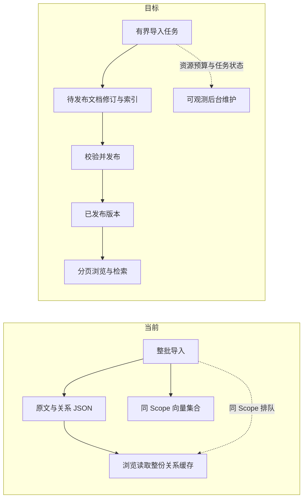

# 单 Scope 大规模数据存储与导入可用性

> 模式：PM 需求草案。证据等级最高为 🟢 代码直读和当前 `ai-docs` 文件数据；未做 10 万文档／100 万 chunk 的混合负载压测。用户已确认规划规模及体验目标，技术选型和迁移细节仍是建议。

## 1. 目标与边界

### 已确认目标

- 单个 Scope 按 **10 万篇文档、约 100 万个 chunk** 规划。
- 在该规模下，知识库浏览 **P95 ≤ 1 秒**，检索 **P95 ≤ 3 秒**；导入期间，同 Scope 页面仍可浏览和检索。
- 导入显示完成后，不应有未登记、无资源约束的后台工作持续使 CPU／内存显著升高。

以上是目标，不代表当前系统已经达到。检索若包含外部 embedding 请求，端到端指标仍应记录外部等待；压测需同时给出本地处理时间，便于归因。

### 本需求覆盖

CLI 与 Web 导入、KB 原文和关系元数据、Group／Relation／标签／来源记录、全文与向量索引、Browse／Search／MCP 读取、编辑删除、备份恢复和旧数据迁移。产品对外的文档、标签与检索语义应尽量保持；磁盘格式可演进，但要有迁移和回退路径。

### 现状与已知约束

- 🟢 `/api/doc/list` 从整份 `relations-cache.json` 构建文档清单；指定 Group 时仍按 `limit` 截取，却固定返回 `truncated: false`。参考 `src/lib/mcp-http-api.ts:310,767-815`。
- 🟢 `/api/doc/list` 与导入均进入同 Scope 的 `OperationCoordinator`，长导入会使同 Scope 读取排队。参考 `src/lib/mcp-http-api.ts:480-489`、`src/lib/operation-coordinator.ts:58-82`。
- 🟢 向量计数和默认标签扫描受 `LIST_ALL_LIMIT=10_000` 约束；`ai-docs` 已有约 1.37 万个内容向量 ID，计数口径可能低报。参考 `src/lib/vector-client.ts:1299,1464,1486-1492`。
- 🟢 文档读取会改写整份关系缓存；导入逐篇读改写 Group 的 `index.json`。参考 `src/get-module-info.ts:171-179`、`src/lib/import.ts:1550`。
- 🟢 当前来源记录是 Scope 级单份 `group-index.source`，后续导入覆盖此前来源；导入把整批 `fileRecords`／`entries` 保留在内存。参考 `src/lib/import.ts:547,758,1330-1336`、`src/lib/scope.ts:259`。
- 🟢 当前样本 `ai-docs` 有 1,859 个 Relation、633 个 Group、13,680 个导入 chunk；KB 约 29.3 MB、dense Collection 约 236 MB、`relations-cache.json` 约 1.5 MB。这只能说明现有规模，不能外推性能上限。
- 🟡 用户观察到导入成功输出后 Node CPU／内存升高、Browse 一度持续加载，随后恢复。尚无成功输出后逐秒任务／线程采样，**不能认定关系元数据同步就是该峰值的根因**。

### 现状 → 预期

## 2. 需求与验收标准

| ID | 优先级／Kano | 需求 | 验收标准 |
|---|---|---|---|
| R1 | P0／必备 | 单 Scope 达到 10 万文档、约 100 万 chunk 时，文档、Group、Relation、标签、原文和索引映射保持完整。 | 用贴近真实分布的数据集完成导入、计数、随机原文读取、Group 枚举和标签核对；数量守恒，不因固定扫描上限静默漏项。 |
| R2 | P0／必备 | 导入期间同 Scope 的浏览与检索保持可用。 | 在约定的混合负载下，整段导入期间浏览 P95 ≤ 1 秒、检索 P95 ≤ 3 秒；浏览不出现无限骨架屏或与导入等长的队列等待。 |
| R3 | P0／必备 | “导入完成”与已发布数据、索引及后台任务状态一致。 | 完成时已发布的数据可读、索引状态可见；之后若仍有合并／回收等工作，任务中心单独显示任务、进度、CPU／内存预算与失败原因，不以完成状态掩盖高负载。 |
| R4 | P0／必备 | 原文、Relation、Group、标签、全文与向量命中应指向同一已发布文档修订。 | 在导入、覆盖、编辑、删除、取消和进程异常边界，读者不会同时看到新原文与旧索引的混合结果；失败明确报告并可恢复。 |
| R5 | P0／必备 | 文档列表、Group 计数、标签和 Scope 计数可正确分页或明确说明截断。 | 单 Group 超过 500 篇、向量超过 10,000 条仍可逐页取全；`total`／`truncated` 与实际结果一致，删除预告不低报。 |
| R6 | P0／必备 | CLI／Web 共用导入预算和资源保护。 | 文件数、总字节、chunk 数、单文件大小、在途向量请求与临时磁盘空间有可配置预算；预检失败明确指出超限项；已跳过项及原因在 CLI／Web 终态可见。不得以默认阈值挡住已成功的 1,866 文件／13,680 chunk 导入。 |
| R7 | P0／必备 | 支持多个导入来源及其独立切分配置和文档归属。 | 连续从两个目录导入同一 Scope 后，每篇文档仍可定位原始来源、相对路径和切分参数；后一次导入不覆盖前一次来源记录。 |
| R8 | P0／必备 | 旧数据可校验迁移和回退。 | 逐 Scope 迁移前保留旧数据与向量快照；核对全部原文哈希、Group、Relation、标签、ID 映射、搜索和导出恢复；校验失败不切换；切换失败可回到最后验证的版本。 |
| R9 | P1／期望 | 大库的读写成本随相关数据规模增长，避免每次读取或更新重写全 Scope 元数据。 | 记录列表查询、单篇读取、批量导入各阶段耗时和字节读写量；热点 Group 与低频 Group 均满足 R2，且单篇读取不触发全量元数据重写。 |
| R10 | P0／必备 | 完整备份与恢复有明确的数据和索引边界。 | 备份能一致恢复原文、关系、标签、来源及附件；若不包含可直接使用的向量索引，恢复界面明确提示重建时间、embedding 依赖及费用，不宣称检索已就绪。 |
| R11 | P0／必备 | 存储迁移不能绕过 Scope 隔离和既有访问授权。 | CLI 保持既有 Scope 名称／路径及 strict 模式校验；HTTP／MCP／附件入口保持 Token 授权 Scope 校验；跨 Scope 迁移／恢复不混入原文、标签、向量或任务状态。 |

### 优先级依据

| 条目 | 用户价值 | 实施成本 | 排序理由 |
|---|---|---|---|
| R1–R5、R8、R10–R11 | 高 | 高 | 数据不完整、页面阻塞、版本混读、越权或无法恢复会使核心能力不可用；Kano 为必备，列 P0。 |
| R6–R7 | 高 | 中 | 容量保护和多来源归属直接影响大批导入的可靠性；Kano 为必备，列 P0。 |
| R9 | 中 | 高 | 消除全 Scope 写放大是达到目标的重要优化，但具体存储实现以 R1／R2 的效果验收为准，列 P1。 |

### 验收负载与观测口径（草案）

- 数据集约 10 万篇／100 万 chunk，含大 Group、深 Group、重名文档、多个来源、不同文档大小与标签；记录 1024 维 embedding 配置及实际主机资源。
- 在同 Scope 持续导入时并发执行浏览、原文读取、全文、语义和混合检索；同时测冷启动、稳定运行与导入结束后的 CPU、RSS、磁盘、队列和任务阶段。
- P95 由用户可感知的请求完成时间计算；另拆分排队、外部 embedding、元数据、索引搜索和前端渲染时间。混合并发量、持续时间及页面可用性的浏览器判据在压测计划中冻结，现阶段不把单次样本当作达标证据。
- 发布一致性、断电／进程中断、索引损坏、磁盘不足、embedding 失败分别验证；不得只用 `ki doctor` 的配置检查代替容量验收。

## 3. 负向需求

| 场景 | 必须给用户的结果 |
|---|---|
| 导入中断或进程重启 | 已发布批次可读；未发布内容不混入结果；任务显示部分完成和续跑入口。 |
| 外部 embedding 限流、超时或维度改变 | 明确失败位置和受影响文档；已发布索引不被半成品覆盖，不静默降级。 |
| 目标磁盘空间不足或内存预算将被突破 | 写入前预警或受控暂停／失败，保留旧数据；给出所需空间与清理建议。 |
| 索引文件缺失、损坏或与元数据版本不符 | 拒绝把结果当作完整检索返回；标记 Scope 降级并提供回退或重建路径。 |
| 单 Group 大于列表上限 | 明确分页和总量；不以 `truncated:false` 隐藏未展示文档。 |
| 多来源中存在同路径、同名、重命名或外部源已删除 | 按来源 ID 和相对路径识别归属；冲突、删除策略明确提示，不猜测覆盖目标。 |
| 备份进行时有导入／编辑，或恢复后索引未就绪 | 备份引用同一已发布版本；恢复明确标注索引状态，不能展示错误的“已完成”。 |
| 迁移、恢复或附件读取时请求不允许访问的 Scope | 保留既有 Scope 鉴权；不因新数据库路径或跨 Scope 任务绕过授权，也不暴露其他 Scope 的计数。 |

## 4. 关联功能与影响

| 受影响功能／方 | 影响类型与程度 | 证据 | 配套要求 | 需拍板 |
|---|---|---|---|---|
| CLI／Web 导入与任务中心 | 流程／性能；预期内 | 🟢 共用 `handleDirectImport`，Web 有任务入口 | 同一预算、进度、取消和终态口径 | 发布粒度见 D1 |
| Browse／Group 树／文档原文读取 | 展示／性能；实现需替换 | 🟢 `buildDocList` 与本地 KB 读 JSON | 分页、准确总量、已发布版本读取，API 尽量兼容 | 否 |
| MCP 检索、全文和向量索引 | 数据／外部契约；可能降级 | 🟢 依赖向量／FTS ID 回查 Relation | 保留定位、标签筛选、来源和索引状态语义 | 索引实现见 D3 |
| 编辑、删除、Wiki 源文件写回 | 数据；误映射可破坏 | 🟢 依赖 Group、Relation、sourcePath 和 source.dir | 使用稳定文档 ID 与来源归属，删除及写回仍可校验和恢复 | 否 |
| 导出、备份、恢复与旧脚本 | 数据／外部契约；旧磁盘格式可能破坏 | 🟢 当前 CLI 直接读 JSON；⚪ 外部直接读 JSON 的脚本未发现 | 保留 Markdown 导出；提供旧格式迁移／恢复；核查外部依赖 | D2 |
| 附件与上传暂存 | 数据／磁盘；预期内 | 🟢 上传目录、KB 附件与快照分别占盘 | 归属、引用、保留期与配额计入容量预算 | 否 |
| Scope 授权和隔离 | 权限／数据；实现错误会破坏隔离 | 🟢 HTTP／MCP 请求按授权 Scope 校验 | 所有新存储读写、附件、备份和迁移入口沿用授权边界 | 否 |

## 5. 方案方向（建议，非已确认技术约束）

1. 每 Scope 一份 SQLite 权威库：按行保存文档原文／修订、Group、Relation、标签、来源、chunk 元数据及任务／发布状态；附件用不可变文件及库内清单。单个数据库文件不意味着整库读取或重写。
2. 全文与向量索引作为可重建派生数据。导入分有界批次构建待发布版本，索引先持久化并校验，再用短事务发布；读请求按已发布清单读取。SQLite WAL 可改善元数据读写并行，但不能自动保证当前 zvec 同集合读写安全。
3. 向量构建、索引合并与回收从 Node 请求主线程隔离，并受资源预算约束；合并／回收有独立任务状态。标签优先保存为文档属性，减少每标签重复向量，前提是检索引擎过滤能力和召回验收通过。
4. SQLite FTS5 仅为候选：须验证中文分词、BM25 排序和现有全文定位语义；未通过则保留独立版本化全文索引。100 万 chunk 下索引段数量、旧修订过滤后的召回及合并成本均须实测，不预设 zvec 当前版本可达标。
5. 迁移采用逐 Scope 快照、转换、双读比对、切换、回退；保留最后验证的旧版本一段明确期限。全量向量原始数据、索引段和备份的磁盘预算必须一并计算。

## 6. 决策与关键假设

| ID | 状态 | 取舍与建议 | 若假设错误的后果／验证方法 |
|---|---|---|---|
| D1 | 待确认 | 建议按有界批次原子发布、导入中逐批可见，失败返回部分成功并可续跑；如要求整批全有或全无，需另设计整体发布。 | 用户若要求整批不可见，当前建议不符合体验；通过业务场景确认。 |
| D2 | 待核查 | 保持 CLI／HTTP／MCP 契约，逐步废弃直接读取 JSON 的磁盘契约。 | 外部脚本可能失效；检索仓库及部署脚本，并请用户核对未入库消费者。 |
| D3 | 待验证 | 优先复用现有 zvec，索引隔离和资源上限必须在当前锁定版本及百万 chunk 下验证。 | 不达 SLO 时须更换索引方案／引擎；以混合负载、召回和故障演练判断。 |
| H1 | 已确认 | 目标是单 Scope 10 万文档／100 万 chunk，Browse P95 ≤1 秒、检索 P95 ≤3 秒，导入期间页面可用。 | 用户在本对话中已确认。 |
| H2 | 待确认 | 当前 44 GB 级主机、1024 维 embedding 可作首轮基准，最终验收应固定主机、语料、并发和网络条件。 | 不同硬件或 embedding 服务会改变可达性；压测计划登记环境与负载。 |

本文件状态为**草案**。下一步先固定 D1／D2 与验收负载，再做索引并发和百万 chunk 的风险验证，随后细化技术设计。
